# Foundry-lite


Foundry-lite는 **데이터가 들어와서, 정제되고, 업무 객체로 바뀌고, 사람이 액션을 실행하고, 그 결과가 다시 데이터 파이프라인으로 돌아가는 폐루프 운영 객체 시스템**입니다.

비개발자 관점으로 말하면, 일반적인 데이터 도구가 "엑셀 파일이나 테이블을 보기 좋게 정리하는 도구"에 가깝다면, Foundry-lite는 "회사의 주문, 고객, 재고 같은 현실 세계의 업무 대상을 객체로 만들고, 그 객체 위에서 안전하게 결정을 실행하고, 그 결정의 흔적을 다시 데이터로 남기는 작은 운영 플랫폼"입니다.

```text
CSV / connector / stream
-> raw dataset
-> DuckDB transform
-> clean dataset
-> ontology activation
-> Order / Customer object index
-> Object Explorer / SDK / API
-> ApproveOrder action
-> audit + outbox + materialization
-> downstream transform
-> refreshed Customer risk object
```

> 현재 구현 상태를 과장하지 않기 위해 이 README는 **구현 완료**, **로컬 MVP proof**, **미래 목표**를 구분합니다. 정확한 현재 상태 원본은 [docs/implementation-status.md](docs/implementation-status.md)입니다.

## Table Of Contents

- [30초 실행](#30초-실행)
- [프로젝트가 증명하는 것](#프로젝트가-증명하는-것)
- [현재 구현 상태](#현재-구현-상태)
- [큰 그림](#큰-그림)
- [아키텍처 원칙](#아키텍처-원칙)
- [코드 구조](#코드-구조)
- [런타임 흐름](#런타임-흐름)
- [도메인 모델](#도메인-모델)
- [포트와 어댑터](#포트와-어댑터)
- [API, CLI, Web, SDK](#api-cli-web-sdk)
- [운영과 관측성](#운영과-관측성)
- [품질 게이트](#품질-게이트)
- [보안과 거버넌스](#보안과-거버넌스)
- [로드맵](#로드맵)
- [문서 지도](#문서-지도)
- [GitHub README 시각화 방식](#github-readme-시각화-방식)

## 30초 실행

로컬 데모는 공급망 예제로 돌아갑니다. `Order`, `Customer`, `ApproveOrder`, `ops.action_log`, `ops.order_current`가 핵심입니다.

```bash
pnpm install
uv sync --all-groups
pnpm demo:supply-chain
```

비정형 멀티모달 데모(OCR/ASR/영상/의미검색)는 실 엔진으로 돌아갑니다. 실행법과 입력은 [`examples/media-multimodal-demo/README.md`](examples/media-multimodal-demo/README.md)를 참고하세요(시스템 `tesseract`/`ffmpeg` 필요).

```bash
pnpm demo:media-multimodal
```

API 서버:

```bash
pnpm dev
curl http://127.0.0.1:8000/healthz
```

FastAPI interactive docs and OpenAPI schema are available while the API server is
running:

```bash
open http://127.0.0.1:8000/docs
curl http://127.0.0.1:8000/openapi.json
```

정적 Web Object Explorer:

```bash
pnpm web:static
```

품질 게이트:

```bash
pnpm ci:gate
```

로컬 기본 게이트는 정적 불변식과 변경 영향권 테스트를 먼저 보는 빠른 피드백용입니다.
전체 release evidence를 로컬에서 직렬로 리허설해야 할 때는 아래 명령을 씁니다.

```bash
pnpm ci:gate:all
```

Docker/Testcontainers가 필요한 PostgreSQL 계약 테스트에서 Colima를 쓰는 로컬 환경은 보통 아래 환경 변수가 필요합니다.

```bash
export DOCKER_HOST=unix:///Users/isihyeon/.colima/default/docker.sock
export TESTCONTAINERS_DOCKER_SOCKET_OVERRIDE=/var/run/docker.sock
pnpm --silent ci:gate
```

## 프로젝트가 증명하는 것

Foundry-lite의 MVP는 "팔란티어 Foundry 전체 복제"가 아닙니다. 목표는 훨씬 좁고 분명합니다.

> **작지만 반복 가능한 하나의 업무 폐루프를 끝까지 증명한다.**

그 폐루프는 아래와 같습니다.

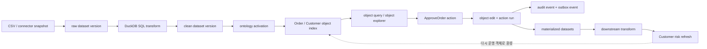

### 비개발자를 위한 한 문장 설명

Foundry-lite는 "원천 데이터에서 업무 객체를 만들고, 그 객체 위에서 사람이 결정을 실행하고, 그 결정까지 다시 데이터로 남겨 다음 분석과 운영에 쓰는 시스템"입니다.

### 개발자를 위한 한 문장 설명

Foundry-lite는 Python 기반 modular monolith 안에서 dataset transaction, transform lineage, ontology/object indexing, action runtime, materialization, outbox/audit, adapter boundary를 하나의 재현 가능한 vertical slice로 묶은 MVP core입니다.

## 현재 구현 상태

| 영역            | 현재 상태                                                                                                                                                                                                                                             | 중요한 주의                                                                                                                                                                                            |
| --------------- | ----------------------------------------------------------------------------------------------------------------------------------------------------------------------------------------------------------------------------------------------------- | ------------------------------------------------------------------------------------------------------------------------------------------------------------------------------------------------------ |
| 저장소          | SQLite + SQLAlchemy + 로컬 filesystem object storage                                                                                                                                                                                                  | PostgreSQL JSONB production object store는 목표이지만 현재 기본 구현은 아닙니다.                                                                                                                       |
| Dataset         | immutable dataset version, transaction, manifest commit, CSV upload, connector snapshot boundary                                                                                                                                                      | PostgreSQL snapshot connector production path는 아직 문서상 목표와 일부 adapter proof로 분리됩니다.                                                                                                    |
| Transform       | DuckDB SQL transform, input version pinning, lineage, output commit protocol                                                                                                                                                                          | Python transform은 fail-closed 성격이며 sandboxed SDK abstraction은 미래 과제입니다.                                                                                                                   |
| Ontology        | YAML import, object/property/link/action metadata, activation validation                                                                                                                                                                              | 복잡한 visual ontology manager는 아직 없습니다.                                                                                                                                                        |
| Object Store    | Order/Customer object indexing, query, link traversal, object sets, shadow reindex proof, CDC indexing proof                                                                                                                                          | 대규모 production search/object serving 튜닝은 미래 과제입니다.                                                                                                                                        |
| Action Runtime  | `ApproveOrder`, expected object version, idempotency, audit, outbox, object edit, real S3/MinIO external writeback timeout/compensation proof                                                                                                         | ERP-specific connector packaging, autonomous compensation worker, and approval UI are future work.                                                                                                     |
| Materialization | `ops.action_log`, `ops.order_current`, watermark/source version proof                                                                                                                                                                                 | 더 많은 materialization type은 v1.5 이후 영역입니다.                                                                                                                                                   |
| Search          | local/fake search adapter, optional Elasticsearch adapter, rebuild/orphan proof, live Testcontainers Elasticsearch ratchet                                                                                                                            | managed cloud Elasticsearch packaging/ops runbook은 아직 미래 과제입니다.                                                                                                                              |
| Stream/CDC      | local/fake stream adapter, Kafka-compatible worker proof, Debezium-shaped CDC proof                                                                                                                                                                   | 계속 도는 production worker와 운영 패키징은 아직 미래 과제입니다.                                                                                                                                      |
| Security        | tenant context, RBAC, property masking, deny audit, Postgres RLS contract proof, S58A local JWT/OIDC human/service-account verification, revoked-JWT denylist, `SecretProvider` local-env/redaction proof, and REST connector secretRef refresh proof | live OIDC discovery/JWKS polling, IdP introspection/refresh-token revocation, service-account registry, cloud/Vault secret manager, full connector workflow credential refresh는 아직 미래 과제입니다. |
| Observability   | structured trace keys, OpenTelemetry, Prometheus metrics, Grafana compose profile                                                                                                                                                                     | 운영 환경 전체 배포 runbook은 아직 확장 과제입니다.                                                                                                                                                    |
| Quality         | `pnpm ci:gate`, static gates, contract tests, integration markers, Playwright E2E                                                                                                                                                                     | CodeQL은 GitHub Actions 전용입니다.                                                                                                                                                                    |

## 큰 그림

Foundry-lite는 데이터를 단순히 저장하고 보여주는 시스템이 아니라, **업무 객체의 현재 상태와 변경 이력**을 관리합니다.

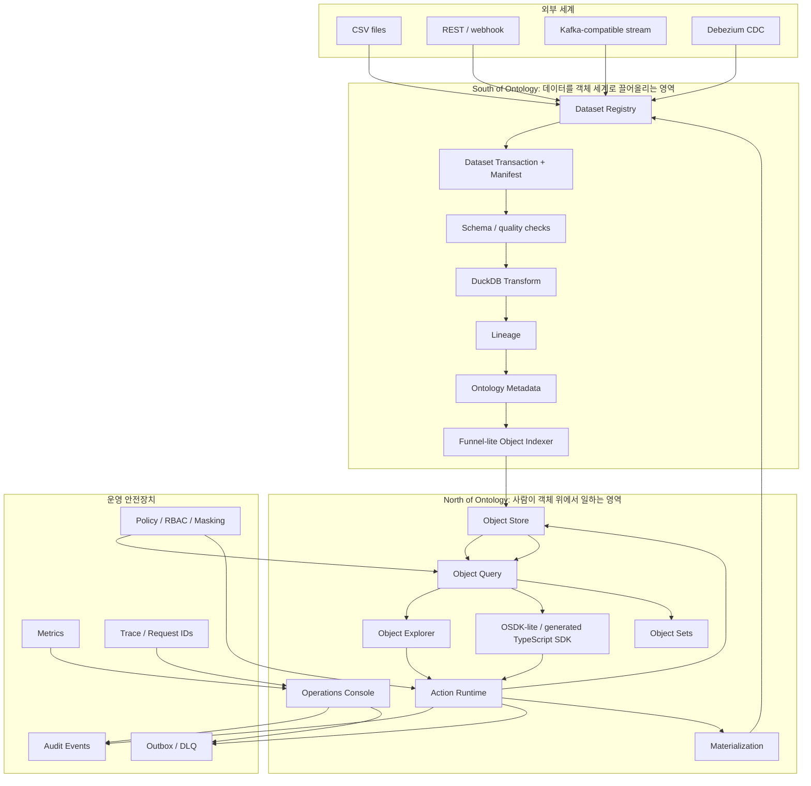

### Control Plane, Data Plane, Event Plane

| Plane         | 쉬운 설명             | 맡는 일                                                                 | 대표 코드                                                                                                              |
| ------------- | --------------------- | ----------------------------------------------------------------------- | ---------------------------------------------------------------------------------------------------------------------- |
| Control Plane | 시스템의 장부와 규칙  | tenant, user, metadata, schema, ontology, run state                     | [libs/foundry_lite/infrastructure/schema.py](libs/foundry_lite/infrastructure/schema.py)                               |
| Data Plane    | 실제 데이터 처리 흐름 | dataset version, storage file, transform output, materialization output | [libs/foundry_lite/application/services/dataset](libs/foundry_lite/application/services/dataset)                       |
| Event Plane   | 변경 사실과 후속 처리 | audit, outbox, DLQ, event replay, operations investigation              | [libs/foundry_lite/application/services/runtime_service.py](libs/foundry_lite/application/services/runtime_service.py) |

## 아키텍처 원칙

### 1. FoundryLite는 얇은 Facade입니다

`FoundryLite`는 모든 일을 직접 하는 거대한 클래스가 아닙니다. 바깥에서는 하나의 안정된 진입점처럼 보이지만, 내부에서는 `datasets`, `transforms`, `ontology`, `objects`, `actions`, `materialization`, `operations`, `demo`라는 작은 창구로 나뉩니다.

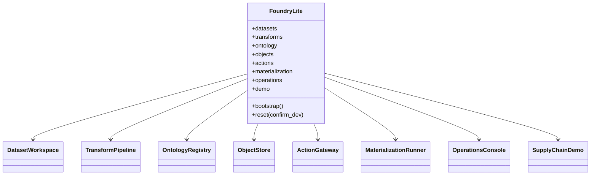

### 2. 실제 일은 Application Service가 합니다

각 service는 직접 쓰는 dependency만 `required_dependencies`에 선언하고, 직접 호출하는 이웃 service만 `required_collaborators`에 선언합니다. 이렇게 하면 "어떤 기능이 어디에 기대고 있는지"가 코드에서 보입니다.

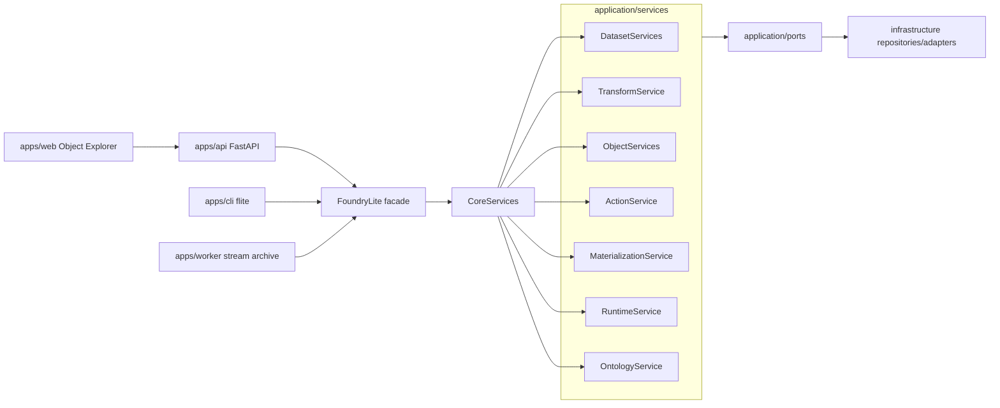

### 3. 핵심 제품 로직은 인프라와 분리됩니다

로컬에서는 SQLite, filesystem, DuckDB를 쓰지만, 핵심 규칙은 특정 장비에 묶이면 안 됩니다. 그래서 storage, metadata, compute, stream, search, workflow, connector, auth는 port/adapter 경계 뒤에 있습니다.

```mermaid
flowchart TB
    subgraph Core["Core product logic"]
        APP["Application Services"]
        DOMAIN["Domain / Policy / Validation"]
    end

    subgraph Ports["Ports: core가 보는 약속"]
        P1["DatasetStorageAdapter"]
        P2["MetadataRepository"]
        P3["ComputeAdapter"]
        P4["StreamAdapter"]
        P5["SearchAdapter"]
        P6["WorkflowAdapter"]
        P7["ConnectorAdapter"]
        P8["AuthProvider"]
    end

    subgraph Local["현재 local/fake 구현"]
        L1["Local filesystem"]
        L2["SQLite / SQLAlchemy"]
        L3["DuckDB"]
        L4["Local/Fake stream"]
        L5["Local/Fake search"]
        L6["Local workflow"]
        L7["Local/Fake connector"]
        L8["Header/Demo auth"]
    end

    subgraph Scale["나중에 교체 가능한 구현"]
        S1["S3 / GCS / Iceberg"]
        S2["PostgreSQL"]
        S3["Spark / Flink"]
        S4["Kafka / Redpanda"]
        S5["Elasticsearch"]
        S6["Temporal"]
        S7["SaaS / REST / CDC connectors"]
        S8["OIDC / SSO"]
    end

    APP --> DOMAIN
    APP --> Ports
    P1 --> L1
    P2 --> L2
    P3 --> L3
    P4 --> L4
    P5 --> L5
    P6 --> L6
    P7 --> L7
    P8 --> L8
    P1 -. future managed storage .-> S1
    P2 -. future catalog operations .-> S2
    P3 -. future cluster operations .-> S3
    P4 -. future orchestration service .-> S4
    P5 -. optional .-> S5
    P6 -. partial product workflow .-> S6
    P7 -. future connector operations .-> S7
    P8 -. future product UI .-> S8
```

### 4. 모든 변경은 추적 가능해야 합니다

Foundry-lite에서 중요한 질문은 "성공했나?"만이 아닙니다. 더 중요한 질문은 "왜 이런 결과가 생겼나?", "어느 요청이 만들었나?", "다시 계산할 수 있나?"입니다.

그래서 주요 변경은 다음 중 하나의 durable record로 남습니다.

| 변경 종류      | 남는 기록                                        | 이유                                    |
| -------------- | ------------------------------------------------ | --------------------------------------- |
| dataset 변경   | dataset transaction, manifest, dataset version   | 어느 원천 데이터와 파일에서 왔는지 추적 |
| transform 실행 | transform run, lineage edge, output version      | 어떤 input version으로 계산했는지 재현  |
| object 변경    | object record version, object edit               | 현재 업무 상태와 과거 변경 구분         |
| action 실행    | action run, request fingerprint, idempotency key | 재시도와 중복 제출 방어                 |
| side effect    | outbox event, DLQ                                | 외부 발행 실패를 복구 가능하게 관리     |
| 운영 실패      | run status, error payload, trace keys            | 운영자가 DB를 직접 열지 않고 조사       |
| 권한 거부      | permission deny audit                            | 보안 실패도 감사 가능하게 기록          |

## 코드 구조

```text
.
├── apps/
│   ├── api/                  # FastAPI HTTP entrypoint
│   ├── cli/                  # flite CLI
│   ├── web/                  # static Object Explorer and browser SDK bundle
│   └── worker/               # stream archive worker entrypoint
├── libs/foundry_lite/
│   ├── application/          # use cases, services, facades, ports
│   ├── domain/               # framework-free context/errors/domain primitives
│   ├── infrastructure/       # SQLAlchemy repositories and concrete adapters
│   ├── observability/        # logging, metrics, tracing
│   └── security/             # policy service and masking rules
├── packages/sdk-ts/          # generated TypeScript SDK package
├── examples/supply-chain-demo/
│   ├── data/                 # orders/customers CSV seed data
│   ├── ontology/             # Order/Customer ontology YAML
│   └── transforms/           # clean_orders, clean_customers, customer_risk SQL
├── examples/media-multimodal-demo/  # real OCR/ASR/video/semantic-search demo
├── scripts/
│   ├── diagnostics/          # runtime diagnostics
│   └── quality/              # static/dynamic quality gates
├── tests/
│   ├── unit/
│   ├── contracts/
│   ├── integration/
│   ├── smoke/
│   └── e2e/
├── infra/
│   ├── docker-compose.dev.yml
│   ├── observability/
│   └── schema_revisions/
└── docs/
```

### 주요 코드 지도

| 궁금한 것                           | 먼저 볼 곳                                                                                                                             |
| ----------------------------------- | -------------------------------------------------------------------------------------------------------------------------------------- |
| 플랫폼 루트                         | [libs/foundry_lite/application/foundry.py](libs/foundry_lite/application/foundry.py)                                                   |
| 서비스 그래프 조립                  | [libs/foundry_lite/application/core_services.py](libs/foundry_lite/application/core_services.py)                                       |
| 의존성 주입 계약                    | [libs/foundry_lite/application/dependencies.py](libs/foundry_lite/application/dependencies.py)                                         |
| 서비스 dependency/collaborator 규칙 | [libs/foundry_lite/application/services/base.py](libs/foundry_lite/application/services/base.py)                                       |
| Dataset use case                    | [libs/foundry_lite/application/services/dataset](libs/foundry_lite/application/services/dataset)                                       |
| Transform use case                  | [libs/foundry_lite/application/services/transform_service.py](libs/foundry_lite/application/services/transform_service.py)             |
| Object query/index/search/set       | [libs/foundry_lite/application/services/object_store](libs/foundry_lite/application/services/object_store)                             |
| Action runtime                      | [libs/foundry_lite/application/services/action_service.py](libs/foundry_lite/application/services/action_service.py)                   |
| Materialization                     | [libs/foundry_lite/application/services/materialization_service.py](libs/foundry_lite/application/services/materialization_service.py) |
| Runtime audit/outbox/operations     | [libs/foundry_lite/application/services/runtime_service.py](libs/foundry_lite/application/services/runtime_service.py)                 |
| 로컬 composition root               | [libs/foundry_lite/infrastructure/local_runtime.py](libs/foundry_lite/infrastructure/local_runtime.py)                                 |
| DB schema                           | [libs/foundry_lite/infrastructure/schema.py](libs/foundry_lite/infrastructure/schema.py)                                               |
| API                                 | [apps/api/foundry_lite_api/main.py](apps/api/foundry_lite_api/main.py)                                                                 |
| CLI                                 | [apps/cli/foundry_lite_cli/main.py](apps/cli/foundry_lite_cli/main.py)                                                                 |
| Worker                              | [apps/worker/foundry_lite_worker/stream_archive.py](apps/worker/foundry_lite_worker/stream_archive.py)                                 |
| SDK generator                       | [scripts/generate_sdk_ts.py](scripts/generate_sdk_ts.py)                                                                               |
| 품질 게이트                         | [scripts/ci_gate.sh](scripts/ci_gate.sh), [scripts/quality](scripts/quality)                                                           |

## 런타임 흐름

### 공급망 데모 시퀀스

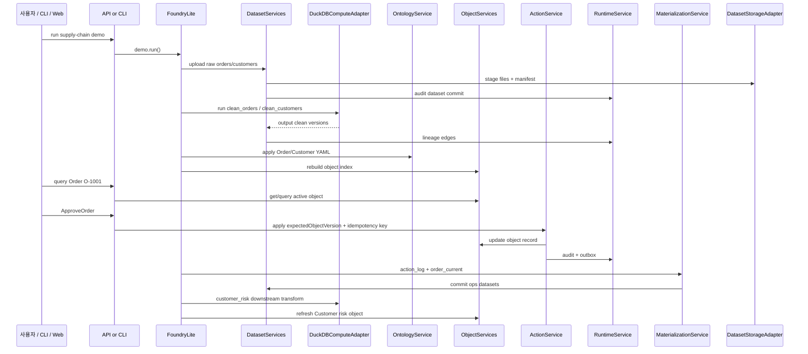

### Dataset transaction 상태

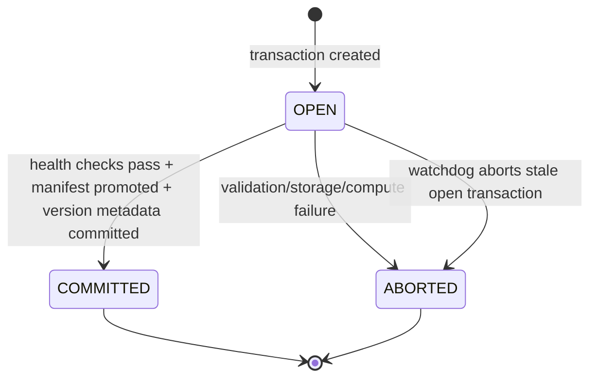

### Action 실행 상태

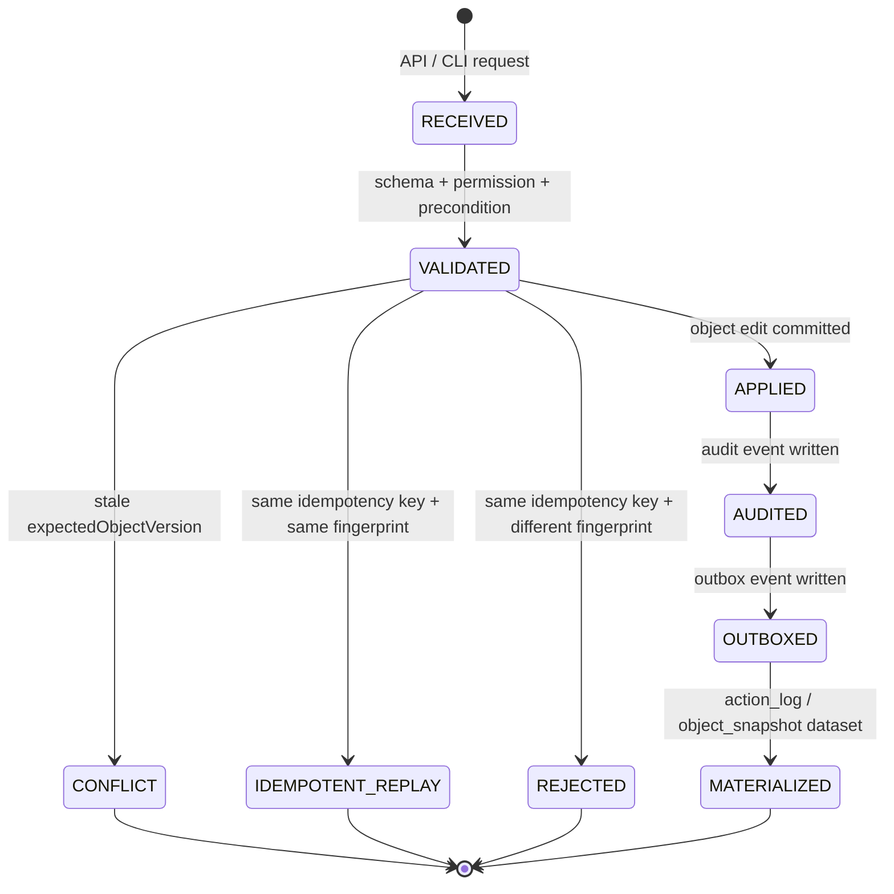

## 도메인 모델

Foundry-lite의 핵심 명사는 아래와 같습니다.

| 개념                | 쉬운 설명                                                      | 예시                                            |
| ------------------- | -------------------------------------------------------------- | ----------------------------------------------- |
| Dataset             | 버전과 이력이 있는 데이터 묶음                                 | `raw.erp_orders`, `clean.orders`                |
| Dataset Version     | 한 번 commit되면 바뀌지 않는 데이터 스냅샷                     | `dataset_version_id`                            |
| Dataset Transaction | 데이터 변경을 `OPEN -> COMMITTED/ABORTED`로 남기는 장부        | CSV upload, transform output                    |
| Transform           | 특정 input version을 읽어 output dataset version을 만드는 계산 | `clean_orders`, `customer_risk`                 |
| Lineage             | 어떤 데이터가 어떤 입력에서 나왔는지 보여주는 연결             | transform input/output edge                     |
| Ontology            | 테이블을 업무 객체로 해석하는 지도                             | `Order`, `Customer`, `OrderCustomer`            |
| Object              | 사용자가 실제로 다루는 업무 대상                               | `Order O-1001`                                  |
| Object Link         | 객체 사이의 관계                                               | `Order -> Customer`                             |
| Object Set          | 저장된 객체 묶음                                               | 승인 대기 주문 목록                             |
| Action              | 객체 위에서 실행되는 typed transaction                         | `ApproveOrder`                                  |
| Audit Event         | 누가 무엇을 바꿨는지 남기는 감사 기록                          | `action.run.succeeded`                          |
| Outbox Event        | 후속 작업을 안전하게 발행하기 위한 이벤트 장부                 | `object.changed`                                |
| Materialization     | 객체/액션 상태를 다시 dataset으로 내보내는 작업                | `ops.action_log`, `ops.order_current`           |
| Run                 | 긴 작업의 상태 기록                                            | sync, transform, index, action, materialization |
| DLQ                 | 실패한 outbox event를 재처리하기 위해 보관하는 곳              | dead letter event                               |

### 핵심 엔티티 관계

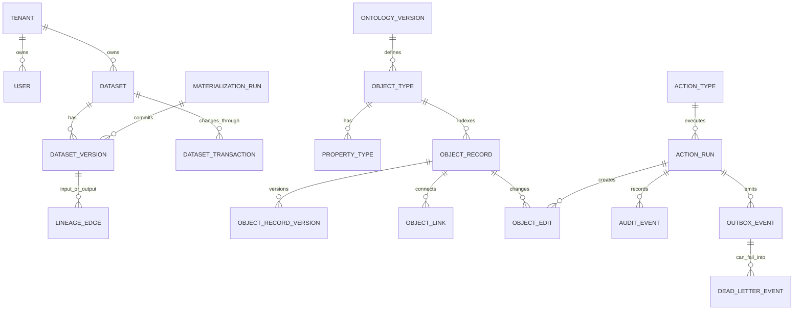

## 포트와 어댑터

Scale Foundation의 핵심은 "지금은 작은 구현으로 돌리되, 제품 규칙을 바꾸지 않고 큰 인프라로 교체할 수 있게 경계를 고정하는 것"입니다.

| Boundary                       | 현재 local/fake 구현                                                                                                             | scale 또는 production 목표                                                                            | contract test                                                                                                 |
| ------------------------------ | -------------------------------------------------------------------------------------------------------------------------------- | ----------------------------------------------------------------------------------------------------- | ------------------------------------------------------------------------------------------------------------- |
| `MetadataRepository`           | SQLAlchemy/SQLite, PostgreSQL contract coverage                                                                                  | PostgreSQL, partitioning, stronger migrations                                                         | `tests/contracts/test_metadata_repository_contract.py`                                                        |
| `DatasetStorageAdapter`        | local filesystem, fake storage URI                                                                                               | S3/GCS/Azure Blob, Iceberg                                                                            | `tests/contracts/test_dataset_storage_adapter_contract.py`                                                    |
| `DatasetRepository`            | SQLAlchemy repositories                                                                                                          | PostgreSQL optimized metadata                                                                         | `tests/contracts/test_dataset_repository_contract.py`                                                         |
| `DatasetTransactionRepository` | SQLAlchemy transaction rows                                                                                                      | stronger transactional DB semantics                                                                   | `tests/contracts/test_dataset_transaction_repository_contract.py`                                             |
| `ComputeAdapter`               | DuckDB, fake compute                                                                                                             | Spark/Flink/Ray-style runners                                                                         | `tests/contracts/test_compute_adapter_contract.py`                                                            |
| `StreamAdapter`                | local/fake stream, Kafka-compatible adapter proof                                                                                | Kafka/Redpanda production profile                                                                     | `tests/contracts/test_stream_adapter_contract.py`                                                             |
| `SearchAdapter`                | local/fake, optional Elasticsearch adapter with live-cluster ratchet                                                             | managed cloud Elasticsearch operations                                                                | `tests/contracts/test_search_adapter_contract.py`                                                             |
| `WorkflowAdapter`              | local/fake workflow                                                                                                              | Temporal                                                                                              | `tests/contracts/test_workflow_adapter_contract.py`                                                           |
| `ConnectorAdapter`             | local/fake, REST adapter, Debezium wrapper proof                                                                                 | SaaS connectors, durable registry, retry workers                                                      | `tests/contracts/test_connector_adapter_contract.py`                                                          |
| `AuthProvider`                 | header trust/demo profiles, local JWT/OIDC discovery/JWKS human and M2M service-account verification, local revoked-JWT denylist | live OIDC discovery, SSO policy, IdP introspection/refresh-token revocation, service-account registry | `tests/contracts/test_auth_provider_contract.py`                                                              |
| `SecretProvider`               | local env adapter, webhook signing key lookup, REST connector secretRef re-resolution, redacted evidence                         | cloud/Vault secret manager, previous/current dual-read, full rotation lifecycle                       | `tests/contracts/test_secret_provider_contract.py`; `tests/contracts/test_rest_connector_adapter_contract.py` |
| `RuntimeRepository`            | SQLAlchemy audit/outbox/lineage/run rows                                                                                         | partitioned audit/outbox, event publisher state                                                       | `tests/contracts/test_runtime_repository_contract.py`                                                         |
| `ObjectReadRepository`         | SQLAlchemy object query/link reads                                                                                               | Postgres JSONB/read indexes                                                                           | `tests/contracts/test_object_read_repository_contract.py`                                                     |
| `ObjectIndexRepository`        | SQLAlchemy index writes/shadow pointer                                                                                           | large index build/promotion path                                                                      | `tests/contracts/test_object_index_repository_contract.py`                                                    |
| `ActionRepository`             | SQLAlchemy action/writeback/object edit writes                                                                                   | stronger concurrency and writeback proof                                                              | `tests/contracts/test_action_repository_contract.py`                                                          |

### Adapter failure contract

모든 adapter는 단순히 "실패했습니다"가 아니라 아래 정보를 잃지 않아야 합니다.

| 실패 정보                          | 왜 필요한가                                           |
| ---------------------------------- | ----------------------------------------------------- |
| failure kind                       | validation, timeout, unavailable, not found 등을 구분 |
| retryable 여부                     | 재시도하면 되는지, 사용자 수정이 필요한지 판단        |
| timeout seconds                    | 운영자가 어느 정도 기다려야 하는지 판단               |
| idempotency key 필요 여부          | 재시도 중 중복 write 방지                             |
| operator message                   | 운영자가 로그 없이도 다음 행동을 이해                 |
| request/tenant/run/correlation key | 실패 위치를 audit, trace, run table로 연결            |

## API, CLI, Web, SDK

### FastAPI

대표 endpoint:

| Method | Path                                                        | 용도                                                 |
| ------ | ----------------------------------------------------------- | ---------------------------------------------------- |
| `GET`  | `/healthz`                                                  | API health check                                     |
| `GET`  | `/metrics`                                                  | Prometheus metrics                                   |
| `GET`  | `/api/datasets/{namespace}/{name}/preview`                  | dataset preview                                      |
| `GET`  | `/api/datasets/{namespace}/{name}/versions`                 | committed dataset versions                           |
| `POST` | `/api/ontology/validate`                                    | ontology YAML validation without activation          |
| `GET`  | `/api/objects/{object_type}/{object_id}`                    | object detail, optional source explanation           |
| `GET`  | `/api/objects/{object_type}/{object_id}/links/{link_type}`  | object link traversal, for example Order to Customer |
| `POST` | `/api/objects/{object_type}/query`                          | filter/sort/page/search object query                 |
| `GET`  | `/api/object-sets`                                          | object set list                                      |
| `POST` | `/api/object-sets`                                          | static/dynamic object set create                     |
| `GET`  | `/api/operations/runs`                                      | operations run list                                  |
| `GET`  | `/api/operations/runs/{run_type}/{run_id}`                  | run detail and investigation                         |
| `POST` | `/api/operations/runs/transform/{run_id}/retry`             | failed transform retry                               |
| `POST` | `/api/operations/index/{object_type}/replay`                | object index replay                                  |
| `POST` | `/api/operations/dead-letter-events/{event_id}/retry`       | DLQ retry                                            |
| `POST` | `/api/connectors/webhooks/{connector_name}/{resource_name}` | signed webhook ingest                                |
| `POST` | `/api/actions/{action_type}/apply`                          | action execution                                     |

### CLI

`flite`는 사람이 직접 실행하는 운영/개발 명령입니다.

```bash
flite demo run-supply-chain
flite dataset preview raw.erp_orders
flite object get Order O-1001 --explain
flite action apply ApproveOrder --object Order/O-1001 --param reason='Inventory confirmed'
flite operations runs --status failed
flite operations run transform <run-id>
flite transform retry <transform-run-id>
flite index replay Order
flite outbox retry <dead-letter-event-id>
```

### Web

`apps/web`는 정적 Object Explorer입니다. 현재는 full SPA framework보다 가볍게 구성되어 있으며, API와 generated browser SDK를 통해 object load, action apply, object set, operations panel을 다룹니다.

```bash
pnpm dev
pnpm web:static
```

### TypeScript SDK

Ontology에서 TypeScript SDK를 생성합니다.

```bash
pnpm sdk:generate
```

생성 결과:

| 출력                                                                 | 용도                                  |
| -------------------------------------------------------------------- | ------------------------------------- |
| [packages/sdk-ts/src/generated.ts](packages/sdk-ts/src/generated.ts) | 패키지용 generated SDK                |
| [apps/web/generated-sdk.js](apps/web/generated-sdk.js)               | 브라우저 Object Explorer용 SDK bundle |

SDK는 object get/query, typed action apply payload, idempotency key helper, expected object version helper를 제공합니다.

## 운영과 관측성

Foundry-lite는 운영 중 문제가 생겼을 때 아래 키로 이어서 추적하도록 설계되어 있습니다.

| Trace Key                                    | 의미                                 |
| -------------------------------------------- | ------------------------------------ |
| `request_id`                                 | API/CLI 요청 하나를 따라가기 위한 ID |
| `tenant_id`                                  | 어떤 tenant의 데이터인지             |
| `actor_user_id`                              | 어떤 사용자가 실행했는지             |
| `dataset_version_id`                         | 어떤 데이터 버전이 input/output인지  |
| `transform_run_id`                           | 어떤 transform 실행인지              |
| `index_run_id`                               | 어떤 object indexing 실행인지        |
| `action_run_id`                              | 어떤 action 실행인지                 |
| `materialization_run_id`                     | 어떤 materialization 실행인지        |
| `object_type`, `object_id`, `object_version` | 어떤 업무 객체가 바뀌었는지          |
| `correlation_id`                             | 여러 작업을 하나의 흐름으로 묶는 ID  |

### Observability stack

```bash
docker compose -f infra/docker-compose.dev.yml up -d prometheus tempo grafana
OTEL_EXPORTER_OTLP_ENDPOINT=http://127.0.0.1:4318/v1/traces pnpm dev
```

| 도구                | 역할                                                                                 |
| ------------------- | ------------------------------------------------------------------------------------ |
| OpenTelemetry       | 요청, service, DB span을 하나의 trace로 연결                                         |
| Prometheus          | dataset commit, transform, action, query, outbox lag, failed run, DLQ size 지표 수집 |
| Grafana             | 로컬 dashboard 확인                                                                  |
| Tempo               | distributed trace 저장                                                               |
| Runtime diagnostics | faulthandler, tracemalloc, cProfile, warnings 수집                                   |

```bash
pnpm diagnostics
pnpm diagnostics:trace
```

주요 산출물:

```text
artifacts/diagnostics/runtime_diagnostics.json
artifacts/diagnostics/demo_profile.pstats
artifacts/diagnostics/demo_profile_top.txt
artifacts/diagnostics/faulthandler.log
artifacts/quality/*.json
artifacts/demo/supply-chain.json
```

## 품질 게이트

Foundry-lite는 "기능이 돌아간다"만으로 완료로 보지 않습니다. 데이터 정합성, 감사 가능성, 회귀 방지, 레이어 경계를 함께 봅니다.

```mermaid
flowchart TB
    LOCAL["local: pnpm ci:gate"] --> LOCAL_STATIC["full static invariants"]
    LOCAL --> IMPACT["Tach impact-scoped pytest"]
    FULL_LOCAL["local: pnpm ci:gate:all"] --> SERIAL["same release lanes, serial order"]

    PR["GitHub PR / push"] --> STATIC["quality-static"]
    PR --> COVERAGE["quality-coverage"]
    PR --> FLAKY["quality-flaky"]
    PR --> RUNTIME["quality-runtime"]
    PR --> E2E["quality-e2e"]

    STATIC --> TYPES["ruff + mypy + pyright"]
    STATIC --> ARCH["architecture/import/service DAG gates"]
    STATIC --> CONTRACT["port/repository/adapter contract presence"]
    STATIC --> SECURITY["Bandit + Semgrep + gitleaks + pip-audit"]
    COVERAGE --> UNIT["unit + integration + smoke tests"]
    COVERAGE --> COVERAGE_FLOORS["95% branch + tier/public API coverage"]
    FLAKY --> REPEAT["3 repeated random + xdist pytest runs"]
    RUNTIME --> RUNTIME_PROOFS["runtime correctness gates"]
    E2E --> BROWSER["Playwright browser E2E"]

    TYPES --> AGG["quality-gate aggregate"]
    ARCH --> AGG
    CONTRACT --> AGG
    SECURITY --> AGG
    UNIT --> AGG
    COVERAGE_FLOORS --> AGG
    REPEAT --> AGG
    RUNTIME_PROOFS --> AGG
    BROWSER --> AGG
    AGG --> REPORT["artifacts/quality reports"]

    STATIC --> G1["router purity"]
    STATIC --> G2["audit on mutation"]
    STATIC --> G3["function length <= 40"]
    STATIC --> G4["dict[str, Any] budget"]
    STATIC --> G5["log trace keys"]
    STATIC --> G6["no pragma no cover"]
    STATIC --> G7["error response request_id"]
    STATIC --> G8["tier coverage"]
    STATIC --> G9["infra ratchet"]
    RUNTIME --> R1["audit count"]
    RUNTIME --> R2["outbox consistency"]
    RUNTIME --> R3["OpenLineage"]
    RUNTIME --> R4["trace continuity"]
    RUNTIME --> R5["failed mutation state"]
```

로컬의 `pnpm ci:gate`는 정적 불변식과 Tach impact-scoped pytest로 빠르게 피드백을 준다. 전체 release evidence를 한 번에 확인해야 하면 `pnpm ci:gate:all`을 사용한다. GitHub Actions에서는 같은 스크립트를 `static`, `coverage`, `flaky`, `runtime`, `e2e` lane으로 나누어 동시에 실행하고, 마지막 `quality-gate` aggregate job이 모든 lane의 성공을 확인한다. 즉, branch protection이 보는 required check 이름은 유지하면서도 검사 강도는 낮추지 않는다.

### 대표 gate

| Gate                                                                     | 막는 문제                                                                                                                                                                                                                                                       |
| ------------------------------------------------------------------------ | --------------------------------------------------------------------------------------------------------------------------------------------------------------------------------------------------------------------------------------------------------------- |
| `check_infra_import_boundary.py`                                         | application/domain이 concrete infra SDK에 묶이는 문제                                                                                                                                                                                                           |
| `check_service_dependencies.py`                                          | service가 선언하지 않은 dependency/collaborator에 숨어 기대는 문제                                                                                                                                                                                              |
| `check_service_call_graph.py`                                            | service collaborator graph cycle/depth/fan-out 회귀                                                                                                                                                                                                             |
| `check_application_module_size.py`                                       | application module이 다시 god file로 커지는 문제                                                                                                                                                                                                                |
| `check_function_length.py`                                               | 40줄 초과 application 함수 재도입                                                                                                                                                                                                                               |
| `check_application_any_budget.py`                                        | application/app boundary에 broad `Any` 재도입                                                                                                                                                                                                                   |
| `check_router_layer_purity.py`                                           | API router가 repository/DB transaction 직접 접근                                                                                                                                                                                                                |
| `check_query_side_effects.py`                                            | 조회 함수가 상태를 바꾸는 문제                                                                                                                                                                                                                                  |
| `check_repository_no_business.py`                                        | repository가 business rule을 판단하는 문제                                                                                                                                                                                                                      |
| `check_tenant_write_guard.py`                                            | tenant-scoped write가 tenant guard 없이 실행되는 문제                                                                                                                                                                                                           |
| `check_contract_test_per_port.py`                                        | port/interface에 contract test가 없는 문제                                                                                                                                                                                                                      |
| `check_integration_scenario_markers.py`                                  | 필수 MVP 통합 시나리오 7개 누락                                                                                                                                                                                                                                 |
| `check_regression_test_per_bugfix.py`                                    | bugfix가 회귀 테스트 없이 들어오는 문제                                                                                                                                                                                                                         |
| `check_pr_root_cause_section.py`                                         | PR이 원인/영향/회귀 방지를 설명하지 않는 문제                                                                                                                                                                                                                   |
| `check_doc_drift.py`                                                     | repo 문서의 코드 경로/package script/API route/pytest node id/Markdown link·anchor/current-state 심볼이 실제 코드·문서와 어긋나는 문제                                                                                                                          |
| `check_evidence_ledger_commands.py`                                      | sprint evidence ledger의 proof command가 실제 package script/file/test를 가리키지 않는 문제                                                                                                                                                                     |
| `check_documentation_map.py` / `quality:documentation-map`               | 문서 지도, doc-drift scan coverage, Document Roles MECE bucket, source-of-truth rules, core 운영 문서 상단 맥락, Update Order, README 문서 링크/설명/중복, README 대표 gate 필수 항목/설명/중복, cross-check command, AGENTS gate briefing이 서로 어긋나는 문제 |
| `check_checklist_evidence.py`                                            | tricky failure checklist의 `[x] test_*` 완료 증거가 실제 pytest 수집 결과와 어긋나는 문제                                                                                                                                                                       |
| `check_infra_tricky_matrix.py`                                           | active 인프라/조합 stack이 관련 tricky 항목, proof class, pytest, CI command를 빠뜨리는 문제                                                                                                                                                                    |
| `quality:proof-matrix`                                                   | infra tricky matrix의 proof class가 실제 pytest/CI proof 없이 문서에만 남는 문제                                                                                                                                                                                |
| `quality:source-of-truth`                                                | source-of-truth 불변식이 enforced test 또는 deferred risk record 없이 선언만 되는 문제                                                                                                                                                                          |
| `quality:operator-evidence`                                              | 실패 원인이 로그에만 남고 run/audit/transaction/error payload 같은 durable evidence에 남지 않는 문제                                                                                                                                                            |
| `check_semantic_doc_consistency.py`                                      | active-covered 인프라를 범위 설명 없이 future로 되돌려 쓰는 문서 drift                                                                                                                                                                                          |
| `check_data_pattern_matrix.py`                                           | 데이터 엔지니어링 패턴 gap이 owner/reason/future test 없이 사라지는 문제                                                                                                                                                                                        |
| `check_data_platform_sprint_status.py`                                   | S46-S64 스프린트 상태가 sprint plan/sprint breakdown/README/status 문서 사이에서 어긋나는 문제                                                                                                                                                                  |
| `check_frontend_backend_surface.py` / `quality:frontend-backend-surface` | FastAPI route, frontend surface matrix, generated SDK, Web named-SDK 호출이 서로 어긋나는 문제                                                                                                                                                                  |
| `quality:sdk-request-contract`                                           | browser SDK method/path/query/header/body/idempotency 계약이 frontend API matrix와 어긋나는 문제                                                                                                                                                                |
| `quality:frontend-foundation`                                            | 프론트엔드 request helper, typed error, retry/idempotency helper, Web Operations SDK-only 호출 회귀                                                                                                                                                             |
| `check_schema_revision_guard.py`                                         | schema.py 변경이 revision snapshot 없이 들어오는 문제                                                                                                                                                                                                           |
| `check_idempotency_on_action.py`                                         | action idempotency contract 회귀                                                                                                                                                                                                                                |
| `check_metrics_exposed.py`                                               | 필수 운영 metrics 누락                                                                                                                                                                                                                                          |
| `check_flaky_detector.py`                                                | 반복 실행에서 흔들리는 test suite                                                                                                                                                                                                                               |
| `check_infra_ratchet.py`                                                 | 인프라를 한 번에 하나씩 추가하고 실패/동시성/재시도/부분 성공/복구/운영 증거를 문서·CI에 고정하지 않는 문제                                                                                                                                                     |
| `quality:s3-storage`                                                     | MinIO/S3 storage adapter가 정상 경로만 통과하고 multipart 실패, retry, cleanup, operator evidence를 놓치는 문제                                                                                                                                                 |

### Infra Ratchet

새 인프라는 한 번에 하나씩만 추가한다. 각 인프라는 adapter contract, normal path,
failure injection, concurrency race, retry/idempotency, partial success,
recovery cleanup, operator evidence, docs sync를 모두 갖춘 뒤에야 다음 인프라로
넘어간다. 이 규율은 [docs/infra-ratchet.md](docs/infra-ratchet.md)에 정의되어
있고, `check_infra_ratchet.py`가 README, implementation status, tricky failure
checklist, commit-point risk register, `package.json`, `ci_gate.sh` 연결을 static
lane에서 검사한다. `check_checklist_evidence.py`도 static lane에 포함되어
체크리스트의 `[x] test_*` 증거명이 실제 pytest collection에 없으면 CI를
실패시킨다. `check_infra_tricky_matrix.py`는
`docs/infra-tricky-matrix.json`을 읽어 active 인프라와 조합 stack이 관련
tricky 항목을 proof class, collectable pytest test, CI command로 끌고 왔는지
검사한다.

첫 active ratchet은 MinIO-backed `S3DatasetStorageAdapter`다. `quality:s3-storage`
는 MinIO/Testcontainers 위에서 S3 adapter contract, partial multipart timeout,
storage-success/DB-failure split brain, committed manifest missing, abort cleanup,
concurrent version-prefix writes, retry-after-timeout, failed-run adapter evidence를
검사한다. 따라서 다음 인프라인 Iceberg는 S3-compatible storage semantics 위에서만
진행한다.

### 필수 통합 시나리오

품질 게이트는 아래 7개 MVP release 시나리오가 pytest marker로 존재하는지 확인합니다.

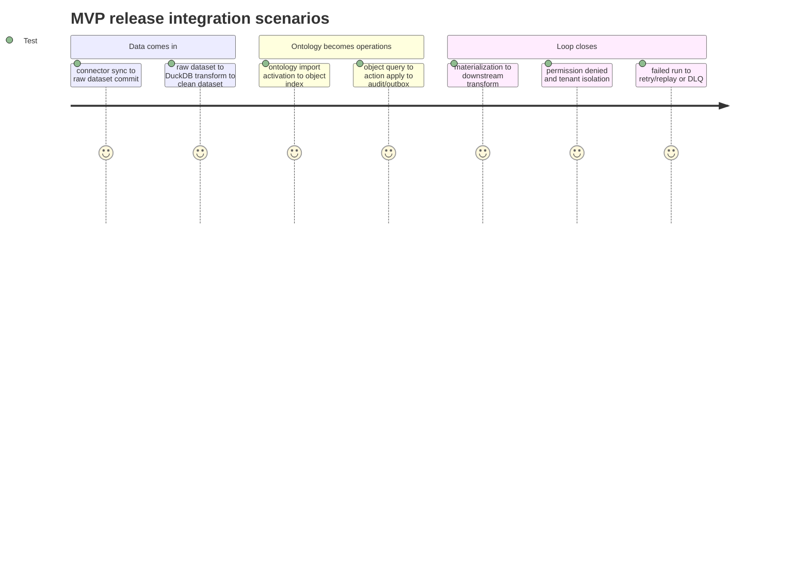

## 보안과 거버넌스

Foundry-lite의 보안 목표는 v1에서 모든 enterprise security를 끝내는 것이 아니라, **tenant isolation, role-based permission, property masking, audit-all-writes**를 일관되게 적용하는 것입니다.

| 영역                  | 현재 원칙                                                                                                    |
| --------------------- | ------------------------------------------------------------------------------------------------------------ |
| Tenant isolation      | application query/write boundary와 PostgreSQL RLS contract proof에서 tenant 분리                             |
| Auth                  | `AuthProvider` port, local/demo/header profile, production runtime에서 unsafe profile 차단                   |
| RBAC                  | `admin`, `data_engineer`, `ops_manager`, `viewer`, `finance` role matrix                                     |
| Permission checkpoint | dataset/object read, dataset write, ontology activation, action execution, materialization, operations retry |
| Property masking      | Order margin 같은 민감 property를 non-finance/non-admin에게 숨김                                             |
| Audit                 | mutation, permission deny, action conflict 등 durable audit evidence                                         |
| Request trace         | API error response와 log/audit/run payload에 `request_id` 유지                                               |

### 보안 흐름

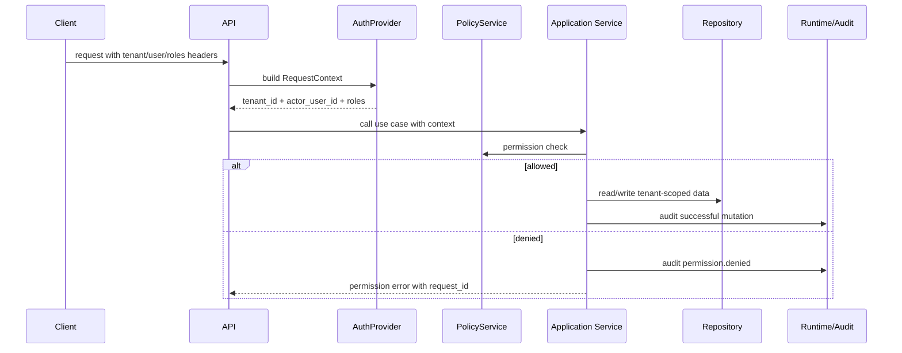

## 로드맵

Sprint 00-36은 MVP core, Sprint 02A는 scale-ready foundation, Sprint 36A는 MVP 운영 안정성 보강입니다. Sprint 37-42는 REST/Webhook, stream archive, Debezium CDC, CDC object indexing, shadow reindex, Elasticsearch-compatible search projection proof입니다. 이후 infra ratchet은 S3/MinIO, Iceberg-on-S3, Spark compute, Temporal workflow adapter, Elasticsearch live proof, 그리고 S3+Iceberg+Spark+CDC 조합까지 active-covered입니다.

S46-S64 데이터 플랫폼 확장 로드맵은 현재 브랜치에서 부분 구현 중입니다. S52는 `ConnectorSyncWorkflow`의 Operations/API/SDK 시작·조회, Temporal profile audit-link proof, worker-bound local connector snapshot commit proof, S53은 simulated writeback `outcome_unknown`/`compensation_required`/idempotent replay proof, real S3/MinIO external writeback timeout/landed-write/`remote_lookup` proof, operator-provided remote-success reconciliation resolve proof, sensitive writeback audit masking proof, S54는 dataset quality check result의 schema-version reference, historical run pinning, checked candidate fingerprint, `PASS`/`WARN`/commit-time `BLOCK_COMMIT`, row-level `QUARANTINE` Record DLQ proof, Operations run detail의 transaction-scoped quality report와 failed-row sample evidence, persisted quality contract check definition create/list/update API/SDK, subsequent commit enforcement proof, quality result history and summary API/SDK proof, S55는 Alembic migration single-head/forward-fix safety gate, singleton migration runner gate, expand-contract phase guard, failed-migration operator evidence, Dataset schema evolution impact/backfill-skeleton evidence, Ontology migration activation guard/object reindex plan/generated SDK compatibility evidence, S56은 read-only observability detector report, missing-data/lag/skew/SLO evidence, API/SDK detect surface, runtime gate wiring, S57은 backup/restore preflight report, committed manifest/data-file validation, DB/storage mismatch `blocked` issue, active index pointer/high-watermark/search rebuild marker evidence, restore-mode start/status, idempotent same-restore replay, serving traffic closed status, outbox retry/reprocess lockout, and post-restore closed-loop evidence 후 `resume_approved` approval path를 포함합니다.

S58A의 현재 slice는 `JwtOidcAuthProvider`와 `SecretProvider`/`EnvSecretProvider`, `quality:auth-secrets`로 local discovery/JWKS 기반 human/M2M bearer-token 검증, tenant-scoped service-account mapping, local revoked-JWT denylist, JWKS refresh-on-unknown-`kid`, 웹훅 서명키 provider lookup, REST connector secretRef 재조회, secret evidence/error redaction을 증명하는 범위입니다. S58B의 현재 slice는 `PrivacyTransformPlan`, `PrivacyFieldRule`, `PrivacyReplicationPolicy`, `PrivacyDatasetRef`, `InMemoryProtectedPrivacyMappingStore`, `transform_privacy_rows`, `build_privacy_openlineage_event`, `quality:privacy`로 tenant-scoped pseudonym, basic anonymization, local text PII redaction, protected in-memory reversible mapping proof, production-to-nonprod replication policy proof, replayable privacy lineage, raw-value-free OpenLineage-compatible privacy event artifact를 증명하는 범위입니다. S58C의 현재 slice는 `ErasureRequest`, `ErasureRetentionPolicy`, `resolve_erasure_subject`, `ErasureManifest`, `is_erased_resource`, `quality:erasure`로 raw subject-free deletion request evidence, tenant-scoped subject resolution, idempotent erasure manifest, backup-retention pending state, audit-minimization action, search rebuild exclusion proof를 증명하는 범위입니다.

S60의 현재 slice는 object explain `propertyLineage`, `EvidenceReference`, `EvidenceSourceSpan`, `build_insight_claim_payload`, `build_llm_extraction_evidence`, `revise_evidence_reference`, `quality:ai-evidence`로 property-level source coordinates, evidence-object-required insight claim, model/prompt/extractor version-pinned LLM evidence, immutable evidence revision, masked source-span redaction을 증명하는 범위입니다. S61의 현재 slice는 generated SDK의 `FoundryLiteApiError`, `createRequestId`, `requestContextHeaders`, `retryWithBackoff`, `collectCursorPages`, `createInFlightActionLock`, `actionLockKey`, `classifyFoundryLiteError`, `requiresIdempotencyKey` surface의 caller-supplied `idempotencyKey`/`MISSING_IDEMPOTENCY_KEY` fail-fast, named SDK namespaces, ontology catalog, dataset list/versions/preview/inspect/qualityChecks/qualityResults, media content search/processing run list/detail, operations lineage get, Iceberg maintenance `planReadOnly`/`plan`, AIP Builder validate/run, AIP Agent run, `docs/frontend-api-sdk-surface-matrix.json`의 route/helper proofClass/request-contract mapping, `tests/sdk/request_contract.mjs`의 57개 browser SDK method/path/query/header/body/typed-error proof와 12개 SDK helper-runtime proof, Web Operations의 named SDK-only 호출, request id/error/retryability 표시, `quality:frontend-backend-surface`, `quality:sdk-request-contract`, `quality:frontend-foundation`을 증명하는 범위입니다.

S62의 현재 backend/API/SDK slice는 `GET /api/datasets`, `GET /api/datasets/{namespace}/{name}/versions`, `GET /api/datasets/{namespace}/{name}/preview`, `GET /api/datasets/{namespace}/{name}/inspect`, `GET /api/operations/lineage?resourceId=...`, generated `client.datasets.list/versions/preview/inspect(...)`, and `client.operations.lineage.get(...)`로 Dataset Explorer가 catalog에서 시작해 committed version/schema/manifest evidence를 inspect하고 lineage로 이동할 수 있게 하는 범위입니다. Visual dataset browser, preview grid, version pinning UX, and lineage graph navigation은 아직 future입니다.

S63의 현재 backend/API/SDK slice는 `insight_reviews` 테이블, `foundry.insights` facade, `GET/POST /api/insights/reviews`, `GET /api/insights/reviews/{review_id}`, `POST /api/insights/reviews/{review_id}/assign`, `POST /api/insights/reviews/{review_id}/decision`, generated `client.insights.reviews.list/create/get/assign/decide(...)`, create/assign/decision `Idempotency-Key`, terminal decision conflict, and `insight_review.created`, `insight_review.assigned`, `insight_review.approved`, `insight_review.rejected` audit evidence를 포함합니다. 이 slice는 프론트가 Insight/Action Workspace를 만들 때 raw API를 새로 조립하지 않고 named SDK와 audit-backed backend contract에 붙을 수 있게 하는 범위입니다.

S64의 현재 backend/API/SDK slice는 `GET /api/operations/recovery/overview`, `foundry.operations.recovery_overview(...)`, generated `client.operations.backupRestore.recoveryOverview()`, and `quality:operations-recovery`로 latest preflight summary, active restore-mode traffic gate, latest restore status, and required operator next actions를 한 read model로 묶는 범위입니다. 이는 Operations/Recovery Console 화면 전체가 아니라, 복구 화면이 raw logs/DB를 열지 않고 S57 restore evidence를 읽을 수 있게 하는 첫 backend contract입니다. Run console UI, recovery dashboard, alert timeline, workflow cancel/reconcile executor는 아직 future입니다.

Sprint 45의 Kubernetes 운영 패키지, full backup artifact creation, platform-wide restore-mode traffic gate, real publisher pause/resume executor, automatic restore smoke execution, live OIDC discovery/JWKS polling, IdP introspection/refresh-token revocation, service-account registry, cloud/Vault secret manager, full connector workflow credential refresh, durable environment replication workflow, production protected-mapping backend, runtime DB/outbox/OpenLineage transport integration, durable erasure request workflow/executors, durable AI evidence table, real LLM extraction executor, insight evidence viewer UI, model diff UI, S61 full login/session UI, screen-specific retry/backoff UX, visual cursor pagination UX, duplicate-click button state UX, stale-version compare/refresh UI, permission-denied masking UX, full catalog-driven workspace UX, S62 visual dataset browser/preview grid/version pin/lineage graph UX, S63 evidence panel UI, S63 action execution orchestration, 나머지 데이터 플랫폼 확장 로드맵은 아직 post-MVP 계획입니다.

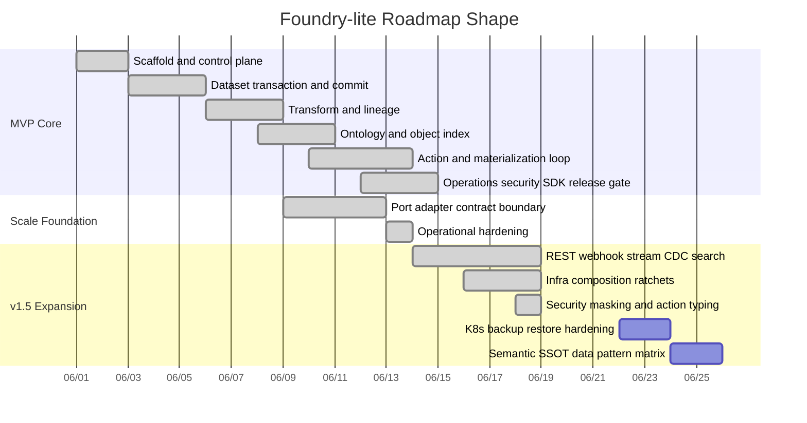

> 위 Gantt는 이해를 돕기 위한 roadmap shape입니다. 실제 완료 증거는 [docs/sprint-evidence-ledger.md](docs/sprint-evidence-ledger.md), 현재 구현 상태는 [docs/implementation-status.md](docs/implementation-status.md)를 따릅니다.

### 현재 남은 큰 목표

| 목표                                        | 상태                                                                                                                                                                                                                                                                                                                                                                                                                                                                                                                                                                                                                                                                                                                                                                                                                                                                                                                                                                                                                                                                                                                                                                                                                                                                                                                                                                                                                                                                                                    |
| ------------------------------------------- | ------------------------------------------------------------------------------------------------------------------------------------------------------------------------------------------------------------------------------------------------------------------------------------------------------------------------------------------------------------------------------------------------------------------------------------------------------------------------------------------------------------------------------------------------------------------------------------------------------------------------------------------------------------------------------------------------------------------------------------------------------------------------------------------------------------------------------------------------------------------------------------------------------------------------------------------------------------------------------------------------------------------------------------------------------------------------------------------------------------------------------------------------------------------------------------------------------------------------------------------------------------------------------------------------------------------------------------------------------------------------------------------------------------------------------------------------------------------------------------------------------- |
| PostgreSQL JSONB production object store    | 목표, 현재 local SQLite/SQLAlchemy 중심                                                                                                                                                                                                                                                                                                                                                                                                                                                                                                                                                                                                                                                                                                                                                                                                                                                                                                                                                                                                                                                                                                                                                                                                                                                                                                                                                                                                                                                                 |
| Alembic migration operations                | 부분 구현, baseline migration + metadata parity test와 S55 `quality:schema-migrations` single-head/forward-fix downgrade safety gate는 active. 같은 gate는 `migration_phase`와 `release_compatibility`를 요구하고 expand 단계의 destructive operation, 기본값 없는 NOT NULL 컬럼, phase/window mismatch, 준비 안 된 contract cleanup을 차단한다. `db:migrate` 전용 runner와 `quality:schema-migration-runner`는 DB-level singleton lock으로 동시 migration job 중 하나만 실행되게 막고, `quality:schema-migration-runner-live`는 live PostgreSQL advisory-lock contention에서 한 runner만 migration callback을 실행하고 다른 runner는 `lock_busy` evidence를 남기는지 검증한다. Full old/new app compatibility window, multi-step upgrade/rollback 운영 runbook은 목표                                                                                                                                                                                                                                                                                                                                                                                                                                                                                                                                                                                                                                                                                                                                                                                                                      |
| Managed Temporal worker operations          | adapter/time-skipping ratchet, S52 connector-sync control-plane proof, worker-bound local connector snapshot commit proof는 active, managed worker 운영 배포/cancellation/reconciliation/workflow upgrade replay/production connector packaging은 목표                                                                                                                                                                                                                                                                                                                                                                                                                                                                                                                                                                                                                                                                                                                                                                                                                                                                                                                                                                                                                                                                                                                                                                                                                                                                                                                                                             |
| Real CEL/JSON Logic evaluator               | 목표, 현재 safeExpression subset                                                                                                                                                                                                                                                                                                                                                                                                                                                                                                                                                                                                                                                                                                                                                                                                                                                                                                                                                                                                                                                                                                                                                                                                                                                                                                                                                                                                                                                                        |
| Real S3/MinIO external writeback            | 부분 구현, 현재 mock/local proof와 S53 outcome-unknown/compensation-required idempotent replay, real S3/MinIO timeout/landed-write/remote-lookup proof, unresolved writeback backend/API/SDK queue, operator-provided reconciliation resolve, sensitive writeback masking proof가 active. ERP/webhook-specific connector packaging, autonomous compensation worker, queue UI, and approval UI are future                                                                                                                                                                                                                                                                                                                                                                                                                                                                                                                                                                                                                                                                                                                                                                                                                                                                                                                                                                                                                                                                                                                                                        |
| Production connector registry/retry workers | 목표                                                                                                                                                                                                                                                                                                                                                                                                                                                                                                                                                                                                                                                                                                                                                                                                                                                                                                                                                                                                                                                                                                                                                                                                                                                                                                                                                                                                                                                                                                    |
| Managed Elasticsearch deployment            | live Testcontainers ratchet은 active-covered, managed cloud packaging은 목표                                                                                                                                                                                                                                                                                                                                                                                                                                                                                                                                                                                                                                                                                                                                                                                                                                                                                                                                                                                                                                                                                                                                                                                                                                                                                                                                                                                                                            |
| Continuously running CDC/search workers     | 부분 구현, S51 bounded stream archive loop와 stop callback proof는 active, CDC object-indexer daemon/rebalance fencing/search worker 운영화는 목표                                                                                                                                                                                                                                                                                                                                                                                                                                                                                                                                                                                                                                                                                                                                                                                                                                                                                                                                                                                                                                                                                                                                                                                                                                                                                                                                                      |
| Record DLQ replay                           | 부분 구현, S47 stream CDC quarantine, Operations API/typed SDK, 유효 payload 실제 replay executor/result, Web Operations UI, source-side threshold, identity/ordering fail-closed, concurrent replay proof는 active, transform-level DLQ policy는 목표                                                                                                                                                                                                                                                                                                                                                                                                                                                                                                                                                                                                                                                                                                                                                                                                                                                                                                                                                                                                                                                                                                                                                                                                                                                  |
| Late data and watermark policy              | 부분 구현, S48 stream/source archive 시간 모델, named timezone override, too-late Record DLQ, partition/source-safe monotonic watermark metadata, committed late-event duplicate delivery idempotency, run-detail lateData reprocessing evidence, materialization watermark/reopen detail, object/materialization late-data badge, downstream impact graph, stale late-delete guard는 active, transform-level DLQ policy는 목표                                                                                                                                                                                                                                                                                                                                                                                                                                                                                                                                                                                                                                                                                                                                                                                                                                                                                                                                                                                                                                                                         |
| Multi-file dataset manifests                | 부분 구현, S49 read/preview path가 manifest-listed data files를 순서대로 읽고 directory/bucket listing을 하지 않으며 local/fake/S3 `partition_filter`가 실제 read file 수를 줄이는 증거는 active, multi-part atomic commit과 Iceberg file-level pruning은 목표                                                                                                                                                                                                                                                                                                                                                                                                                                                                                                                                                                                                                                                                                                                                                                                                                                                                                                                                                                                                                                                                                                                                                                                                                                          |
| Iceberg maintenance                         | 부분 구현, S50 planning path가 compaction candidate/orphan/protected/retained snapshot preview와 audit evidence를 남기며 DB committed version snapshot을 삭제 후보에서 제외하는 증거는 active, 실제 compaction rewrite/snapshot expiration/orphan cleanup 실행은 목표                                                                                                                                                                                                                                                                                                                                                                                                                                                                                                                                                                                                                                                                                                                                                                                                                                                                                                                                                                                                                                                                                                                                                                                                                                   |
| Data quality contracts                      | 부분 구현, S54가 commit-time quality check result에 `checked_manifest_hash`/`validated_against_schema_version_id`/`validated_against_schema_version`을 저장하고, 이후 새 schema version이 생겨도 historical run evidence가 당시 schema reference에 pinned되는 증거는 active. 성공 row를 `PASS`, warning failure를 non-blocking `WARN`으로 남기며 검사 후 candidate tamper와 hard failure를 commit 전에 `BLOCK_COMMIT`으로 거부하는 증거도 active. Row-level `not_null`/`unique` quarantine check는 실패 record를 Record DLQ에 `DATA_QUALITY_CONTRACT`로 격리하고 정상 record만 재검증해 commit하는 증거가 active. Operations run detail은 transaction별 quality summary/schema reference/result와 data-quality quarantine failed-row sample을 보여준다. Persisted quality contract check definition create/list/update API/SDK와 enabled/config 변경의 subsequent commit enforcement proof가 active이고, dataset quality result history and summary API/SDK proof도 active이다. Full versioned DataContract object CRUD, owner notification, dedicated failed-row sample UI, trend UI, production DB schema race proof는 목표                                                                                                                                                                                                                                                                                                                                                                                                                                                                                          |
| Iceberg/Spark active-stack hardening        | adapter/profile/composition ratchet은 active-covered, production cluster/catalog operations은 목표                                                                                                                                                                                                                                                                                                                                                                                                                                                                                                                                                                                                                                                                                                                                                                                                                                                                                                                                                                                                                                                                                                                                                                                                                                                                                                                                                                                                      |
| Kubernetes and backup/restore package       | 목표, S45/S57 future scope                                                                                                                                                                                                                                                                                                                                                                                                                                                                                                                                                                                                                                                                                                                                                                                                                                                                                                                                                                                                                                                                                                                                                                                                                                                                                                                                                                                                                                                                              |
| Data platform expansion S46-S64             | S46 semantic/data-pattern guardrails는 active, S47 Record DLQ, S48 stream/source late-data watermark, S49 multi-file manifest reader와 read/preview partition pruning, S50 Iceberg maintenance planning, S51 bounded stream archive loop, S54 quality contract check definition API/SDK/runtime enforcement proof, S55 schema migration safety/runner/expand-contract/operator-evidence gates, Dataset schema evolution/backfill-skeleton evidence, Ontology migration activation guard/object reindex plan/generated SDK compatibility evidence, S56 read-only observability detector/SLO evidence, S57 backup/restore preflight, restore-mode outbox retry lockout, post-restore validation/approval evidence, S58A local JWT/OIDC human/M2M/revoked-JWT plus SecretProvider/local-env/redaction/REST connector secretRef refresh proof, S58B tenant-scoped pseudonym/basic anonymization/local PII redaction/protected reversible mapping/replication policy/versioned privacy lineage/OpenLineage artifact proof, S58C erasure request/resolution/manifest/backup-retention/audit-minimization/search-exclusion proof, S60 property-level object explain/AI evidence reference proof, S61 generated SDK request/error/request-id + ontology catalog + media content search/processing run SDK + named SDK-only frontend backend surface lock + 57 route-surface browser SDK request-contract proof + 12 helper-surface contract proof, S62 Dataset Explorer backend/API/SDK catalog/inspect/lineage proof, S63 Insight Review backend/API/SDK queue proof, and S64 Operations Recovery overview/post-restore validation backend/API/SDK proof는 부분 구현, 이후 product/data/auth/privacy/AI evidence 기능은 목표 |
| Broader Operations UI                       | 목표, 기본 panel/detail/retry/replay는 존재                                                                                                                                                                                                                                                                                                                                                                                                                                                                                                                                                                                                                                                                                                                                                                                                                                                                                                                                                                                                                                                                                                                                                                                                                                                                                                                                                                                                                                                             |

## 문서 지도

| 문서                                                                                                       | 역할                                                                                      |
| ---------------------------------------------------------------------------------------------------------- | ----------------------------------------------------------------------------------------- |
| [docs/implementation-status.md](docs/implementation-status.md)                                             | 현재 커밋이 실제로 보장하는 것과 아직 목표인 것의 경계                                    |
| [docs/documentation-map.md](docs/documentation-map.md)                                                     | 문서별 원본 책임, 업데이트 순서, 문서/코드 크로스체크 명령                                |
| [docs/sprint-evidence-ledger.md](docs/sprint-evidence-ledger.md)                                           | 스프린트 claim이 어떤 테스트, 게이트, PR evidence로 증명되는지 기록                       |
| [docs/infra-ratchet.md](docs/infra-ratchet.md)                                                             | 인프라를 하나씩 추가하고 실패/동시성/재시도/부분 성공/복구/운영 증거를 CI에 고정하는 규칙 |
| [docs/infra-tricky-matrix.json](docs/infra-tricky-matrix.json)                                             | active infra별 source-of-truth, proof class, operator evidence 요구사항                   |
| [docs/foundry_lite_tricky_failure_modes_checklist.md](docs/foundry_lite_tricky_failure_modes_checklist.md) | 실패 모드 후보와 future hardening backlog                                                 |
| [docs/frontend-api-sdk-surface-matrix.json](docs/frontend-api-sdk-surface-matrix.json)                     | FastAPI route와 named SDK method, proof test, operator evidence 매핑                      |
| [docs/frontend-backend-surface-contract.md](docs/frontend-backend-surface-contract.md)                     | 프론트가 사용할 수 있는 API/SDK surface와 named-SDK-only 규칙                             |
| [docs/data-engineering-pattern-matrix.json](docs/data-engineering-pattern-matrix.json)                     | S46 데이터 엔지니어링 패턴별 current/partial/deferred 상태와 증거·미래 테스트             |
| [docs/data-platform-expansion-sprint-plan-ko.md](docs/data-platform-expansion-sprint-plan-ko.md)           | S46 이후 roadmap, 상세 sprint plan, current/partial/future 경계                           |
| [foundry_lite_development_plan_ko_sprintified.md](foundry_lite_development_plan_ko_sprintified.md)         | 제품 목표와 설계 원본                                                                     |
| [foundry_lite_sprint_breakdown_ko.md](foundry_lite_sprint_breakdown_ko.md)                                 | 스프린트 순서와 Must-Win Goal 원본                                                        |
| [foundry_lite_python_engineering_guidelines_ko.md](foundry_lite_python_engineering_guidelines_ko.md)       | Python 백엔드 구현 표준                                                                   |
| [docs/quality-gate-roadmap.md](docs/quality-gate-roadmap.md)                                               | 품질 게이트, release/runtime lane, operator evidence, diagnostics                         |
| [docs/commit-point-risk-register.md](docs/commit-point-risk-register.md)                                   | commit point 위험과 회귀 테스트 목록                                                      |
| [examples/supply-chain-demo/README.md](examples/supply-chain-demo/README.md)                               | 공급망 데모 설명                                                                          |

## GitHub README 시각화 방식

이 README는 GitHub 첫 화면에서 바로 렌더링되는 시각화만 직접 사용합니다.

| 방식                                            | README에서 사용 | 설명                                                                                                |
| ----------------------------------------------- | --------------: | --------------------------------------------------------------------------------------------------- |
| Shields.io badge                                |              예 | 기술 스택과 release gate를 첫 화면에서 빠르게 보여줍니다.                                           |
| Mermaid flowchart                               |              예 | 전체 폐루프, 계층 구조, 품질 게이트를 보여줍니다.                                                   |
| Mermaid sequence diagram                        |              예 | 데모 실행, 보안 흐름처럼 시간 순서가 중요한 흐름을 보여줍니다.                                      |
| Mermaid state diagram                           |              예 | dataset transaction/action 상태 전이를 보여줍니다.                                                  |
| Mermaid ER diagram                              |              예 | 핵심 DB/도메인 엔티티 관계를 보여줍니다.                                                            |
| Mermaid class diagram                           |              예 | `FoundryLite` facade와 public sub-facade 관계를 보여줍니다.                                         |
| Mermaid journey                                 |              예 | MVP 통합 시나리오를 사용자 여정처럼 보여줍니다.                                                     |
| Mermaid gantt                                   |              예 | roadmap shape를 보여줍니다.                                                                         |
| Markdown table                                  |              예 | 구현 상태, 포트/어댑터, 품질 게이트를 비교합니다.                                                   |
| HTML details                                    |     필요시 가능 | 너무 긴 섹션을 접을 때 쓸 수 있습니다.                                                              |
| SVG/PNG 이미지                                  |            가능 | 별도 산출물을 `docs/`나 `artifacts/`에 넣으면 README에서 참조할 수 있습니다.                        |
| D3.js / Chart.js / ECharts / Plotly / Vega-Lite |  직접 실행 불가 | GitHub README는 임의 JavaScript를 실행하지 않습니다. 필요하면 PNG/SVG로 export해서 포함해야 합니다. |
| PlantUML / Graphviz                             |  직접 실행 불가 | GitHub에서 바로 실행되지 않으므로 Mermaid 또는 export 이미지가 안전합니다.                          |

## 기여 원칙

이 프로젝트는 단순 패치보다 원인 제거와 회귀 방지를 중시합니다.

- 문서와 코드가 다르면 코드를 과장하지 말고 현재 구현 상태를 정직하게 적습니다.
- `FoundryLite`를 다시 god class로 만들지 않습니다.
- API router가 repository나 DB transaction을 직접 만지지 않습니다.
- Repository는 business rule을 판단하지 않습니다.
- 새 mutation은 transaction, audit, outbox, idempotency, error traceability를 함께 고려합니다.
- bugfix는 가능한 한 같은 변경 안에 regression test를 포함합니다.
- PR 설명에는 Root Cause, Impact, Regression Test를 적습니다.

```markdown
## Root Cause

## Impact

## Regression Test
```

Foundry-lite의 북극성은 하나입니다.

> **데이터 유입 -> 변환 -> 온톨로지/객체 -> 액션 -> 감사/아웃박스 -> 데이터셋 환류 -> 다시 객체 갱신**이 반복 가능하고, 추적 가능하고, 테스트로 증명되는 것.
