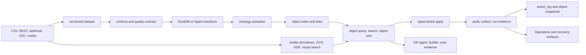

# Foundry-lite


Foundry-lite는 **데이터가 들어오고, 검증되고, 업무 객체가 되고, 사람이 액션을 실행하고, 그 결과가 다시 감사 가능한 데이터로 돌아오는 작은 운영 객체 플랫폼**입니다.

비개발자식으로 말하면, 단순히 "표를 예쁘게 보여주는 도구"가 아니라 "주문, 고객, 미디어, 외부 소스, AI 판단, 운영 복구 같은 실제 업무 단위를 안전한 장부 위에서 움직이는 실험용 Foundry 축소판"입니다.

이 README는 GitHub 첫 화면용 요약입니다. 현재 구현 상태의 원본은 `docs/implementation-status.md`, 실제 증거 명령의 원본은 `docs/sprint-evidence-ledger.md`, 문서 역할의 원본은 `docs/documentation-map.md`입니다.

## 현재 결론

지금 제품은 로컬과 CI에서 꽤 넓은 backend/API/SDK proof를 갖고 있습니다. 핵심 폐루프는 dataset commit, transform, ontology activation, object index/query, action apply, audit/outbox, materialization, operations evidence까지 연결됩니다.

다만 아직 "클라우드에 올리면 바로 여러 팀이 쓰는 완성형 SaaS"는 아닙니다. 개발/검증 서버로는 비교적 쉽게 띄울 수 있지만, 공개 production 배포에는 인증, secret manager, managed worker, 외부 인프라 운영, UI 완성도, 백업/복구 runbook을 더 묶어야 합니다.

S46-S64 데이터 플랫폼 확장 로드맵은 현재 브랜치에서 부분 구현 중입니다. S46은 완료 경계이고, S47-S64는 많은 proof가 있지만 완성 제품 UI나 managed 운영까지 끝났다는 뜻은 아닙니다.

## 빠른 실행

필수 도구는 Python 3.12, `uv`, Node.js, `pnpm`입니다. Docker 또는 Colima는 Testcontainers 기반 live infra gate를 돌릴 때 필요합니다.

```bash
pnpm install
uv sync --all-groups
pnpm demo:supply-chain
pnpm dev
```

API 서버는 `pnpm dev`로 뜹니다. 프론트엔드는 별도 터미널에서 아래처럼 띄웁니다.

```bash
pnpm dev:foundry
```

기본 품질 확인은 아래 명령입니다.

```bash
pnpm ci:gate
```

GitHub의 예산제 PR 병합 게이트를 로컬에서 재현하려면 `pnpm ci:gate:pr`을 사용합니다.
전체 coverage/runtime/browser/CodeQL 증거는 main, nightly, release lane에서 이어집니다.

로컬에서 release lane을 더 넓게 확인하려면 아래를 사용합니다.

```bash
pnpm ci:gate:all
```

Colima를 쓰는 Mac 환경에서 Testcontainers가 Docker socket을 못 찾으면 보통 아래 환경 변수가 필요합니다.

```bash
export DOCKER_HOST=unix:///Users/isihyeon/.colima/default/docker.sock
export TESTCONTAINERS_DOCKER_SOCKET_OVERRIDE=/var/run/docker.sock
```

## 제품 흐름



## 지금 가능한 것

| 영역 | 현재 가능한 것 | 대표 입구 |
| --- | --- | --- |
| Dataset | CSV upload, versioned commit, preview, inspect, schema evolution warning/blocking, quality check definition and result history | `foundry.datasets`, FastAPI dataset endpoints, `client.datasets` |
| Source onboarding | CSV, batch file, signed webhook listener, Debezium-shaped CDC start, direct Kafka Source broker test/topic exploration/streaming Sync, durable Start/Stop/status와 one-Sync resident supervisor, all-partition discovery와 partition별 durable checkpoint/lag, lease-expiry standby takeover, checkpoint/lag/throughput health rules, Kraken WebSocket v2 → Kafka → checkpointed Dataset 예제, media upload, Generic REST source wrapper, durable Source/Sync separation with audited disable/re-enable, Source-level live REST/database/Kafka connection test with persisted redacted history, scheduled managed sync with schedule edit/pause/resume, consecutive-failure auto-pause and recovery build, credential/agent/network policy read models | `foundry.sources`, FastAPI source endpoints, `client.sources` |
| Connector onboarding | tenant-scoped REST connection/resource registry, resource test without commit, connector sync workflow start | `foundry.connectors`, FastAPI connector endpoints, `client.connectors` |
| Projects and resources | Compass-style projects as permission boundaries, folders as organization, RID-backed resource rows, favorites, trash/restore, explicit admin reconcile | `foundry.resources`, `/api/projects`, `/api/resources`, `client.resources` |
| Transform and lineage | SQL transform registration/run, input/output version lineage, failed transform retry, bounded snapshot scheduler preview/tick, `worker:transform-scheduler`, OpenLineage-compatible evidence | `foundry.transforms`, FastAPI transform endpoints, `client.transforms` |
| Pipeline Builder distributed DAG | `schemaVersion: 2` typed graph를 Temporal이 fork/join 제어하고 capability allowlist별 worker가 실행합니다. API는 기본 `202 queued`, PostgreSQL 원장은 node/attempt/artifact/event와 fencing token을 보존하며, retry·취소·worker takeover·crash resume·Dataset/Media Set exactly-once commit을 실제 Temporal worker 2개 gate로 검증합니다. Preview도 같은 orchestration 경로에서 `commitForbidden`을 유지합니다. | `docs/pipeline-builder-parity-matrix.json`, `quality:pipeline-async-dag`, `quality:pipeline-async-dag-live` |
| Ontology and objects | ontology YAML validation/catalog, object get/query/link traversal, object sets, active index pointer, shadow reindex proof | `foundry.ontology`, `foundry.objects`, FastAPI ontology/object endpoints |
| Actions | canonical Action Contract v3와 typed Action IR, v1/v2 호환 compile, 결정적 plan/dry-run hash, edit별 permission·risk·approval 판단, object create/modify/delete와 many-to-many link create/delete의 원자적 apply, OCC/idempotency, unified edit ledger, audit/outbox | `foundry.actions`, `/api/actions/{action_type}/plan`, `/api/actions/{action_type}/dry-run`, `/api/actions/{action_type}/apply`, `quality:action-types-palantir` |
| Operations | run list/detail, prompt artifact access, DLQ retry/discard, outbox publish start, reconciliation queue/resolve, observability detect, backup/restore preflight, artifact receipt, historical artifact dataset-head execution, and restore-mode gates | `foundry.operations`, FastAPI operations endpoints, `client.operations` |
| Media and content | media set transaction/upload/commit, processing runs, OCR, ASR, PDF/image/video processors, derivative indexing, content search, visual search, object media binding, retention/legal hold purge proof | `foundry.media`, FastAPI media endpoints, `client.media` |
| AIP and AI evidence | model gateway ledger, prompt artifacts, context compiler, tool broker, retrieval orchestration, agent runtime, builder validate/run, eval run, release promote, citation/evidence references | `foundry.aip`, FastAPI AIP endpoints, `client.aip` |
| AI FDE | 9개 permission-scoped mode, 68개 server-owned tool(43개 Palantir 공식 exact-name native + 25개 Foundry-lite branch/test/proposal/Pilot), lazy tool search, structured plan/clarification, explicit multi-resource context, branch-first Ontology/Pipeline authoring, Builder MCP OAuth와 fingerprint-bound one-time 사람 승인 receipt, strict MCP lifecycle·typed JSON-RPC ID·canonical structured/text result, durable replay·rate limit·SSE lease, 공식 MCP client+별도 Uvicorn+PostgreSQL live proof, Pilot app generation, durable AI Operations ledger. `pipeline.branch.run_tests`는 실제 row 실행이 아니라 static graph/output-contract proof다. | `foundry.aip.run_fde_payload`, `/api/aip/fde/*`, `/mcp/builder/*`, `mcp:builder:stdio`, `quality:builder-mcp-live`, `quality:mcp-rate-limits`, `client.aip.fde`, `client.aip.pilot` |
| Action Builder | open Ontology branch 안에서만 ActionDefinitionV3 생성·수정·삭제, typed parameter/default, first-match override, nested criteria, ordered object/link rules, version-pinned function, registered before/after effect, 위험·agent policy, Action Log/revert policy, canonical fingerprint/inline eligibility, durable replay와 audit/outbox 원자성. 브라우저에서 branch 저장→proposal→독립 검토자 승인→activation까지 연결 | Foundry Actions `Action Builder`, `/api/ontology/branches/{branch_id}/action-types`, `client.ontology.branches.actionTypes` |
| Action runtime + Python OSDK | 새로 활성화한 Action을 SDK 재생성 없이 동적 schema로 즉시 실행하고 sync/async를 하나의 run 이력으로 조회. SSE 재연결/snapshot fallback, step·attempt·worker·fencing·retry/takeover, effect receipt, 취소, p95/failure/backlog, Action Log·edited objects·revert UI; attachment/media는 staging 전 malware scan, 운영 ClamAV 강제, retention·권한 상속·lifetime holder 증거를 적용. Python은 catalog/schema/plan/dry-run/apply/branch/run/events/cancel/log/revert와 fingerprint-pinned `TypedDict` 패키지 제공 | Foundry Actions `실행·로그`, `foundry_lite.osdk.OsdkActionInvoker`, `packages/sdk-python`, `quality:action-types-palantir-ui` |
| Consumer Ontology MCP | app에 허용된 object/action/function만 MCP tool로 투영, Authorization Code + PKCE와 Client Credentials service principal, one-time client secret 발급·회전·폐기, native structured content와 execution-error `isError`, typed query-function schema, low-risk autonomous durable run, medium/high immutable AIP approval proposal, Developer Console 발행/MCP Hub 화면, app Origin 제한, 단일 durable SSE lease·resume·종료 후 404, POST/GET/DELETE와 tool 호출의 durable rate limit, stdio HTTP proxy, 공식 MCP SDK+별도 Uvicorn+PostgreSQL live client proof, 로컬 브라우저의 실제 OAuth bearer → 사람 승인 → 원 서비스 계정 동일 run readback proof | `/mcp/ontology/{application_id}`, `developerConsole.mcpServers.*`, `developerConsole.osdkApplications.*ClientSecret*`, `mcp:ontology:stdio`, `quality:ontology-mcp`, `quality:ontology-mcp-live`, `quality:mcp-rate-limits-live`, `quality:action-types-palantir-ui` |
| Frontend SDK | 319 frontend route surface request contracts, 28 SDK helper contracts, 91 idempotency-required mutation surfaces, screen recipes for resources, source, dataset, pipeline, object/action, media, AIP, insight, operations | `@foundry-lite/sdk`, `@foundry-lite/sdk/react`, `@foundry-lite/sdk/screen-recipes` |

## 아직 아닌 것

아래 항목은 README에서 current 기능처럼 주장하지 않습니다.

| 아직 future 또는 partial인 것 | 현재 의미 |
| --- | --- |
| Kubernetes/Helm, one-click production deploy, managed cloud operations | 로컬/CI proof와 adapter profile은 있지만 운영 패키징은 별도 작업입니다. |
| full visual product UI | Foundry SPA는 핵심 route와 여러 실제 업무 흐름을 E2E로 검증하지만, production-grade 운영자용 SPA 전체가 완성됐다는 뜻은 아닙니다. |
| Pipeline Builder의 cluster 운영 패키징과 아직 foundation인 output plane | Temporal 분산 DAG, browser 실행 이력/SSE/retry/takeover/cancel/partial evidence, no-commit preview, Dataset·Media Set 다중 output commit은 current입니다. Kubernetes/Helm/HPA/PDB, multi-region Temporal 운영, Virtual Table·Ontology serving output, hot-stream DAG 엔진과 data/logic trigger DSL은 아직 future입니다. |
| full Palantir Action Types + consumer Ontology MCP parity | Action v3, EditPlan, multi-object/link atomic commit, Function-backed Action, governed effect, 12/18 capability axes, advanced Builder, Python/TypeScript OSDK, runtime UI와 consumer Ontology MCP는 실제 제품 경로에 있습니다. PostgreSQL+Temporal two-worker gate는 kill/takeover·취소·dispatch 복구·exact-one commit을, `quality:ontology-mcp-live`는 공식 MCP `ClientSession`+별도 Uvicorn+PostgreSQL에서 object 조회와 고위험 Action 승인 분기를 증명합니다. 다만 hosted ChatGPT SaaS tenant, production cloud KMS, live ClamAV, virtual Ontology log link·Workshop timeline, effect/revert/branch 전용 multi-process race는 남았습니다. 자세한 경계는 [Action Types 비교표](docs/action-types-parity-matrix.json)와 [Agent-Native Operations PRD](docs/palantir-action-mcp-prd-ko.md)를 따릅니다. |
| S62 visual dataset browser/preview grid/version pin/lineage graph UX | Datasets 화면의 catalog 선택, preview grid, manifest/schema evidence, version tab, quality tab, lineage handoff는 `tests/e2e-foundry/datasets-explorer-flow.spec.ts`로 current입니다. 대용량/다중 데이터셋 비교, Dataset 화면 안의 완전한 interactive lineage graph, production-scale browser UX는 future입니다. |
| S63 evidence panel UI, S63 action execution orchestration | Approvals 화면의 Insight action queue, evidence panel, assign/approve/reject, AIP-approved `executeApprovedAction` 실행 흐름은 `tests/e2e-foundry/aip-approval-flow.spec.ts`로 current입니다. model diff UI, approval-policy builder, autonomous orchestration, full managed review workspace는 future입니다. |
| vendor-specific SAP/NetSuite/OAuth connectors | Generic REST, webhook, CDC proof는 있지만 production vendor-specific packaged connector 범위는 future입니다. |
| production scheduler operations beyond bounded UI | Data Connection의 Source scheduler preview/tick UI, Code의 Transform scheduler tick UI, Source managed sync schedule API/SDK/`worker:source-scheduler`, transform scheduler API/SDK/`worker:transform-scheduler` proof는 있지만 브라우저에서 데몬을 직접 운영하는 UI와 Kubernetes lease/fencing 운영 패키징은 future입니다. |
| cloud Vault, full secret rotation, live OIDC discovery lifecycle | local JWT/OIDC and SecretProvider proof는 있지만 cloud-grade lifecycle은 future입니다. |
| automatic restore smoke, full production restore rehearsal, rich recovery dashboard | Operations Recovery 화면의 recovery overview와 backup/restore preflight 실행은 `tests/e2e-foundry/operations-maintenance-recovery-flow.spec.ts`로 current입니다. automatic smoke, production restore rehearsal, alert timeline과 full recovery dashboard는 future입니다. |
| managed compensation daemon and full approval workflow | external writeback retryable/outcome-unknown/compensation-required, reconciliation proof와 bounded writeback reconciliation worker proof, sensitive/high-risk writeback의 `operator_approval_required` skip 및 backend approval-release API/SDK/audit proof와 Foundry Operations approval-release UI proof, AI direct vendor/API tool denial proof는 있지만 automatic retry/reissue worker, 상시 managed daemon, ERP-specific reverse/compensation executor, connector-backed vendor tool release policy, full managed approval workflow/queue UI는 future입니다. |
| object detection counts and bounding boxes in video | media visual search and CLIP scene-frame proof는 있지만 custom CV/VLM object detection 제품 범위는 future입니다. |

## Data pattern 상태

데이터 플랫폼 쪽은 "전혀 없음"과 "완전 운영 가능" 사이의 partial 단계가 많습니다. 아래 이름들은 CI가 읽는 `docs/data-engineering-pattern-matrix.json`의 README alias와 맞춰 둔 요약입니다.

| Pattern alias | README 기준 상태 |
| --- | --- |
| Alembic migration operations | Partial: migration safety, schema revision, dedicated runner proof는 있지만 multi-step production upgrade/rollback runbook은 future입니다. |
| Record DLQ | Partial: source/stream record-level DLQ replay proof, Python transform row-error quarantine proof, snapshot transform-specific full-rebuild retry proof가 있습니다. Append/incremental transform DLQ replay는 duplicate-safe merge policy 전까지 future입니다. |
| Late data | Partial: stream/source late-data, normalized `platformWatermark` metadata, snapshot transform output watermark propagation, materialization action/object boundary watermark proof는 있지만 full platform-wide watermark semantics는 future입니다. |
| Multi-file dataset | Partial: multi-file manifest reader, local/fake/S3/Iceberg multi-part commit proof, manifest column stats/sort bounds, partition pruning, Iceberg snapshot file-level pruning, high-cardinality partition warning 및 단일 입력 SQL transform predicate-to-storage proof가 있습니다. |
| Iceberg maintenance | Partial: maintenance planning, `POST /api/operations/maintenance/iceberg/{dataset}/run`, current snapshot compaction, row-hash preservation, deletable orphan snapshot expiration/cleanup, protected DB committed snapshot proof가 있습니다. Transform/materialization/backup pin까지 포함한 full retention policy, concurrent maintenance fencing, ambiguous retry idempotency는 future입니다. |
| Continuously running CDC/search workers | Partial: bounded stream archive worker loop, CDC object-indexer bounded/continuous loop, workflow-run lease/cursor proof, stream pre-commit assignment revoke guard는 있지만 full broker callback/commit-unknown reconciliation, OS SIGTERM proof, production worker packaging은 future입니다. |
| Managed Temporal worker operations | Partial: Temporal product workflow control-plane, worker-bound connector data-plane evidence, deterministic sync-run retry idempotency, cancel cleanup evidence, and start-response-loss reconciliation proof는 있지만 continue-as-new, upgrade replay, managed worker operations 범위는 future입니다. |
| Real S3/MinIO external writeback | Partial: simulated retryable-not-changed evidence plus real S3/MinIO external writeback outcome-unknown/reconciliation proof, bounded writeback reconciliation worker proof, sensitive/high-risk writeback approval-required skip 및 backend approval-release API/SDK/audit proof와 Foundry Operations approval-release UI proof, AI direct vendor/API tool denial proof가 있지만 automatic retry/reissue policy, ERP-specific packaging, connector-backed vendor tool release policy, managed daemon, full managed approval workflow/queue UI는 future입니다. |
| Data quality contracts | Partial: check-definition API/SDK/runtime enforcement, default versioned DataContract create/list/get/activate, accepted-values policy proof는 있지만 remaining policy surface, owner workflow, trend UI는 future입니다. |
| Broader Operations UI | Partial: SDK and backend recovery/readiness surfaces는 있지만 Broader Operations UI 전체 제품 화면은 future입니다. |

## 코드 입구

Python application root는 `FoundryLite`입니다. `FoundryLite`는 한 파일에 모든 책임을 넣는 방식이 아니라 작업 공간 facade로 나뉩니다.

```text
foundry.datasets
foundry.transforms
foundry.ontology
foundry.objects
foundry.actions
foundry.media
foundry.sources
foundry.connectors
foundry.insights
foundry.aip
foundry.operations
foundry.materialization
foundry.erasure
foundry.demo
```

주요 코드 위치는 아래와 같습니다.

| 경로 | 역할 |
| --- | --- |
| `libs/foundry_lite/application/foundry.py` | 제품 root facade와 workspace 조립 |
| `libs/foundry_lite/application/dependencies.py` | 모든 port/repository/adapter dependency 계약 |
| `libs/foundry_lite/application/services` | Dataset, Source, Media, AIP, Operations 등 application service |
| `libs/foundry_lite/application/ports` | infra 교체를 가능하게 하는 port/interface |
| `libs/foundry_lite/infrastructure` | SQLAlchemy repositories, local/S3/Iceberg/Spark/Temporal/Elasticsearch/Kafka adapters |
| `apps/api/foundry_lite_api/main.py` | FastAPI route surface |
| `apps/cli/foundry_lite_cli/main.py` | `flite` CLI |
| `apps/worker/foundry_lite_worker` | stream archive and outbox publisher worker entrypoints |
| `apps/foundry` | React frontend (Vite) |
| `packages/sdk-ts/src/generated.ts` | generated TypeScript SDK |
| `packages/sdk-python/src/foundry_lite_sdk` | fingerprint-pinned generated Python Action OSDK package |
| `packages/sdk-ts/src/screen-recipes.ts` | screen-level SDK recipes |
| `tests` | unit, contract, smoke, integration, SDK request-contract, E2E proof |

## API, CLI, Web, SDK

대표 FastAPI endpoint는 아래처럼 나뉩니다.

| Endpoint | 용도 |
| --- | --- |
| `GET /healthz` | API health check |
| `GET /metrics` | Prometheus metrics scrape |
| `GET /api/datasets` | dataset catalog |
| `GET /api/datasets/{namespace}/{name}/preview` | committed dataset preview |
| `POST /api/sources/csv/uploads` | source onboarding CSV upload |
| `POST /api/connectors/connections` | REST connector connection create |
| `GET /api/ontology/catalog` | ontology catalog read |
| `POST /api/objects/{object_type}/query` | object query |
| `POST /api/actions/{action_type}/validate` | typed action validation |
| `POST /api/actions/{action_type}/plan` | permission·risk·approval을 포함한 immutable EditPlan |
| `POST /api/actions/{action_type}/dry-run` | 동일 plan hash를 사용하는 non-committing before/after preview |
| `POST /api/actions/{action_type}/apply` | typed action execution |
| `POST /api/media/sets` | media set create |
| `POST /api/aip/agent/run` | AIP agent run |
| `GET /api/aip/fde/catalog` | invoking-user 권한으로 축소된 AI FDE mode/tool/safety catalog |
| `POST /api/aip/fde/run` | bounded one-to-eight-tool cross-domain execute/observe/adjust turn |
| `POST /api/aip/pilot/plan` | Project·Dataset·Ontology·OSDK·React·CI 생성 계획 |
| `POST /api/aip/pilot/applications` | idempotent branch-first Pilot application 생성 |
| `GET /api/aip/pilot/applications/{rid}` | 생성된 Pilot bundle과 stable preview path 조회 |
| `GET /api/insights/reviews` | insight review queue |
| `GET /api/operations/runs` | operations run list |
| `POST /api/transforms/sql` | SQL transform registration |
| `POST /api/materializations/{api_name}/run` | materialization run |

CLI는 사람이 직접 운영/개발 중에 확인하는 입구입니다.

```bash
flite demo run-supply-chain
flite dataset preview raw.erp_orders
flite object get Order O-1001 --explain
flite action apply ApproveOrder --object Order/O-1001 --param reason='Inventory confirmed'
flite operations runs --status failed
flite operations run transform <run-id>
flite transform retry <transform-run-id>
flite index replay Order
flite outbox retry <dead-letter-event-id>
```

TypeScript SDK는 generated SDK를 중심으로 동작합니다.

```bash
pnpm sdk:generate
pnpm --silent quality:sdk-request-contract
pnpm --silent quality:frontend-foundation
```

프론트엔드는 raw `/api/...` 문자열을 직접 조립하기보다 named SDK method와 helper를 사용해야 합니다. 현재 matrix 기준으로 319개 frontend route surface는 모두 `named-sdk-only` 정책이며, 13개 non-frontend route는 Prometheus scrape, signed webhook ingest, legacy alias, external callback, MCP transport, OAuth discovery처럼 브라우저 product SDK가 직접 호출하면 안 되는 표면으로 분리됩니다.

## Runtime profile

기본 profile은 local입니다.

| 구성 | 기본값 | 확장 profile |
| --- | --- | --- |
| Metadata DB | SQLite through SQLAlchemy | PostgreSQL via `FOUNDRY_LITE_DB_URL` |
| Dataset storage | local filesystem | `s3-storage`, `iceberg` |
| Compute | DuckDB | Spark via `FOUNDRY_LITE_COMPUTE_PROFILE=spark` |
| Search | local/fake adapter | Elasticsearch via `FOUNDRY_LITE_SEARCH_PROFILE=elasticsearch` |
| Workflow | local/fake workflow | Temporal via `FOUNDRY_LITE_WORKFLOW_PROFILE=temporal` |
| Stream | local/fake stream | Kafka-compatible adapter, resident one-Sync supervisor, all-partition cursor map, Kraken WebSocket v2 producer, worker lease/takeover/checkpoint/health telemetry proof |
| Media storage | local filesystem | `FOUNDRY_LITE_MEDIA_STORAGE_PROFILE=s3-media` |
| Auth | header trust demo profile | `FOUNDRY_LITE_AUTH_PROFILE=jwt` or `oidc` local verification |
| Secrets | env-backed `SecretProvider` | cloud/Vault remains future |

Migration은 전용 runner로 실행합니다.

```bash
pnpm db:migrate
```

Worker entrypoint는 아래처럼 분리되어 있습니다.

```bash
pnpm worker:stream-archive
pnpm worker:source-scheduler
pnpm worker:transform-scheduler
pnpm worker:outbox-publisher
pnpm worker:pipeline-dag
pnpm worker:pipeline-control
```

## 배포 판단

개발 서버나 내부 검증 서버로 띄우는 것은 어렵지 않습니다. `pnpm dev`로 FastAPI를 띄우고, SQLite/local filesystem 또는 PostgreSQL/S3-compatible profile을 연결하면 현재 proof를 재현할 수 있습니다.

하지만 공개 production 배포는 아직 "설정 몇 개 넣고 끝"으로 보면 안 됩니다. 최소한 production auth profile, secret manager, PostgreSQL migration 운영, object storage lifecycle, worker process supervision, observability stack, backup/restore rehearsal, external connector credential policy, API exposure policy를 같이 정해야 합니다. README 기준으로는 **local/dev deploy ready, production packaging partial**로 보는 것이 정직합니다.

## 대표 명령

| 명령 | 의미 |
| --- | --- |
| `pnpm demo:supply-chain` | 공급망 폐루프 데모를 fresh local runtime에서 실행합니다. |
| `pnpm demo:media-multimodal` | OCR/ASR/video/semantic media demo를 실행합니다. |
| `pnpm dev` | FastAPI app을 로컬에서 실행합니다. |
| `pnpm dev:foundry` | React 프론트엔드를 4173 포트에서 띄웁니다. |
| `pnpm ci:gate` | 빠른 local static plus impact gate입니다. |
| `pnpm ci:gate:pr` | diff security, 직접 연관 테스트, focused static/type 검사를 420초 budget으로 실행합니다. |
| `pnpm ci:gate:all` | 로컬에서 release lane을 직렬로 넓게 확인합니다. |
| `pnpm --silent quality:media-active-covered` | Media/Content Plane active-covered proof를 확인합니다. |
| `pnpm --silent quality:operations-recovery` | Operations/Recovery backend/API/SDK slice를 확인합니다. |
| `pnpm --silent quality:distributed-control-plane` | PostgreSQL/S3/Iceberg/Spark/Kafka/Temporal control-plane proof를 확인합니다. |
| `pnpm --silent quality:pipeline-parity-matrix` | Pipeline Builder 공개 동작별 current, foundation, planned 경계와 코드·테스트 근거가 어긋나지 않는지 확인합니다. |
| `pnpm --silent quality:pipeline-async-dag` | async API, Temporal 결정성, retry 분류, lease/fencing/event 원장 계약을 확인합니다. |
| `pnpm --silent quality:pipeline-async-dag-live` | 실제 PostgreSQL·Temporal·worker 2개에서 kill/takeover/cancel/exactly-once output commit을 확인합니다. |

## 대표 gate

| Gate | 막는 문제 |
| --- | --- |
| `check_documentation_map.py` / `quality:documentation-map` | README 문서 지도, 대표 gate 표, source-of-truth rules, update order, cross-check command가 서로 어긋나는 문제를 차단합니다. |
| `check_frontend_backend_surface.py` / `quality:frontend-backend-surface` | FastAPI route 분류, named SDK method, screen recipe export, helper count, Web raw API 우회가 frontend 계약보다 앞서가는 문제를 차단합니다. |
| `quality:sdk-request-contract` | 브라우저 SDK가 method, path, query, header, body, idempotency key, typed error metadata를 실제 계약과 다르게 보내는 문제를 차단합니다. |
| `quality:frontend-foundation` | generated SDK, browser SDK helper, Foundry SPA strict TypeScript 검사, Web Operations SDK-only 호출, request id, retryability, typed frontend error가 drift 나는 문제를 차단합니다. |
| `quality:proof-matrix` | infra tricky matrix의 proof class가 문서에만 있고 실제 pytest나 CI evidence와 연결되지 않는 문제를 차단합니다. |
| `quality:source-of-truth` | serving source of truth가 코드, 테스트, 운영 증거, 문서 사이에서 갈라지는 문제를 차단합니다. |
| `quality:operator-evidence` | 실패 원인이 로그 한 줄에만 남고 audit, run detail, transaction, error payload로 다시 추적되지 않는 문제를 차단합니다. |
| `check_infra_ratchet.py` / `quality:infra-ratchet` | Infra Ratchet 원칙처럼 새 인프라가 self proof와 active composition proof 없이 README나 운영 문서에서 current처럼 보이는 문제를 차단합니다. |
| `check_infra_tricky_matrix.py` / `quality:infra-tricky-matrix` | tricky infra matrix가 active infra, source-of-truth rule, operator evidence, checked failure-mode evidence와 어긋나는 문제를 차단합니다. |
| `check_pipeline_parity_matrix.py` / `quality:pipeline-parity-matrix` | Graph v2 타입이나 DB 테이블만 생긴 상태를 완성형 멀티모달 Builder처럼 과장하거나, 공식 공개 기능과 구현·테스트·rollout gap의 연결이 끊기는 문제를 차단합니다. |

## 문서 지도

| 문서 | 역할 |
| --- | --- |
| [docs/implementation-status.md](docs/implementation-status.md) | 현재 코드가 실제로 보장하는 current, partial, future 경계를 가장 자세히 설명하는 상태 원본입니다. |
| [docs/sprint-evidence-ledger.md](docs/sprint-evidence-ledger.md) | 어떤 claim이 어떤 테스트, gate, script, artifact로 증명되는지 기록하는 evidence 장부입니다. |
| [foundry_lite_development_plan_ko_sprintified.md](foundry_lite_development_plan_ko_sprintified.md) | 제품 목표와 장기 아키텍처 방향을 설명하는 큰 설계 원본입니다. |
| [docs/palantir-action-mcp-prd-ko.md](docs/palantir-action-mcp-prd-ko.md) | Palantir 공개 문서에서 도출한 Action Types, AI FDE, Builder MCP, Ontology MCP, Pilot 통합 제품 요구사항과 완료 기준입니다. 현재 구현 증거가 아니라 목표 PRD입니다. |
| [foundry_lite_sprint_breakdown_ko.md](foundry_lite_sprint_breakdown_ko.md) | 스프린트별 목표, acceptance, Done/Partial/Future 상태를 관리하는 계획표입니다. |
| [docs/data-platform-expansion-sprint-plan-ko.md](docs/data-platform-expansion-sprint-plan-ko.md) | S46 이후 데이터 플랫폼 확장 계획과 sprint-by-sprint 체크리스트를 담은 상세 roadmap입니다. |
| [docs/quality-gate-roadmap.md](docs/quality-gate-roadmap.md) | 품질 게이트가 왜 있고 어떤 위험을 막는지, release/runtime lane에서 어떻게 운영되는지 설명합니다. |
| [docs/documentation-map.md](docs/documentation-map.md) | 문서별 역할, source-of-truth 규칙, update order, README 검증 규칙을 관리하는 문서 운영 지도입니다. |
| [docs/commit-point-risk-register.md](docs/commit-point-risk-register.md) | commit point, retry, idempotency, partial failure, cleanup 위험을 추적하는 위험 장부입니다. |
| [docs/infra-ratchet.md](docs/infra-ratchet.md) | 새 인프라 profile을 추가할 때 self proof와 active composition proof를 어떻게 쌓는지 설명합니다. |
| [docs/infra-tricky-matrix.json](docs/infra-tricky-matrix.json) | 인프라별 tricky failure, proof class, source-of-truth rule, operator evidence를 CI가 읽는 registry입니다. |
| [docs/data-engineering-pattern-matrix.json](docs/data-engineering-pattern-matrix.json) | 데이터 엔지니어링 pattern별 current, partial, deferred 상태와 proof level을 잠그는 registry입니다. |
| [docs/frontend-api-sdk-surface-matrix.json](docs/frontend-api-sdk-surface-matrix.json) | FastAPI route와 frontend SDK method/helper, proof test, operator evidence 매핑을 잠그는 registry입니다. |
| [docs/pipeline-builder-parity-matrix.json](docs/pipeline-builder-parity-matrix.json) | Palantir MMDP/Pipeline Builder의 공식 공개 동작과 Foundry-lite의 current, foundation, planned 상태를 코드·테스트·완료 기준에 연결하는 registry입니다. |
| [docs/frontend-backend-surface-contract.md](docs/frontend-backend-surface-contract.md) | 프론트가 백엔드를 붙일 때 raw API 호출 대신 named SDK와 helper를 써야 하는 계약을 설명합니다. |
| [docs/foundry_lite_tricky_failure_modes_checklist.md](docs/foundry_lite_tricky_failure_modes_checklist.md) | 아직 남은 failure-mode 후보와 hardening backlog를 추적하는 체크리스트입니다. |

## 기여 원칙

기능을 추가할 때는 "돌아간다"보다 "나중에 운영자가 원인을 다시 찾을 수 있다"가 더 중요합니다.

1. source-of-truth 문서를 먼저 확인합니다.
2. 새 mutation은 transaction, audit, outbox, idempotency, request id를 같이 봅니다.
3. 새 infra dependency는 `CoreDependencies`와 해당 service의 `required_dependencies` 경계를 지킵니다.
4. API나 SDK를 늘리면 `docs/frontend-api-sdk-surface-matrix.json`, generated SDK, request-contract proof를 같이 맞춥니다.
5. 문서를 바꾸면 최소한 `pnpm --silent quality:doc-drift`, `pnpm --silent quality:documentation-map`, 관련 focused gate를 확인합니다.

README는 마지막에 고칩니다. 먼저 코드, 테스트, evidence ledger, implementation status가 진짜를 말해야 하고, README는 그 진짜를 사람이 빠르게 이해하도록 번역하는 문서입니다.
