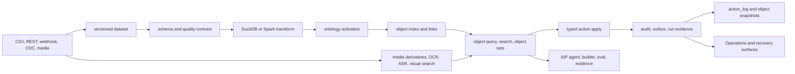

# Foundry-lite


Foundry-lite는 **데이터가 들어오고, 검증되고, 업무 객체가 되고, 사람이 액션을 실행하고, 그 결과가 다시 감사 가능한 데이터로 돌아오는 작은 운영 객체 플랫폼**입니다.

비개발자식으로 말하면, 단순히 "표를 예쁘게 보여주는 도구"가 아니라 "주문, 고객, 미디어, 외부 소스, AI 판단, 운영 복구 같은 실제 업무 단위를 안전한 장부 위에서 움직이는 실험용 Foundry 축소판"입니다.

이 README는 GitHub 첫 화면용 요약입니다. 현재 구현 상태의 원본은 `docs/implementation-status.md`, 실제 증거 명령의 원본은 `docs/sprint-evidence-ledger.md`, 문서 역할의 원본은 `docs/documentation-map.md`입니다.

## 현재 결론

지금 제품은 로컬과 CI에서 꽤 넓은 backend/API/SDK proof를 갖고 있습니다. 핵심 폐루프는 dataset commit, transform, ontology activation, object index/query, action apply, audit/outbox, materialization, operations evidence까지 연결됩니다.

다만 아직 "클라우드에 올리면 바로 여러 팀이 쓰는 완성형 SaaS"는 아닙니다. 개발/검증 서버로는 비교적 쉽게 띄울 수 있지만, 공개 production 배포에는 인증, secret manager, managed worker, 외부 인프라 운영, UI 완성도, 백업/복구 runbook을 더 묶어야 합니다.

S46-S64 데이터 플랫폼 확장 로드맵은 현재 브랜치에서 부분 구현 중입니다. S46은 완료 경계이고, S47-S64는 많은 proof가 있지만 완성 제품 UI나 managed 운영까지 끝났다는 뜻은 아닙니다.

## 빠른 실행

필수 도구는 Python 3.12, `uv`, Node.js, `pnpm`입니다. Docker 또는 Colima는 Testcontainers 기반 live infra gate를 돌릴 때 필요합니다.

```bash
pnpm install
uv sync --all-groups
pnpm demo:supply-chain
pnpm dev
```

API 서버는 `pnpm dev`로 뜹니다. 프론트엔드는 별도 터미널에서 아래처럼 띄웁니다.

```bash
pnpm dev:foundry
```

기본 품질 확인은 아래 명령입니다.

```bash
pnpm ci:gate
```

GitHub의 예산제 PR 병합 게이트를 로컬에서 재현하려면 `pnpm ci:gate:pr`을 사용합니다.
전체 coverage/runtime/browser/CodeQL 증거는 main, nightly, release lane에서 이어집니다.

로컬에서 release lane을 더 넓게 확인하려면 아래를 사용합니다.

```bash
pnpm ci:gate:all
```

Colima를 쓰는 Mac 환경에서 Testcontainers가 Docker socket을 못 찾으면 보통 아래 환경 변수가 필요합니다.

```bash
export DOCKER_HOST=unix:///Users/isihyeon/.colima/default/docker.sock
export TESTCONTAINERS_DOCKER_SOCKET_OVERRIDE=/var/run/docker.sock
```

## 제품 흐름



## 지금 가능한 것

| 영역 | 현재 가능한 것 | 대표 입구 |
| --- | --- | --- |
| Dataset | CSV upload, versioned commit, preview, inspect, schema evolution warning/blocking, quality check definition and result history | `foundry.datasets`, FastAPI dataset endpoints, `client.datasets` |
| Source onboarding | CSV, batch file, signed webhook listener, Debezium-shaped CDC start, direct Kafka Source broker test/topic exploration/streaming Sync, durable Start/Stop/status와 one-Sync resident supervisor, all-partition discovery와 partition별 durable checkpoint/lag, lease-expiry standby takeover, checkpoint/lag/throughput health rules, Kraken WebSocket v2 → Kafka → checkpointed Dataset 예제, media upload, Generic REST source wrapper, durable Source/Sync separation with audited disable/re-enable, Source-level live REST/database/Kafka connection test with persisted redacted history, scheduled managed sync with schedule edit/pause/resume, consecutive-failure auto-pause and recovery build, credential/agent/network policy read models | `foundry.sources`, FastAPI source endpoints, `client.sources` |
| Connector onboarding | tenant-scoped REST connection/resource registry, resource test without commit, connector sync workflow start | `foundry.connectors`, FastAPI connector endpoints, `client.connectors` |
| Projects and resources | Compass-style projects as permission boundaries, folders as organization, RID-backed resource rows, favorites, trash/restore, explicit admin reconcile | `foundry.resources`, `/api/projects`, `/api/resources`, `client.resources` |
| Transform and lineage | SQL transform registration/run, input/output version lineage, failed transform retry, bounded snapshot scheduler preview/tick, `worker:transform-scheduler`, OpenLineage-compatible evidence | `foundry.transforms`, FastAPI transform endpoints, `client.transforms` |
| Pipeline Builder distributed DAG | `schemaVersion: 2` typed graph를 Temporal이 fork/join 제어하고 capability allowlist별 worker가 실행합니다. API는 기본 `202 queued`, PostgreSQL 원장은 node/attempt/artifact/event와 fencing token을 보존하며, retry·취소·worker takeover·crash resume·Dataset/Media Set exactly-once commit을 실제 Temporal worker 2개 gate로 검증합니다. Preview도 같은 orchestration 경로에서 `commitForbidden`을 유지합니다. | `docs/pipeline-builder-parity-matrix.json`, `quality:pipeline-async-dag`, `quality:pipeline-async-dag-live` |
| Ontology and objects | ontology YAML validation/catalog, object get/query/link traversal, object sets, active index pointer, shadow reindex proof | `foundry.ontology`, `foundry.objects`, FastAPI ontology/object endpoints |
| Actions | canonical Action Contract v3와 typed Action IR, v1/v2 호환 compile, 결정적 plan/dry-run hash, edit별 permission·risk·approval 판단, object create/modify/delete와 many-to-many link create/delete의 원자적 apply, OCC/idempotency, unified edit ledger, audit/outbox | `foundry.actions`, `/api/actions/{action_type}/plan`, `/api/actions/{action_type}/dry-run`, `/api/actions/{action_type}/apply`, `quality:action-types-palantir` |
| Operations | run list/detail, prompt artifact access, DLQ retry/discard, outbox publish start, reconciliation queue/resolve, observability detect, backup/restore preflight, artifact receipt, historical artifact dataset-head execution, and restore-mode gates | `foundry.operations`, FastAPI operations endpoints, `client.operations` |
| Media and content | media set transaction/upload/commit, processing runs, OCR, ASR, PDF/image/video processors, derivative indexing, content search, visual search, object media binding, retention/legal hold purge proof | `foundry.media`, FastAPI media endpoints, `client.media` |
| AIP and AI evidence | model gateway ledger, prompt artifacts, context compiler, tool broker, retrieval orchestration, agent runtime, builder validate/run, eval run, release promote, citation/evidence references | `foundry.aip`, FastAPI AIP endpoints, `client.aip` |
| AI FDE | 9개 permission-scoped mode, 69개 server-owned tool(43개 Palantir 공식 exact-name native + 26개 Foundry-lite branch/test/proposal/Pilot), lazy tool search, structured plan/clarification, explicit multi-resource context, branch-first Ontology/Pipeline authoring, Builder MCP OAuth와 fingerprint-bound one-time 사람 승인 receipt를 제공한다. 모델에는 노출되지 않는 app-only `approve_builder_mutation` 확인 카드는 승인 응답이 유실되면 같은 미소비 receipt를 복구하고, mutation commit 후 응답이 유실되면 새 승인이나 추가 tool quota 소비 없이 exact durable replay를 반환한다. strict MCP lifecycle·typed JSON-RPC ID·canonical structured/text result, durable replay·rate limit·SSE lease, 공식 MCP client+별도 Uvicorn+PostgreSQL live proof, Pilot app generation, durable AI Operations ledger를 포함한다. `pipeline.branch.run_tests`는 실제 row 실행이 아니라 static graph/output-contract proof다. | `foundry.aip.run_fde_payload`, `/api/aip/fde/*`, `/mcp/builder/*`, `mcp:builder:stdio`, `quality:builder-mcp-live`, `quality:mcp-rate-limits`, `client.aip.fde`, `client.aip.pilot` |
| Action Builder | open Ontology branch 안에서만 ActionDefinitionV3 생성·수정·삭제, typed parameter/default, first-match override, nested criteria, ordered object/link rules, version-pinned function, registered before/after effect, 위험·agent policy, Action Log/revert policy, canonical fingerprint/inline eligibility, durable replay와 audit/outbox 원자성. 브라우저에서 branch 저장→proposal→배정된 사람 검토자 승인(보호 프로필은 작성자 제외)→activation까지 연결 | Foundry Actions `Action Builder`, `/api/ontology/branches/{branch_id}/action-types`, `client.ontology.branches.actionTypes` |
| Action runtime + Python OSDK | 새로 활성화한 Action을 SDK 재생성 없이 동적 schema로 즉시 실행하고 sync/async를 하나의 run 이력으로 조회. SSE 재연결/snapshot fallback, step·attempt·worker·fencing·retry/takeover, effect receipt, 취소, p95/failure/backlog, Action Log·edited objects·revert UI; attachment/media는 staging 전 malware scan, 운영 ClamAV 강제, retention·권한 상속·lifetime holder 증거를 적용. Python은 catalog/schema/plan/dry-run/apply/branch/run/events/cancel/log/revert와 fingerprint-pinned `TypedDict` 패키지 제공 | Foundry Actions `실행·로그`, `foundry_lite.osdk.OsdkActionInvoker`, `packages/sdk-python`, `quality:action-types-palantir-ui` |
| Consumer Ontology MCP | app에 허용된 object/action/function만 MCP tool로 투영, Authorization Code + PKCE와 Client Credentials service principal, one-time client secret 발급·회전·폐기, native structured content와 execution-error `isError`, typed query-function schema, low-risk autonomous durable run, medium/high immutable AIP approval proposal, Developer Console 발행/MCP Hub 화면, app Origin 제한, 단일 durable SSE lease·resume·종료 후 404, POST/GET/DELETE와 tool 호출의 durable rate limit, stdio HTTP proxy, 공식 MCP SDK+별도 Uvicorn+PostgreSQL live client proof, 로컬 브라우저의 실제 OAuth bearer → 사람 승인 → 원 서비스 계정 동일 run readback proof | `/mcp/ontology/{application_id}`, `developerConsole.mcpServers.*`, `developerConsole.osdkApplications.*ClientSecret*`, `mcp:ontology:stdio`, `quality:ontology-mcp`, `quality:ontology-mcp-live`, `quality:mcp-rate-limits-live`, `quality:action-types-palantir-ui` |
| Governed Release MCP | 사람 Authorization Code OAuth와 전용 app scope, tool별 OAuth discovery/re-login challenge, ChatGPT MCP App HTML, 정확히 13개 release tool로 workspace 열기→격리 branch 생성→위젯의 Builder handoff(별도 Release tool이 아님)→review inbox→사람 reviewer claim(보호 프로필은 작성자 self-claim 차단)→candidate 조회→작성자 확인 기반 exact source candidate/PR 게시→action 확인 준비→decision→GitHub exact-PR merge→내부 branch 병합·Ontology activation→Pipeline `PROMOTED`→Render exact-commit deploy/실제 상태 관찰→status를 대화 안에서 처리한다. `ui://foundry-lite/governed-release-v9-87ac4aeadd8c.html`은 MCP Apps `2026-01-26` JSON-RPC `postMessage` 브리지에서 ChatGPT same-window adapter와 parent host를 초기화 단계에 함께 탐색해 첫 유효 응답 source에 고정한 뒤 `ui/initialize`, `tools/call`, `ui/message`, teardown을 처리하며, `window.openai`는 기존 host 호환 fallback으로만 쓴다. 빈 초기 tool output은 릴리스로 오인하지 않고 서버 스냅샷을 bounded polling으로 복구한다. `workspace_ready`·`branch_created`·`empty_inbox`처럼 실제 proposal이 없는 카드는 `get_release_status`를 호출하지 못하도록 상태 새로고침을 fail-closed한다. 위험 작업은 app-only이며 5분짜리 hash-only one-time widget token, fingerprint/argument/stable OAuth session/origin binding, deterministic client idempotency replay와 bounded durable recovery를 적용한다. GitHub ruleset과 classic branch protection을 함께 읽고, test-merge commit에 상태가 있으면 그 commit의 required check를, 없으면 exact head required check를 지키며, Render `autoDeploy=false` live preflight가 실패하면 GitHub를 호출하지 않는다. 외부 mutation은 tenant-scoped intent/receipt/audit/outbox 원장에 먼저 기록하고, timeout·응답 유실은 `outcome_unknown`으로 격리해 조회로만 조정한다. Render의 요청 접수는 완료가 아니며 exact service/deploy/commit의 terminal-success를 다시 읽어야만 `operationalCompletion.isComplete=true`인 정상 운영 완료가 된다. 정상 완료와 별도로, 서버가 현재 OAuth 검토자에게만 exact 두 workflow root를 `completionCoordinates`로 제시할 때 안전한 rollback과 `verify_release_completion`을 실행해 `liveReadiness` rollback rehearsal attestation을 만들 수 있다. `deployment_failed`는 실패한 후보가 live가 된 적이 없으므로 기존 Render live deploy를 외부 rollback하지 않고 내부 Pipeline `PROMOTED`만 직전 버전으로 되돌린다. 외부 OIDC 모드는 public HTTPS resource와 authorization server를 시작 시점에 고정하고 issuer·정확한 resource audience·scope·client·사람 grant·안정적인 hashed session을 검증한다. 보호 프로필(`staging`/`production`)은 외부 GitHub·Render 설정이 빠지거나 지원 Ontology/Pipeline mutation에 exact running Governed Release 증거가 없으면 시작/실행 단계에서 fail-closed한다. MCP transport session ID와 짧은 수명의 access-token window는 요청별로 검증·감사하지만 같은 human OAuth grant의 widget confirmation을 무효화하지 않는다. 2026-08-12 hosted ChatGPT에서 public HTTPS + local Authorization Code OAuth로 workspace open → exact 격리 branch 생성 → Builder handoff를 실증했고, 후속 v9 read-only 호출은 `empty-inbox` 카드와 8개 action의 disabled 상태 및 새 탭 재접속 자동 복구를 확인했으며, 외부 IdP 상호운용·GitHub merge·Render deploy/rollback은 아직 live proof 밖이다. local/demo/test의 direct admin/IaC 호환 경로는 유지한다. | `foundry.release`, `/mcp/release/{application_id}`, `ui://foundry-lite/governed-release-v9-87ac4aeadd8c.html`, `quality:governed-release-mcp` |
| Frontend SDK | 322 frontend route surface request contracts, 28 SDK helper contracts, 92 idempotency-required mutation surfaces, screen recipes for resources, source, dataset, pipeline, object/action, media, AIP, insight, operations. 식당 예약 고객 화면은 첫 `consumer_osdk_strict` 앱으로 등록되어 앱 전용 object/action/function 타입과 React hook만 소비하며, base SDK·generic object/function/action escape hatch·예외 추가를 AST gate가 차단한다. | `@foundry-lite/sdk`, `@foundry-lite/sdk/react`, `@foundry-lite/sdk/screen-recipes`, `@foundry-lite/restaurant-reservation-osdk`, `quality:consumer-osdk` |

Governed Release 위젯 URI의 마지막 12자리는 실제 embedded HTML의 SHA-256 prefix다. HTML을 바꾸고 URI를 올리지 않으면 `test_governed_release_widget_uri_is_content_addressed`가 실패하므로, ChatGPT가 동일 URI의 오래된 카드를 새 대화에서도 재사용하는 문제를 배포 전에 차단한다.

### ChatGPT Domain OS Studio

Builder MCP의 `pilot.application.plan`과 `pilot.application.generate`는 `ui://foundry-lite/domain-os-studio-v1-de151b571ede.html`을 ChatGPT 내부 출력 화면으로 사용한다. URI의 마지막 12자리는 고수준 MCP OSDK adapter를 주입한 최종 HTML의 SHA-256 prefix이며, 내용이 바뀌고 URI를 갱신하지 않으면 integration gate가 실패한다. ChatGPT는 비개발자의 자연어 설명에서 사람, 업무 기록, 상태, 규칙, 업무 버튼, 증거를 bounded `domainBrief`로 정리한다. API 이름을 사용자에게 묻지 않으며, 설계가 비어 있으면 서버가 반환한 쉬운 업무 질문만 다시 묻는다. 서버는 이 설명을 versioned `businessSystemDefinition`으로 컴파일하고, GPT 화면과 외부 앱 번들이 같은 screen/component binding과 정의서 fingerprint를 소비한다. 화면은 MCP Apps `2026-01-26` JSON-RPC `postMessage`를 기본 bridge로 사용하고 `window.openai`는 호환 fallback으로만 사용한다. 화면 코드가 `tools/call`이나 `pilot.application.generate`를 직접 조립하지 못하게 하고, Foundry-lite가 제공하는 `DomainOsStudio` 고수준 MCP OSDK만 사용한다.

현재 범위는 자연어 설계 → ChatGPT 내부 검토 → app-only 사람 확인 → 격리 Project/Dataset/Ontology branch/OSDK application 생성 → 휴대형 React 앱 소스 저장과 Foundry-hosted 운영 앱 `/apps/{applicationId}` 발급까지다. 큰 소스 본문은 MCP 출력 한도에 싣지 않고 governed resource에 보관하며, ChatGPT에는 완료 화면에 필요한 요약, resource RID, 파일 목록과 배포 상태만 반환한다. 운영 앱은 GPT 화면과 같은 `businessSystemDefinition`의 화면·컴포넌트·Action을 읽고, 매 요청마다 active Ontology, 정확한 OSDK grant, 활성 client, 서버 소유 사용자-역할 매핑을 다시 확인한다. 생성자에게는 `creator_preview` 역할 매핑을 durable resource로 만들며, 브라우저가 role이나 OSDK scope를 스스로 주장하지 못한다. 승인 전에는 `awaiting_release`, 승인·활성화 후에는 `operating`이고 Ontology rollback으로 정의가 맞지 않으면 자동으로 다시 차단된다. 생성 앱의 고객 화면은 앱 전용 고수준 OSDK hook만 import한다. 업무 설명에 `count/sum/avg/min/max` 계산을 넣으면 정확한 Object와 필드를 검증한 Python OSDK Function, 실행 scope, app-owned TypeScript Function client도 함께 생성한다. 앱 전용 패키지 안에는 Object 조회, Function 실행, Action 실행, idempotency key, 브라우저 세션 연결에 필요한 작은 런타임이 포함되어 있어 Foundry-lite 모노레포 밖에서도 설치, strict OSDK 검사, TypeScript 검사, 런타임 계약 검사, Vite production build가 가능하다. `pnpm --silent quality:domain-os-deploy-bundle`이 이 독립 빌드를 검증한다.

식당, 부동산, 세무회계, 대출, 병원, 제조 여섯 업무 설명이 같은 컴파일러에서 서로 다른 Object, 상태 전이, Action, 자동 차단 조건, 사람 확인 규칙, 독립 seed Dataset, 최소 권한 scope로 생성되는지 `quality:ai-fde`가 검증한다. 각 업무 버튼에는 자연어 참여자 중 실제로 누를 수 있는 사람을 지정해야 하며, 비어 있거나 알려지지 않은 참여자를 쓰면 생성이 차단된다. 서버는 이 선택을 앱별 안정적인 role ID와 Action `allowedRoles`로 컴파일한다. 상태 필드는 `edit_wins`로 컴파일되어 실행 성공 로그만 남고 객체가 바뀌지 않는 가짜 성공을 막으며, 브라우저 Action도 기존 transaction·audit·outbox·idempotency·object-version 검사를 그대로 통과한다. 생성된 고객 화면은 여러 업무 건을 모두 보여주고 API 키 대신 사람이 읽는 정보 이름과 버튼별 실행 가능 참여자를 표시한다. 이는 업종별 법률·세무·의료 판단이 자동으로 옳다는 증거가 아니다. 명시적인 property/operator/value 조건만 Action precondition으로 자동화하고, 필드 형식과 맞지 않는 조건은 거절하며, 조건이 없는 자연어 규칙은 `검토용 규칙 · 아직 자동화 안 됨`으로 표시한다. 대출 승인, 신고 승인, 의료 확인 같은 책임 작업은 사람 확인으로 남긴다. 실제 운영 사용 전에는 실제 데이터, 정식 IdP/조직 역할 관리, 업종 담당자의 정책 검토가 필요하다. Foundry-hosted 로컬 운영 앱은 현재이지만 새 Domain OS Studio의 hosted ChatGPT SaaS 실증, 회사용 외부 OIDC 로그인, 공개 HTTPS custom domain과 독립 SaaS host 배포는 아직 검증되지 않았다.

Governed Release와 Ontology/Pipeline proposal은 **검토 담당 배정과 사람의 명시적 위젯 승인**을 필수로 요구한다. 보호 프로필(`staging`/`production`)에서는 작성자와 검토자의 외부 IdP `subject`가 반드시 달라야 하므로 작성자는 자신의 제안을 수락하거나 승인할 수 없다. live attestation은 두 역할의 OAuth session과 MCP session set도 겹치면 거절한다. local/demo/test에만 명시적인 비운영 self-review 호환 경로가 남아 있으며, GitHub ruleset이나 조직 정책은 추가 조건으로 적용된다.

현재 v9 위젯은 첫 정상 스냅샷에서 비밀 없는 read-only 복구 좌표만 MCP Apps 표준 `ui/update-model-context`로 영구 저장한다. Hosted 대화 재접속에서 과거 tool result/input이 즉시 재전달되지 않아도 bounded wait 뒤 `open_release_workspace`, `list_release_inbox`, 또는 exact `get_release_status` 중 하나만 호출해 서버 상태를 다시 읽으며, 좌표까지 없으면 mutation을 추측하지 않고 명시적 복구 안내로 끝낸다. 2026-08-12 실제 ChatGPT 새 탭 재접속은 23초 안에 `empty-inbox`를 복구했고 durable tool quota는 정확히 read-only 1회를 기록했다.

같은 hosted QA에서 실제 pending Ontology proposal을 fresh 조회한 뒤 같은 대화를 재접속해 exact `get_release_status` 복구도 확인했다. 최초 상태 타임라인에 proposal과 무관한 이전 active Ontology의 활성화 이벤트가 섞이는 결함을 발견했고, 현재 비교용 `activeOntology`/`currentDeployment`는 audit resource ref에서 제외하고 proposal이 직접 만든 `appliedOntologyVersion`/`candidateDeployment`만 포함하도록 수정했다. 재검증 카드에는 해당 proposal의 제출 이벤트 1건만 남았고 proposal 상태·delivery·보호 작업 audit는 바뀌지 않았다.

실제 `in_review` Pipeline proposal도 fresh 조회와 같은 대화 재접속으로 검증했다. 현재 OAuth 사용자가 작성자도 지정 검토자도 아닌 경우 담당 수락·승인·반려·내부 병합·`PROMOTED` 배포·rollback은 모두 비활성화됐고, 누락된 graph validation과 external CI는 위험 “미분류”와 증거 “미완결”로 표시됐다. 재접속 상태 타임라인은 exact proposal 제출·검토자 배정 2건만 포함했다. 이어 실제 iframe의 “상태 새로고침” 버튼을 클릭하자 최신 스냅샷 완료 안내와 새 request ID가 표시됐고, 해당 fixed window의 durable quota는 read-only tool 정확히 1회, proposal/version/delivery/protected-action audit는 변경 0건이었다.

외부 source-control adapter가 구성된 작성자 경로도 실제 hosted ChatGPT에서 별도로 확인했다. 의도적으로 인증에 실패하는 non-secret QA token을 사용해 provider 쓰기가 성공할 수 없게 한 상태에서 작성자 `user-demo`의 pending Ontology 후보를 조회하자 `GitHub 후보 PR 게시`만 활성화되고 claim·승인·반려·병합·활성화·배포·rollback은 계속 비활성화됐다. 게시 버튼과 `prepare_release_action`은 호출하지 않았다. 같은 대화를 reload하면 5초 skeleton 뒤 약 30초 안에 동일 권한 상태와 exact proposal 제출 timeline으로 복구됐고, durable tool quota는 read-only 1회, proposal 상태·delivery·protected-action audit와 GitHub 열린 PR 수는 모두 그대로였다. 이는 author-only publication UI/권한 경로의 hosted 증거이지 실제 GitHub publication 증거는 아니다.

인프라 교체 가능성은 이제 별도 품질 계약입니다. `docs/infrastructure-swapability-matrix.json`은 DB·Dataset Storage·Compute·Event Stream·Workflow·Search·Media Storage·Auth·Secret·Release Source·Release Deployment 11개 핵심 인프라군의 port, 선택 지점, 대체 구현, contract test, cutover 상태를 고정합니다. 배포 application 계층은 특정 공급자 이름이나 Render의 `autoDeploy` DTO를 알지 않고, `releaseMode`, `triggerMode`, `sourceBinding`, `workloadKind`만 사용합니다. composition root는 `FOUNDRY_LITE_GOVERNED_RELEASE_SOURCE_PROVIDER`·`FOUNDRY_LITE_GOVERNED_RELEASE_DEPLOYMENT_PROVIDER`와 각 adapter factory registry로 소스 제어와 배포 구현을 따로 고르며, 공급자 신원이 registry key와 다르면 시작을 거부합니다. 현재 내장 배포 공급자는 Render와 Kubernetes입니다. Kubernetes 공급자는 deterministic `FoundryDeployment` CR을 만들고 controller가 exact commit의 immutable digest·OCI revision·서명을 확인한 뒤 지정 namespace의 Deployment만 갱신합니다. `quality:infrastructure-swapability`와 `quality:kubernetes-packaging`은 이 계약을 함께 고정합니다. 실제 GitLab source adapter와 상태형 데이터의 교차 공급자 cutover/RPO/RTO live 리허설은 아직 완료되지 않았습니다.

## 아직 아닌 것

아래 항목은 README에서 current 기능처럼 주장하지 않습니다.

| 아직 future 또는 partial인 것 | 현재 의미 |
| --- | --- |
| one-click production과 managed cloud operations | 범용 Helm chart, 제한 RBAC/NetworkPolicy/PDB, ARM64 digest 이미지 공급망, Kubernetes release controller, 격리 실행 Job, Mac mini 설치·장애·백업·소크 도구는 repository package로 구현돼 있습니다. 다만 실제 Mac mini 배포·복구·24시간 소크가 통과하기 전에는 production-ready나 24/7 SLA라고 부르지 않습니다. |
| hosted ChatGPT SaaS + external IdP + 실제 GitHub/Render 계정의 write live E2E | GitHub exact PR/rules/CI/merge 어댑터와 Render exact-commit deploy/live observation/rollback 어댑터, durable outcome ledger, 보호 프로필 fail-closed 설정은 로컬 계약 테스트로 구현·검증했습니다. 아직 이 checkout에는 실제 GitHub/Render secretRef와 IdP/public HTTPS 설정이 없으므로, hosted ChatGPT에서 배정된 사람이 승인하고 실제 PR과 Render 서비스가 바뀌는 최종 live 증거는 없습니다. |
| Governed Release의 강제 범위와 recovery edge | MCP app-only visibility는 준수 host가 버튼을 모델에서 숨기고 사람에게만 보여준다는 UI 계약이지, 물리적 click의 암호학적 증명은 아닙니다. 보호 프로필의 지원 Ontology/Pipeline release mutation은 direct REST/SDK 호출도 exact Governed Release action 증거가 없으면 거절하지만, local/demo/test의 개발용 direct admin/IaC, 아직 분류되지 않은 다른 mutation, raw repository/DB 자격 증명, hostile in-process 호출까지 막는 보안 샌드박스는 아닙니다. deterministic key는 응답 유실·재로드 exact replay에 사용합니다. mutation 전 admission/precondition 실패로 `knownNotCommitted`와 `safeToRetry`가 함께 남은 exact failed run만 새 app-only token, quota, CAS, fenced attempt를 거쳐 재개하며 tokenless·succeeded·running·outcome-unknown·분류 불가 실패는 reopen하지 않습니다. |
| full visual product UI | Foundry SPA는 핵심 route와 여러 실제 업무 흐름을 E2E로 검증하지만, production-grade 운영자용 SPA 전체가 완성됐다는 뜻은 아닙니다. |
| Pipeline Builder의 완전한 cluster 운영과 아직 foundation인 output plane | Temporal 분산 DAG, browser 실행 이력/SSE/retry/takeover/cancel/partial evidence, no-commit preview, Dataset·Media Set 다중 output commit 및 Kubernetes worker packaging/PDB는 current repository proof입니다. HPA, multi-node·multi-region Temporal 운영, Virtual Table·Ontology serving output, hot-stream DAG 엔진과 data/logic trigger DSL은 아직 future입니다. |
| full Palantir Action Types + consumer Ontology MCP parity | Action v3, EditPlan, multi-object/link atomic commit, Function-backed Action, governed effect, 12/18 capability axes, advanced Builder, Python/TypeScript OSDK, runtime UI와 consumer Ontology MCP는 실제 제품 경로에 있습니다. PostgreSQL+Temporal two-worker gate는 kill/takeover·취소·dispatch 복구·exact-one commit을, `quality:ontology-mcp-live`는 공식 MCP `ClientSession`+별도 Uvicorn+PostgreSQL에서 object 조회와 고위험 Action 승인 분기를 증명합니다. 다만 hosted ChatGPT SaaS tenant, production cloud KMS, live ClamAV, virtual Ontology log link·Workshop timeline, effect/revert/branch 전용 multi-process race는 남았습니다. 자세한 경계는 [Action Types 비교표](docs/action-types-parity-matrix.json)와 [Agent-Native Operations PRD](docs/palantir-action-mcp-prd-ko.md)를 따릅니다. |
| S62 visual dataset browser/preview grid/version pin/lineage graph UX | Datasets 화면의 catalog 선택, preview grid, manifest/schema evidence, version tab, quality tab, lineage handoff는 `tests/e2e-foundry/datasets-explorer-flow.spec.ts`로 current입니다. 대용량/다중 데이터셋 비교, Dataset 화면 안의 완전한 interactive lineage graph, production-scale browser UX는 future입니다. |
| S63 evidence panel UI, S63 action execution orchestration | Approvals 화면의 Insight action queue, evidence panel, assign/approve/reject, AIP-approved `executeApprovedAction` 실행 흐름은 `tests/e2e-foundry/aip-approval-flow.spec.ts`로 current입니다. model diff UI, approval-policy builder, autonomous orchestration, full managed review workspace는 future입니다. |
| vendor-specific SAP/NetSuite/OAuth connectors | Generic REST, webhook, CDC proof는 있지만 production vendor-specific packaged connector 범위는 future입니다. |
| production scheduler operations beyond bounded UI | Data Connection의 Source scheduler preview/tick UI, Code의 Transform scheduler tick UI, Source managed sync schedule API/SDK/`worker:source-scheduler`, transform scheduler API/SDK/`worker:transform-scheduler` proof는 있지만 브라우저에서 데몬을 직접 운영하는 UI와 Kubernetes lease/fencing 운영 패키징은 future입니다. |
| cloud Vault와 full identity lifecycle | 외부 HTTPS discovery/JWKS의 issuer 고정, redirect 차단, 응답 크기·timeout 제한, TTL refresh와 retired-key grace 및 Keycloak Authorization Code+PKCE/DCR 정책 패키지는 current repository proof입니다. IdP introspection, refresh-token revocation, 조직 group/role governance, cloud Vault/KMS와 전체 secret rotation은 future입니다. |
| automatic restore smoke, full production restore rehearsal, rich recovery dashboard | Operations Recovery 화면의 recovery overview와 backup/restore preflight 실행은 `tests/e2e-foundry/operations-maintenance-recovery-flow.spec.ts`로 current입니다. automatic smoke, production restore rehearsal, alert timeline과 full recovery dashboard는 future입니다. |
| managed compensation daemon and full approval workflow | external writeback retryable/outcome-unknown/compensation-required, reconciliation proof와 bounded writeback reconciliation worker proof, sensitive/high-risk writeback의 `operator_approval_required` skip 및 backend approval-release API/SDK/audit proof와 Foundry Operations approval-release UI proof, AI direct vendor/API tool denial proof는 있지만 automatic retry/reissue worker, 상시 managed daemon, ERP-specific reverse/compensation executor, connector-backed vendor tool release policy, full managed approval workflow/queue UI는 future입니다. |
| object detection counts and bounding boxes in video | media visual search and CLIP scene-frame proof는 있지만 custom CV/VLM object detection 제품 범위는 future입니다. |

## Hosted ChatGPT용 외부 OIDC 설정 경계

공개 tunnel을 쓰는 local/demo QA에서는 내장 OAuth server를 임시로 노출할 수 있다. 이 경우 `FOUNDRY_LITE_OAUTH_ISSUER`와 `FOUNDRY_LITE_MCP_PUBLIC_BASE_URL`을 같은 공개 HTTPS origin으로 정확히 설정해야 한다. 둘 중 하나가 빠지거나 서로 다르면 API는 시작되지 않는다. ChatGPT식 DCR을 허용하려면 `FOUNDRY_LITE_MCP_DYNAMIC_CLIENT_APPLICATION_ID`도 QA 대상 application으로 명시해야 한다. 이는 PKCE·resource audience·MCP protocol 상호운용을 검증하는 개발용 경로이며, 실제 회사 IdP 상호운용을 대체하지 않는다.

운영자는 최초 한 번, 기존 Auth0·사내 OIDC 같은 authorization server와 공개 HTTPS 주소를 연결해야 합니다. 아래 값은 시작 시점에 함께 검증되며, issuer가 다르거나 HTTP 주소이거나 사람 로그인 증거가 빠지면 API가 시작되지 않습니다.

```text
FOUNDRY_LITE_RUNTIME_PROFILE=production
FOUNDRY_LITE_AUTH_PROFILE=oidc
FOUNDRY_LITE_OIDC_ISSUER=https://identity.example.com
FOUNDRY_LITE_OIDC_DISCOVERY_URL=https://identity.example.com/.well-known/openid-configuration
FOUNDRY_LITE_OIDC_AUDIENCE=https://foundry.example.com/mcp/release/foundry-lite
FOUNDRY_LITE_OIDC_CLIENT_ID_CLAIM=azp
FOUNDRY_LITE_OIDC_ALLOWED_CLIENT_IDS_JSON=["https://chatgpt.com/oauth/client.json"]
FOUNDRY_LITE_OIDC_SESSION_CLAIM=sid
FOUNDRY_LITE_OIDC_HUMAN_GRANT_CLAIM=gty
FOUNDRY_LITE_OIDC_HUMAN_GRANT_VALUE=authorization_code
FOUNDRY_LITE_MCP_AUTHORIZATION_SERVER=https://identity.example.com
FOUNDRY_LITE_MCP_PUBLIC_BASE_URL=https://foundry.example.com
```

Keycloak 26.7 QA profile은 현재 OAuth `resource` parameter를 직접 audience로 처리하지 못하는 경계를 보완하기 위해 opt-in `mcp-audience:<exact-resource-uri>` parameterized scope를 token `aud`로 매핑합니다. 이 기능은 기본 외부 IdP 계약을 바꾸지 않으며, 실제 hosted DCR 뒤에는 생성된 public client id를 `FOUNDRY_LITE_OIDC_ALLOWED_CLIENT_IDS_JSON`에 정확히 등록하고 token의 `azp`, `aud`, `sid`, 사람 grant claim을 다시 확인해야 합니다.

`CLIENT_ID`, `SESSION`, `HUMAN_GRANT` claim 이름과 값은 IdP 계약에 맞춰야 합니다. `FOUNDRY_LITE_OIDC_ALLOWED_CLIENT_IDS_JSON`에는 실제 IdP 토큰의 `azp`/`client_id`와 정확히 일치하는 ChatGPT OAuth client만 넣습니다. allowlist가 비었거나 다른 앱의 client ID가 들어오면 운영 서버는 시작 또는 인증 단계에서 차단합니다. IdP는 ChatGPT가 보낸 `resource`를 access token의 정확한 단일 `aud`로 돌려주고, Authorization Code + PKCE와 ChatGPT callback allowlist를 지원해야 합니다. Release application과 `osdk:connector:governed_release:execute` grant는 Foundry-lite에서 active여야 합니다. 외부 세션은 raw `sid`를 저장하지 않고 issuer·client·session의 hash로 승인 receipt에 묶입니다. 이 설정 계약은 로컬 회귀 검증을 통과하지만, 실제 IdP 상호운용/hosted ChatGPT write live proof를 뜻하지는 않습니다.

## Governed Release 외부 GitHub·Render 설정 경계

운영 정의 활성화와 애플리케이션 배포를 GPT 안의 한 승인 흐름으로 묶으려면 서버 운영 환경에 아래 target과 secret reference를 한 번 고정해야 합니다. 토큰 원문이 아니라 `SecretProvider`가 해석할 reference를 넣습니다. `staging`/`production`에서는 외부 OAuth authorization server·고정 public HTTPS base·사용 가능한 JWKS key·GitHub·Render 묶음이 빠지거나 일부만 있으면 시작 자체가 실패합니다. GitHub/Render secret reference도 시작할 때 실제로 한 번 해석해 오타나 누락을 배포 버튼을 누르기 전에 차단하며, 토큰 값은 결과나 로그에 넣지 않습니다.

```text
FOUNDRY_LITE_GITHUB_RELEASE_REPOSITORY_ID=123456789
FOUNDRY_LITE_GITHUB_RELEASE_OWNER=example-org
FOUNDRY_LITE_GITHUB_RELEASE_REPOSITORY=foundry-lite
FOUNDRY_LITE_GITHUB_RELEASE_BASE_REF=main
FOUNDRY_LITE_GITHUB_RELEASE_HEAD_PREFIX=codex/
FOUNDRY_LITE_GITHUB_RELEASE_TOKEN_SECRET_REF=secret/github-release-token
FOUNDRY_LITE_GITHUB_RELEASE_MERGE_METHOD=squash
FOUNDRY_LITE_GITHUB_RELEASE_MINIMUM_APPROVALS=0
FOUNDRY_LITE_GITHUB_RELEASE_BYPASS_POLICY_VERIFIED=false
FOUNDRY_LITE_RENDER_RELEASE_SERVICE_ID=srv-...
FOUNDRY_LITE_RENDER_RELEASE_TOKEN_SECRET_REF=secret/render-release-token
FOUNDRY_LITE_RENDER_RELEASE_ENVIRONMENT=production
```

`MINIMUM_APPROVALS=0`은 승인 우회가 아닙니다. Governed Release의 배정된 OAuth 사람 승인은 항상 필요하고, GitHub ruleset/classic branch protection이 추가 reviewer를 요구하면 그 수가 그대로 더 강제됩니다. 아직 완전 해석하지 못하는 팀·파일 패턴별 필수 reviewer 규칙은 허용하지 않고 차단합니다. Render 서비스는 같은 GitHub owner/repository와 base branch를 사용하는 활성 `web_service`이고 `autoDeploy=false`여야 하며, GitHub 병합 직전과 실제 deploy/rollback 전 이 결합을 모두 live 재확인합니다. 서비스가 정지됐거나 repo/branch가 바뀌면 GitHub 병합 전부터 차단합니다. 그래야 병합이나 정책 변경이 승인되지 않은 자동 배포 또는 다른 애플리케이션 배포를 유발하지 않습니다. GitHub 토큰은 exact repository에서 PR read/merge와 rules/check/reviewer/branch-protection 확인 권한을, Render 토큰은 고정된 service의 policy/deploy/status/rollback 권한을 가져야 합니다.

외부 쓰기 전에 `pnpm --silent release:live-preflight`를 실행합니다. 이 명령은 공개 MCP protected-resource metadata, OIDC Authorization Code·PKCE S256·JWKS, GitHub exact repository/base branch/권한/보호 규칙, Render exact service/repository/branch/활성 상태와 `autoDeploy=false`, secret reference 해석을 **GET-only**로 확인하고 redacted JSON을 `artifacts/operations/governed_release_live_preflight.json`에 남깁니다. 필수 설정이 여러 개 비어 있으면 비밀값 없이 누락된 설정 이름을 모두 한 번에 보고하며, 하나라도 맞지 않으면 종료 코드 `1`과 `blocked`를 반환합니다. 이 사전점검의 `ready`는 연결과 읽기 권한이 준비됐다는 뜻일 뿐이며, hosted ChatGPT의 배정된 사람 승인과 실제 merge→activation→deploy→rollback 쓰기 E2E는 계속 `unverified`로 분리합니다.

Hosted golden run은 [manifest 예시](examples/governed-release-golden-manifest.example.json)의 exact application/public OAuth/GitHub/Render target과 Ontology·Pipeline 두 시나리오를 사용합니다. `pnpm --silent release:verify-live-evidence`는 서로 다른 작성자·검토자 issuer subject와 OAuth session, 검증·승인, GitHub merge/CI, Ontology activation/rollback, Pipeline `PROMOTED`, Render exact-commit observation/rollback 영수증의 파일 구조를 검사합니다. 이 파일 verifier는 자체 `host=chatgpt.com`이나 `isSimulated=false` 주장을 신뢰해 live 성공으로 올리지 않으므로, 구조가 모두 맞아도 최대 `structurally_complete`, `is_live_verified=false`, blocker `authentic_live_collector_required`를 반환합니다. 정상 릴리스의 현재 운영 완료는 `operationalCompletion`이 exact Render terminal-success를 반영하는 것으로 끝나며 rollback을 요구하지 않습니다. 별도의 rollback rehearsal/live attestation은 서버가 현재 OAuth 검토자와 정확히 일치하는 최근 Ontology·Pipeline workflow root를 찾아 `attestationPurpose=rollback_rehearsal`인 `completionCoordinates`로 제시한 경우에만 GPT의 app-only `verify_release_completion` 버튼이 활성화됩니다. 사용자가 ID나 evidence/status/live flag를 직접 입력하지 않으며, 도구는 그 서버 소유 좌표만 받아 PostgreSQL action/delivery/audit 원장과 실제 GitHub·Render 상태를 두 번 재조회한 뒤 최종 DB transaction 안에서 append-only attestation·audit·outbox를 기록합니다. Hosted release MCP는 시작 시 고정한 `FOUNDRY_LITE_GOVERNED_RELEASE_APPLICATION_ID` 한 개만 노출하고, 현재 public MCP base에서 파생한 exact release resource가 OIDC token audience와 같아야 합니다. application, audience, issuer, public base, 허용 OAuth client 목록, scope 또는 ChatGPT origin 설정이 바뀌면 기존 attestation fingerprint는 즉시 stale/blocked가 되며, 같은 사용자·세션도 다른 client/resource로 재사용할 수 없습니다. 인증된 `get_release_status`의 `liveReadiness`와 `/mcp/release/{application_id}/live-readiness`는 이 현재 서버 구성과 일치하고 아직 만료되지 않은 rollback rehearsal DB attestation만 `live_verified`로 표시합니다. 이 authentic collector 경로는 실제 저장소들을 잇는 full-path 회귀 테스트까지 구현됐지만, hosted ChatGPT·실제 IdP 상호운용 및 hosted 쓰기 흐름·GitHub·Render 계정에 대한 live E2E 성공은 아직 검증되지 않았습니다.

### Hosted protected staging bootstrap

`deploy/render/Dockerfile.api`와 `deploy/render/render.staging-bootstrap.yaml`은 non-root API image, Render `PORT` binding, singleton-lock pre-deploy migration, `autoDeployTrigger: off`, PostgreSQL, persistent state disk, `/readyz` health gate를 고정합니다. 보호 프로필은 이제 PostgreSQL이 아니거나 `FOUNDRY_LITE_HOME`이 실제 `FOUNDRY_LITE_DURABLE_STATE_MOUNT` 아래에 있지 않으면 시작 전에 차단합니다. Blueprint의 provider endpoint·token·OIDC/JWKS·digest-pinned execution image는 `sync: false`이므로 저장소에 비밀 기본값이 없습니다.

이 패키지는 **single-instance protected staging bootstrap**입니다. 적용하면 비용이 발생할 수 있어 자동으로 Render에 동기화하지 않습니다. S3, Elasticsearch, Kafka, Temporal, ClamAV, OIDC, Anthropic과 별도 Docker-compatible 격리 실행 plane은 실제 managed dependency로 연결해야 합니다. 현재 local prompt/backup/OAuth signing state가 persistent disk를 사용하므로 재시작 유실은 막지만, 다중 instance·zero-downtime production을 증명하지 않습니다. 전체 준비 조건과 남은 production gap은 [Hosted staging 배포 runbook](./docs/governed-release-hosted-staging-runbook.md)에 정리되어 있습니다. 저장소 내부 계약은 `pnpm --silent quality:hosted-deployment-packaging`으로 확인합니다.

### Kubernetes와 Mac mini Enterprise QA 패키지

`deploy/helm/foundry-lite`는 API/Web 각 2개, migration/bootstrap Job, outbox·scheduler·pipeline·action worker, release controller, Kubernetes 격리 실행 broker와 기본 deny network policy를 배포합니다. 기본 profile은 PostgreSQL·S3·Kafka·Temporal·검색·OIDC를 외부 서비스로 받고, `values.macmini-qa.yaml`만 단일노드 QA 의존성을 켭니다. 보호 profile은 S3 prompt/backup store, 외부 OIDC, cursor signing secret, exact governed-release audience가 없으면 시작되지 않습니다.

현재 확인된 증거는 Helm lint/template, Kubernetes schema, ARM64 exact digest, Keycloak realm import/start, controller·Job·S3·OIDC·운영 script 계약까지입니다. 실제 `sean1234@ongleam-macmini` 설치, 장애 주입, recovery namespace 복원, hosted ChatGPT write E2E와 24시간 소크 결과는 아직 별도 실행 전입니다. 절차와 합격 기준은 [Mac mini Enterprise QA runbook](./docs/macmini-enterprise-qa-runbook.md)을 따릅니다. 단일 Mac mini는 Pod·process·VM restart 복구를 보여줄 수 있지만 다중 물리 node/AZ 장애 무중단은 증명하지 못합니다.

## Data pattern 상태

데이터 플랫폼 쪽은 "전혀 없음"과 "완전 운영 가능" 사이의 partial 단계가 많습니다. 아래 이름들은 CI가 읽는 `docs/data-engineering-pattern-matrix.json`의 README alias와 맞춰 둔 요약입니다.

| Pattern alias | README 기준 상태 |
| --- | --- |
| Alembic migration operations | Partial: migration safety, schema revision, dedicated runner proof는 있지만 multi-step production upgrade/rollback runbook은 future입니다. |
| Record DLQ | Partial: source/stream record-level DLQ replay proof, Python transform row-error quarantine proof, snapshot transform-specific full-rebuild retry proof가 있습니다. Append/incremental transform DLQ replay는 duplicate-safe merge policy 전까지 future입니다. |
| Late data | Partial: stream/source late-data, normalized `platformWatermark` metadata, snapshot transform output watermark propagation, materialization action/object boundary watermark proof는 있지만 full platform-wide watermark semantics는 future입니다. |
| Multi-file dataset | Partial: multi-file manifest reader, local/fake/S3/Iceberg multi-part commit proof, manifest column stats/sort bounds, partition pruning, Iceberg snapshot file-level pruning, high-cardinality partition warning 및 단일 입력 SQL transform predicate-to-storage proof가 있습니다. |
| Iceberg maintenance | Partial: maintenance planning, `POST /api/operations/maintenance/iceberg/{dataset}/run`, current snapshot compaction, row-hash preservation, deletable orphan snapshot expiration/cleanup, protected DB committed snapshot proof가 있습니다. Transform/materialization/backup pin까지 포함한 full retention policy, concurrent maintenance fencing, ambiguous retry idempotency는 future입니다. |
| Continuously running CDC/search workers | Partial: bounded stream archive worker loop, CDC object-indexer bounded/continuous loop, workflow-run lease/cursor proof, stream pre-commit assignment revoke guard는 있지만 full broker callback/commit-unknown reconciliation, OS SIGTERM proof, production worker packaging은 future입니다. |
| Managed Temporal worker operations | Partial: Temporal product workflow control-plane, worker-bound connector data-plane evidence, deterministic sync-run retry idempotency, cancel cleanup evidence, and start-response-loss reconciliation proof는 있지만 continue-as-new, upgrade replay, managed worker operations 범위는 future입니다. |
| Real S3/MinIO external writeback | Partial: simulated retryable-not-changed evidence plus real S3/MinIO external writeback outcome-unknown/reconciliation proof, bounded writeback reconciliation worker proof, sensitive/high-risk writeback approval-required skip 및 backend approval-release API/SDK/audit proof와 Foundry Operations approval-release UI proof, AI direct vendor/API tool denial proof가 있지만 automatic retry/reissue policy, ERP-specific packaging, connector-backed vendor tool release policy, managed daemon, full managed approval workflow/queue UI는 future입니다. |
| Data quality contracts | Partial: check-definition API/SDK/runtime enforcement, default versioned DataContract create/list/get/activate, accepted-values policy proof는 있지만 remaining policy surface, owner workflow, trend UI는 future입니다. |
| Broader Operations UI | Partial: SDK and backend recovery/readiness surfaces는 있지만 Broader Operations UI 전체 제품 화면은 future입니다. |

## 코드 입구

Python application root는 `FoundryLite`입니다. `FoundryLite`는 한 파일에 모든 책임을 넣는 방식이 아니라 작업 공간 facade로 나뉩니다.

```text
foundry.datasets
foundry.transforms
foundry.ontology
foundry.objects
foundry.actions
foundry.media
foundry.sources
foundry.connectors
foundry.insights
foundry.aip
foundry.operations
foundry.materialization
foundry.erasure
foundry.demo
```

주요 코드 위치는 아래와 같습니다.

| 경로 | 역할 |
| --- | --- |
| `libs/foundry_lite/application/foundry.py` | 제품 root facade와 workspace 조립 |
| `libs/foundry_lite/application/dependencies.py` | 모든 port/repository/adapter dependency 계약 |
| `libs/foundry_lite/application/services` | Dataset, Source, Media, AIP, Operations 등 application service |
| `libs/foundry_lite/application/ports` | infra 교체를 가능하게 하는 port/interface |
| `libs/foundry_lite/infrastructure` | SQLAlchemy repositories, local/S3/Iceberg/Spark/Temporal/Elasticsearch/Kafka adapters |
| `apps/api/foundry_lite_api/main.py` | FastAPI route surface |
| `apps/cli/foundry_lite_cli/main.py` | `flite` CLI |
| `apps/worker/foundry_lite_worker` | stream archive and outbox publisher worker entrypoints |
| `apps/foundry` | React frontend (Vite) |
| `packages/sdk-ts/src/generated.ts` | generated TypeScript SDK |
| `packages/sdk-python/src/foundry_lite_sdk` | fingerprint-pinned generated Python Action OSDK package |
| `packages/sdk-ts/src/screen-recipes.ts` | screen-level SDK recipes |
| `tests` | unit, contract, smoke, integration, SDK request-contract, E2E proof |

## API, CLI, Web, SDK

대표 FastAPI endpoint는 아래처럼 나뉩니다.

| Endpoint | 용도 |
| --- | --- |
| `GET /healthz` | API health check |
| `GET /metrics` | Prometheus metrics scrape |
| `GET /api/datasets` | dataset catalog |
| `GET /api/datasets/{namespace}/{name}/preview` | committed dataset preview |
| `POST /api/sources/csv/uploads` | source onboarding CSV upload |
| `POST /api/connectors/connections` | REST connector connection create |
| `GET /api/ontology/catalog` | ontology catalog read |
| `POST /api/objects/{object_type}/query` | object query |
| `POST /api/actions/{action_type}/validate` | typed action validation |
| `POST /api/actions/{action_type}/plan` | permission·risk·approval을 포함한 immutable EditPlan |
| `POST /api/actions/{action_type}/dry-run` | 동일 plan hash를 사용하는 non-committing before/after preview |
| `POST /api/actions/{action_type}/apply` | typed action execution |
| `POST /api/media/sets` | media set create |
| `POST /api/aip/agent/run` | AIP agent run |
| `GET /api/aip/fde/catalog` | invoking-user 권한으로 축소된 AI FDE mode/tool/safety catalog |
| `POST /api/aip/fde/run` | bounded one-to-eight-tool cross-domain execute/observe/adjust turn |
| `POST /api/aip/pilot/plan` | Project·Dataset·Ontology·OSDK·React·CI 생성 계획 |
| `POST /api/aip/pilot/applications` | idempotent branch-first Pilot application 생성 |
| `GET /api/aip/pilot/applications/{rid}` | 생성된 Pilot bundle과 stable preview path 조회 |
| `GET /api/aip/pilot/operating-applications/{application_id}` | 같은 업무 정의를 사용하는 운영 앱과 현재 release readiness 조회 |
| `POST /api/aip/pilot/operating-applications/{application_id}/objects/{object_type}/query` | 서버 소유 역할·OSDK 범위로 운영 앱 데이터 조회 |
| `POST /api/aip/pilot/operating-applications/{application_id}/actions/{action_type}/runs` | 사람 요청을 기존 Action transaction·audit·outbox로 실행 |
| `GET /api/insights/reviews` | insight review queue |
| `GET /api/operations/runs` | operations run list |
| `POST /api/transforms/sql` | SQL transform registration |
| `POST /api/materializations/{api_name}/run` | materialization run |

CLI는 사람이 직접 운영/개발 중에 확인하는 입구입니다.

```bash
flite demo run-supply-chain
flite dataset preview raw.erp_orders
flite object get Order O-1001 --explain
flite action apply ApproveOrder --object Order/O-1001 --param reason='Inventory confirmed'
flite operations runs --status failed
flite operations run transform <run-id>
flite transform retry <transform-run-id>
flite index replay Order
flite outbox retry <dead-letter-event-id>
```

TypeScript SDK는 generated SDK를 중심으로 동작합니다.

```bash
pnpm sdk:generate
pnpm --silent quality:sdk-request-contract
pnpm --silent quality:frontend-foundation
pnpm --silent quality:consumer-osdk
pnpm --silent quality:consumer-osdk-typecheck
pnpm --silent quality:domain-os-deploy-bundle
```

프론트엔드는 raw `/api/...` 문자열을 직접 조립하기보다 named SDK method와 helper를 사용해야 합니다. 현재 matrix 기준으로 322개 frontend route surface는 모두 `named-sdk-only` 정책이며, 17개 non-frontend route는 Prometheus scrape, signed webhook ingest, legacy alias, external callback, MCP transport, OAuth discovery처럼 브라우저 product SDK가 직접 호출하면 안 되는 표면으로 분리됩니다.

고객용 앱처럼 도메인 계약이 분명한 화면은 한 단계 더 강한 `consumer_osdk_strict` profile을 쓸 수 있습니다. `config/consumer-osdk-apps.json`이 앱의 source root, contract, generated package를 등록하고, `scripts/generate_consumer_osdk.py`가 object/action/function 타입을 생성합니다. `scripts/quality/check_consumer_osdk_boundary.mjs`는 TypeScript AST로 base SDK import, generic object/function/action 호출, bracket notation 우회, 예외 추가를 거절하고 source/package/artifact/ontology fingerprint가 포함된 compliance receipt를 만듭니다. AI FDE Pilot도 inline generic object와 base React SDK를 고객 화면에 쓰지 않고 앱 전용 `consumer_osdk_strict` package/domain hook 및 자체 AST checker를 생성하며, 모델이 plan의 profile/package/exception을 바꿔도 서버가 strict 좌표를 다시 계산합니다. Governed Release source publication에 해당 앱과 receipt를 지정하면 provider base commit과 receipt commit이 정확히 일치해야 하며 위반·예외가 0이어야 합니다. 서버 런타임은 HTTP 요청만 보고 호출 라이브러리를 식별할 수 없으므로 이 보장은 source/build/release chain의 보장입니다. checked-in strict inventory는 현재 식당 예약 고객 화면 하나이며, 동적으로 생성된 Pilot bundle은 대상 repository의 inventory와 required CI에 등록해야 릴리스 receipt까지 이어집니다. 모든 기존 Foundry 관리 화면이 앱 전용 OSDK로 전환됐다는 뜻은 아닙니다.

## Runtime profile

기본 profile은 local입니다.

| 구성 | 기본값 | 확장 profile |
| --- | --- | --- |
| Metadata DB | SQLite through SQLAlchemy | PostgreSQL via `FOUNDRY_LITE_DB_URL` |
| Dataset storage | local filesystem | `s3-storage`, `iceberg` |
| Compute | DuckDB | Spark via `FOUNDRY_LITE_COMPUTE_PROFILE=spark` |
| Search | local/fake adapter | Elasticsearch via `FOUNDRY_LITE_SEARCH_PROFILE=elasticsearch` |
| Workflow | local/fake workflow | Temporal via `FOUNDRY_LITE_WORKFLOW_PROFILE=temporal` |
| Stream | local/fake stream | Kafka-compatible adapter, resident one-Sync supervisor, all-partition cursor map, Kraken WebSocket v2 producer, worker lease/takeover/checkpoint/health telemetry proof |
| Media storage | local filesystem | `FOUNDRY_LITE_MEDIA_STORAGE_PROFILE=s3-media` |
| Auth | header trust demo profile | `FOUNDRY_LITE_AUTH_PROFILE=jwt` or `oidc` local verification |
| Secrets | env-backed `SecretProvider` | cloud/Vault remains future |

Migration은 전용 runner로 실행합니다.

```bash
pnpm db:migrate
```

Worker entrypoint는 아래처럼 분리되어 있습니다.

```bash
pnpm worker:stream-archive
pnpm worker:source-scheduler
pnpm worker:transform-scheduler
pnpm worker:outbox-publisher
pnpm worker:pipeline-dag
pnpm worker:pipeline-control
```

## 배포 판단

개발 서버나 내부 검증 서버로 띄우는 것은 어렵지 않습니다. `pnpm dev`로 FastAPI를 띄우고, SQLite/local filesystem 또는 PostgreSQL/S3-compatible profile을 연결하면 현재 proof를 재현할 수 있습니다.

하지만 공개 production 배포는 아직 "설정 몇 개 넣고 끝"으로 보면 안 됩니다. 최소한 production auth profile, secret manager, PostgreSQL migration 운영, object storage lifecycle, worker process supervision, observability stack, backup/restore rehearsal, external connector credential policy, API exposure policy를 같이 정해야 합니다. README 기준으로는 **local/dev deploy ready, production packaging partial**로 보는 것이 정직합니다.

## 대표 명령

| 명령 | 의미 |
| --- | --- |
| `pnpm demo:supply-chain` | 공급망 폐루프 데모를 fresh local runtime에서 실행합니다. |
| `pnpm demo:media-multimodal` | OCR/ASR/video/semantic media demo를 실행합니다. |
| `pnpm dev` | FastAPI app을 로컬에서 실행합니다. |
| `pnpm dev:foundry` | React 프론트엔드를 4173 포트에서 띄웁니다. |
| `pnpm ci:gate` | 빠른 local static plus impact gate입니다. |
| `pnpm ci:gate:pr` | diff security, 직접 연관 테스트, focused static/type 검사를 420초 budget으로 실행합니다. |
| `pnpm ci:gate:all` | 로컬에서 release lane을 직렬로 넓게 확인합니다. |
| `pnpm --silent quality:media-active-covered` | Media/Content Plane active-covered proof를 확인합니다. |
| `pnpm --silent quality:operations-recovery` | Operations/Recovery backend/API/SDK slice를 확인합니다. |
| `pnpm --silent quality:distributed-control-plane` | PostgreSQL/S3/Iceberg/Spark/Kafka/Temporal control-plane proof를 확인합니다. |
| `pnpm --silent quality:pipeline-parity-matrix` | Pipeline Builder 공개 동작별 current, foundation, planned 경계와 코드·테스트 근거가 어긋나지 않는지 확인합니다. |
| `pnpm --silent quality:palantir-design-authority` | 주요 ADR과 공개 동작 parity registry가 Palantir 공식 Foundry 문서, 결과와 비목표를 빠뜨리지 않는지 확인합니다. |
| `pnpm --silent quality:functions-object-set-parity` | Functions/ObjectSet의 lazy 실행, Python/TypeScript OSDK, Domain OS Function 생성 증거와 남은 공개 기능 gap을 확인합니다. |
| `pnpm --silent quality:pipeline-async-dag` | async API, Temporal 결정성, retry 분류, lease/fencing/event 원장 계약을 확인합니다. |
| `pnpm --silent quality:pipeline-async-dag-live` | 실제 PostgreSQL·Temporal·worker 2개에서 kill/takeover/cancel/exactly-once output commit을 확인합니다. |

## 대표 gate

| Gate | 막는 문제 |
| --- | --- |
| `check_documentation_map.py` / `quality:documentation-map` | README 문서 지도, 대표 gate 표, source-of-truth rules, update order, cross-check command가 서로 어긋나는 문제를 차단합니다. |
| `check_frontend_backend_surface.py` / `quality:frontend-backend-surface` | FastAPI route 분류, named SDK method, screen recipe export, helper count, Web raw API 우회가 frontend 계약보다 앞서가는 문제를 차단합니다. |
| `quality:sdk-request-contract` | 브라우저 SDK가 method, path, query, header, body, idempotency key, typed error metadata를 실제 계약과 다르게 보내는 문제를 차단합니다. |
| `quality:frontend-foundation` | generated SDK, browser SDK helper, Foundry SPA strict TypeScript 검사, Web Operations SDK-only 호출, request id, retryability, typed frontend error가 drift 나는 문제를 차단합니다. |
| `quality:consumer-osdk` | strict consumer app이 base SDK나 generic object/function/action escape hatch로 내려가거나, 생성 패키지가 contract에서 drift하거나, 예외 budget이 0보다 커지거나, 릴리스 receipt의 source/package/artifact/ontology fingerprint가 누락·변조되는 문제를 차단합니다. |
| `quality:domain-os-deploy-bundle` | 동적으로 생성된 Domain OS를 Foundry-lite 모노레포 밖의 빈 디렉터리에 풀어 offline dependency install, 앱 전용 OSDK boundary, TypeScript, portable runtime contract, Vite production build를 실행하고 `dist/index.html` 생성을 검증합니다. 실제 운영 인증·데이터·host 배포 증거는 별도입니다. |
| `quality:proof-matrix` | infra tricky matrix의 proof class가 문서에만 있고 실제 pytest나 CI evidence와 연결되지 않는 문제를 차단합니다. |
| `quality:source-of-truth` | serving source of truth가 코드, 테스트, 운영 증거, 문서 사이에서 갈라지는 문제를 차단합니다. |
| `quality:operator-evidence` | 실패 원인이 로그 한 줄에만 남고 audit, run detail, transaction, error payload로 다시 추적되지 않는 문제를 차단합니다. |
| `check_infra_ratchet.py` / `quality:infra-ratchet` | Infra Ratchet 원칙처럼 새 인프라가 self proof와 active composition proof 없이 README나 운영 문서에서 current처럼 보이는 문제를 차단합니다. |
| `check_infrastructure_swapability.py` / `quality:infrastructure-swapability` | 핵심 인프라군의 port, composition selector, 대체 구현, contract test가 사라지거나 provider 전용 필드가 application 계층으로 새는 문제를 차단합니다. |
| `check_infra_tricky_matrix.py` / `quality:infra-tricky-matrix` | tricky infra matrix가 active infra, source-of-truth rule, operator evidence, checked failure-mode evidence와 어긋나는 문제를 차단합니다. |
| `check_pipeline_parity_matrix.py` / `quality:pipeline-parity-matrix` | Graph v2 타입이나 DB 테이블만 생긴 상태를 완성형 멀티모달 Builder처럼 과장하거나, 공식 공개 기능과 구현·테스트·rollout gap의 연결이 끊기는 문제를 차단합니다. |
| `check_palantir_design_authority.py` / `quality:palantir-design-authority` | 주요 설계 결정이나 parity registry가 공식 Palantir Foundry 근거 없이 제품 사실로 올라가거나 private 구현 동일성을 과장하는 문제를 차단합니다. |
| `check_functions_object_set_parity_matrix.py` / `quality:functions-object-set-parity` | eager 배열을 ObjectSet이라고 부르거나, 일부 필터·함수만으로 전체 Functions 공개 동작이 완성됐다고 과장하는 문제를 차단합니다. |

## 문서 지도

| 문서 | 역할 |
| --- | --- |
| [docs/implementation-status.md](docs/implementation-status.md) | 현재 코드가 실제로 보장하는 current, partial, future 경계를 가장 자세히 설명하는 상태 원본입니다. |
| [docs/sprint-evidence-ledger.md](docs/sprint-evidence-ledger.md) | 어떤 claim이 어떤 테스트, gate, script, artifact로 증명되는지 기록하는 evidence 장부입니다. |
| [foundry_lite_development_plan_ko_sprintified.md](foundry_lite_development_plan_ko_sprintified.md) | 제품 목표와 장기 아키텍처 방향을 설명하는 큰 설계 원본입니다. |
| [docs/palantir-action-mcp-prd-ko.md](docs/palantir-action-mcp-prd-ko.md) | Palantir 공개 문서에서 도출한 Action Types, AI FDE, Builder MCP, Ontology MCP, Pilot 통합 제품 요구사항과 완료 기준입니다. 현재 구현 증거가 아니라 목표 PRD입니다. |
| [foundry_lite_sprint_breakdown_ko.md](foundry_lite_sprint_breakdown_ko.md) | 스프린트별 목표, acceptance, Done/Partial/Future 상태를 관리하는 계획표입니다. |
| [docs/data-platform-expansion-sprint-plan-ko.md](docs/data-platform-expansion-sprint-plan-ko.md) | S46 이후 데이터 플랫폼 확장 계획과 sprint-by-sprint 체크리스트를 담은 상세 roadmap입니다. |
| [docs/quality-gate-roadmap.md](docs/quality-gate-roadmap.md) | 품질 게이트가 왜 있고 어떤 위험을 막는지, release/runtime lane에서 어떻게 운영되는지 설명합니다. |
| [docs/macmini-enterprise-qa-runbook.md](docs/macmini-enterprise-qa-runbook.md) | `sean1234` 전용 Colima/k3s에서 안전하게 설치·장애·복구·24시간 소크·Funnel 종료까지 수행하는 운영 절차입니다. |
| [docs/documentation-map.md](docs/documentation-map.md) | 문서별 역할, source-of-truth 규칙, update order, README 검증 규칙을 관리하는 문서 운영 지도입니다. |
| [docs/commit-point-risk-register.md](docs/commit-point-risk-register.md) | commit point, retry, idempotency, partial failure, cleanup 위험을 추적하는 위험 장부입니다. |
| [docs/infra-ratchet.md](docs/infra-ratchet.md) | 새 인프라 profile을 추가할 때 self proof와 active composition proof를 어떻게 쌓는지 설명합니다. |
| [docs/infra-tricky-matrix.json](docs/infra-tricky-matrix.json) | 인프라별 tricky failure, proof class, source-of-truth rule, operator evidence를 CI가 읽는 registry입니다. |
| [docs/infrastructure-swapability-matrix.json](docs/infrastructure-swapability-matrix.json) | 11개 핵심 인프라군의 port, 선택 지점, 대체 구현, contract test, stateful cutover 증명 여부를 CI가 읽는 registry입니다. |
| [docs/data-engineering-pattern-matrix.json](docs/data-engineering-pattern-matrix.json) | 데이터 엔지니어링 pattern별 current, partial, deferred 상태와 proof level을 잠그는 registry입니다. |
| [docs/frontend-api-sdk-surface-matrix.json](docs/frontend-api-sdk-surface-matrix.json) | FastAPI route와 frontend SDK method/helper, proof test, operator evidence 매핑을 잠그는 registry입니다. |
| [docs/pipeline-builder-parity-matrix.json](docs/pipeline-builder-parity-matrix.json) | Palantir MMDP/Pipeline Builder의 공식 공개 동작과 Foundry-lite의 current, foundation, planned 상태를 코드·테스트·완료 기준에 연결하는 registry입니다. |
| [docs/functions-object-set-parity-matrix.json](docs/functions-object-set-parity-matrix.json) | Palantir Functions/ObjectSet 공식 공개 동작과 Foundry-lite의 current, partial, planned 상태를 코드·테스트·gap에 연결하는 registry입니다. |
| [docs/adr/0003-palantir-public-behavior-is-design-authority.md](docs/adr/0003-palantir-public-behavior-is-design-authority.md) | Palantir 공식 공개 동작을 제품 설계 권위로 사용하면서 private 구현 복제를 주장하지 않는 공통 의사결정 규칙입니다. |
| [docs/frontend-backend-surface-contract.md](docs/frontend-backend-surface-contract.md) | 프론트가 백엔드를 붙일 때 raw API 호출 대신 named SDK와 helper를 써야 하는 계약을 설명합니다. |
| [docs/foundry_lite_tricky_failure_modes_checklist.md](docs/foundry_lite_tricky_failure_modes_checklist.md) | 아직 남은 failure-mode 후보와 hardening backlog를 추적하는 체크리스트입니다. |

## 기여 원칙

기능을 추가할 때는 "돌아간다"보다 "나중에 운영자가 원인을 다시 찾을 수 있다"가 더 중요합니다.

1. source-of-truth 문서를 먼저 확인합니다.
2. 새 mutation은 transaction, audit, outbox, idempotency, request id를 같이 봅니다.
3. 새 infra dependency는 `CoreDependencies`와 해당 service의 `required_dependencies` 경계를 지킵니다.
4. API나 SDK를 늘리면 `docs/frontend-api-sdk-surface-matrix.json`, generated SDK, request-contract proof를 같이 맞춥니다.
5. 문서를 바꾸면 최소한 `pnpm --silent quality:doc-drift`, `pnpm --silent quality:documentation-map`, 관련 focused gate를 확인합니다.

README는 마지막에 고칩니다. 먼저 코드, 테스트, evidence ledger, implementation status가 진짜를 말해야 하고, README는 그 진짜를 사람이 빠르게 이해하도록 번역하는 문서입니다.
