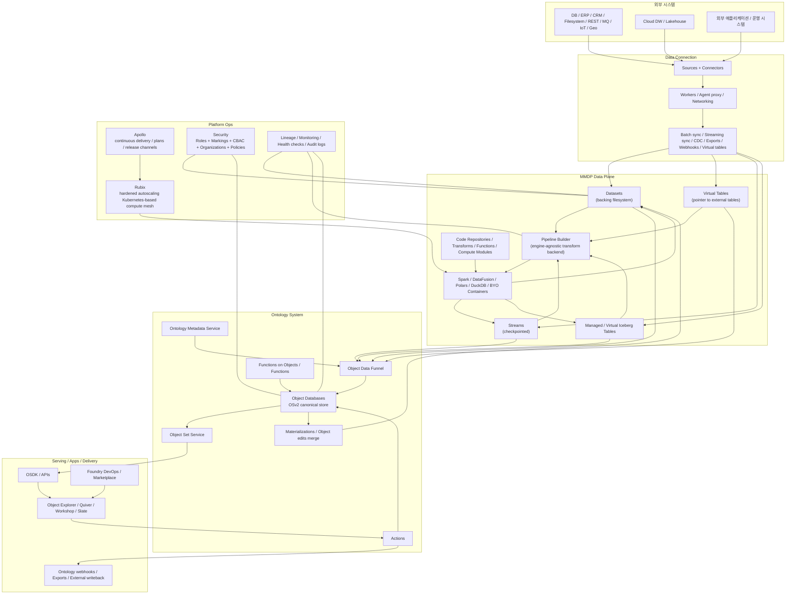
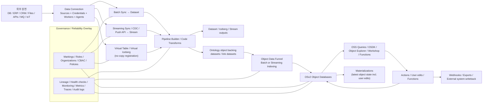

# 팔란티어 Foundry 심층 기술 분석

## 문서 지도

이 문서는 Foundry-lite 문서 체계의 **외부 근거 원본**이다. Palantir Foundry 공개 문서에서 확인 가능한 원칙을 정리하고, 그 원칙이 [Foundry-lite 개발 기획서](./foundry_lite_development_plan_ko_sprintified.md), [스프린트 실행 계획](./foundry_lite_sprint_breakdown_ko.md), [Python 백엔드 엔지니어링 가이드](./foundry_lite_python_engineering_guidelines_ko.md)에 어떻게 반영되는지 연결한다.

> 체크박스 해석 주의: 이 문서의 `[ ]`는 제품 구현 완료 상태가 아니라, 공개 근거를 설계 문서에 연결해 읽기 위한 추적 템플릿이다. 현재 구현 완료 여부는 [Implementation Status](./docs/implementation-status.md), [Sprint Evidence Ledger](./docs/sprint-evidence-ledger.md), [스프린트 실행 계획](./foundry_lite_sprint_breakdown_ko.md)을 따른다.

- [ ] 이 문서는 Foundry 공개 문서에서 확인 가능한 아키텍처 원칙과 기능 경계를 정리한다.
- [ ] 제품 목표와 구현 설계의 원본은 [Foundry-lite 개발 기획서](./foundry_lite_development_plan_ko_sprintified.md)다.
- [ ] 실행 순서와 완료 체크리스트의 원본은 [스프린트 실행 계획](./foundry_lite_sprint_breakdown_ko.md)이다.
- [ ] Python 백엔드 구현 원칙과 코드 품질 기준은 [Python 백엔드 엔지니어링 가이드](./foundry_lite_python_engineering_guidelines_ko.md)를 원본으로 본다.
- [ ] 공개 문서에 없는 내부 구현 세부는 추측하지 않고 `미지정`으로 남긴다.

### 함께 읽을 문서

- [Foundry-lite 개발 기획서](./foundry_lite_development_plan_ko_sprintified.md): 이 보고서의 외부 근거를 실제 제품 설계로 옮긴 문서다.
- [스프린트 실행 계획](./foundry_lite_sprint_breakdown_ko.md): 이 보고서의 원칙을 구현 순서와 Acceptance Gate로 나눈 문서다.
- [Python 백엔드 엔지니어링 가이드](./foundry_lite_python_engineering_guidelines_ko.md): 공개 문서에서 가져온 재현성, health checks, audit 원칙을 Python 코드 품질 기준으로 바꾼 문서다.

### 이 보고서가 기획서에 주는 근거

- [ ] Ontology 중심성은 [Ontology Metadata Service-lite](./foundry_lite_development_plan_ko_sprintified.md#8-ontology-metadata-service-lite)와 [Object Store 설계](./foundry_lite_development_plan_ko_sprintified.md#9-object-store-설계)의 근거다.
- [ ] Data as Code와 lineage 원칙은 [Dataset transaction](./foundry_lite_development_plan_ko_sprintified.md#52-dataset-transaction-types), [Dataset commit protocol](./foundry_lite_development_plan_ko_sprintified.md#57-dataset-commit-protocol), [Build graph and lineage](./foundry_lite_development_plan_ko_sprintified.md#77-build-graph-and-lineage)의 근거다.
- [ ] Actions와 materialization 흐름은 [Action Runtime](./foundry_lite_development_plan_ko_sprintified.md#12-action-runtime-설계), [Materialization / Writeback](./foundry_lite_development_plan_ko_sprintified.md#13-materialization--writeback-설계)의 근거다.
- [ ] Observability, health checks, audit 원칙은 [Operations](./foundry_lite_sprint_breakdown_ko.md#sprint-33--runsqueuesreplay-operations-uicli), [Security/Governance](./foundry_lite_sprint_breakdown_ko.md#sprint-34--v1-rbacdatasetobject-permissionproperty-masking), [MVP Release Hardening](./foundry_lite_sprint_breakdown_ko.md#sprint-36--mvp-e2e성능데이터-정합성-release-gate)의 근거다.
- [ ] Clean Code와 SRP 자체는 Palantir 공개 문서의 직접 주장이 아니라, 위 원칙을 구현 코드에서 안정적으로 지키기 위한 [Foundry-lite 내부 개발 표준](./foundry_lite_python_engineering_guidelines_ko.md)이다.

### 판독 주의

이 보고서는 공개 문서 기반 분석이다. 쉽게 말해, Palantir가 공개적으로 설명한 원칙과 API/서비스 경계는 근거로 삼을 수 있지만, Palantir 내부에서 실제로 어떤 데이터베이스, 메시지 버스, 캐시, 서비스 메시를 쓰는지는 공개 문서만으로 알 수 없다. 그래서 내부 구현 세부는 일부러 추측하지 않는다.

---

## 실행 요약

Palantir의 공개 문서만 놓고 보면, Foundry는 단순한 데이터 통합 도구가 아니라 **Apollo로 운영되는 배포 계층**, **Rubix로 구현되는 보안 강화형 쿠버네티스 기반 실행 계층**, **MMDP로 대표되는 개방형 데이터·컴퓨트 계층**, 그리고 **Ontology를 중심으로 한 읽기·쓰기 운영 계층**이 결합된 데이터 운영 플랫폼이다. Palantir는 Foundry를 “데이터 관리, 로직 작성, Ontology 개발, 분석, 워크플로 개발”의 기반 플랫폼으로 설명하고, 표준 아키텍처를 Foundry+AIP+Apollo의 결합으로 제시한다. 또한 Foundry의 핵심은 Ontology이며, Ontology는 데이터·로직·액션·보안을 통합하는 시스템으로 설명된다. [핵심 URL: `https://palantir.com/docs/foundry/architecture-center/platforms/`, `https://palantir.com/docs/foundry/architecture-center/ontology-system/`, `https://www.palantir.com/platforms/foundry/`]

기술 스택 측면에서 이 보고서는 Foundry-lite가 실제 채택하거나 비교 대상으로 유지하는 범위만 기술한다. 대용량 데이터 처리는 **Spark**, 단일 노드 실행은 **Apache DataFusion, Polars, DuckDB**를 공개 비교 대상으로 둔다. 변환 로직 언어는 **SQL, Python, Java, Mesa**가 명시되며, 함수는 **TypeScript v1/v2와 Python**을 지원한다. 개발자 도구는 **Code Repositories, VS Code Workspaces, JupyterLab, RStudio Workbench, OSDK**로 구성되며, OSDK는 **TypeScript(NPM), Python(Pip/Conda), Java(Maven), OpenAPI**를 지원한다. 반면 내부 마이크로서비스가 어떤 언어와 DBMS 위에 구현되는지, OMS/OSS/Object DB의 구체적 저장 엔진이 무엇인지는 공개 문서상 **미지정**이다. [핵심 URL: `https://palantir.com/docs/foundry/optimizing-pipelines/spark-concepts/`, `https://palantir.com/docs/foundry/functions/getting-started/`, `https://palantir.com/docs/foundry/ontology-sdk/overview/`, `https://palantir.com/docs/foundry/architecture-center/multimodal-data-plane/`]

데이터 흐름은 대체로 다음과 같이 복원된다. 외부 시스템은 **Data Connection**의 source/worker/agent 모델을 통해 연결되고, 데이터는 **dataset, stream, virtual table, managed/virtual Iceberg table** 등의 형태로 유입된다. 이후 **Pipeline Builder** 또는 코드 기반 변환이 엔진 비종속 중간 계층을 통해 실행되고, 결과는 Ontology로 매핑되며, **Object Data Funnel**이 **OSv2**에 대한 배치/스트리밍 인덱싱을 담당한다. 운영 중 발생하는 사용자 결정은 **Actions**를 통해 객체 상태를 변경하고, 필요하면 materialization을 통해 “소스 데이터 + 유저 수정”이 반영된 최신 객체 스냅샷을 다시 dataset으로 내보낸다. 이 전 과정은 lineage, health checks, monitoring, audit logging으로 감싼다. [핵심 URL: `https://palantir.com/docs/foundry/data-connection/overview/`, `https://palantir.com/docs/foundry/pipeline-builder/overview/`, `https://palantir.com/docs/foundry/object-indexing/overview/`, `https://palantir.com/docs/foundry/object-edits/materializations/`]

Palantir가 공개 문서에서 반복적으로 강조하는 엔지니어링 기법은 다음과 같다. **Treat data like code**라는 버전 관리 철학, 데이터·스토리지·컴퓨트의 **개방형 상호운용성**, **zero-trust** 기본값, **mandatory + discretionary access control** 조합, **policy-driven multi-tenant isolation**, **exactly-once 기본 스트리밍**, **live/replacement indexing pipelines**, **통합 lineage**, **데이터 품질 기대치와 health checks**, **SIEM 친화형 audit.3**, **release channels와 maintenance windows**, **Apollo의 pull-based autonomous deployment**, 그리고 **72시간 이내 컨테이너 순환** 같은 운영 보안 자동화다. [핵심 URL: `https://palantir.com/docs/foundry/security/overview/`, `https://palantir.com/docs/foundry/observability/overview/`, `https://palantir.com/docs/foundry/foundry-devops/overview/`, `https://palantir.com/docs/apollo/core/introduction/`, `https://palantir.com/docs/foundry/architecture-center/rubix/`]

가장 중요한 주의점은, 공개 문서는 **“플랫폼 원리와 공개 API/서비스 경계”는 비교적 상세히 설명하지만, “내부 구현 세부”는 상당수 생략**한다는 점이다. 따라서 이 보고서에서는 확인 가능한 것만 기술했고, 명시가 없는 항목은 모두 **미지정**으로 표기했다. 특히 내부 메시지 버스, 서비스 메시의 구체 구현, Object Database의 실제 DB 제품, 쿠버네티스 배포판, Spark/Iceberg 버전, 내부 CI 러너 구조, 재해복구 수치 등은 공개 문서만으로 특정할 수 없다.

## 조사 범위와 판독 기준

본 보고서는 **palantir.com** 하위 도메인만을 사용해 작성했다. 우선순위는 공개 문서 허브(`https://palantir.com/docs/foundry/`), Architecture Center, Data Connection/Data Integration, Ontology/Object Backend/Object Indexing, Security/Governance, Observability, Developer Toolchain, Foundry DevOps/Marketplace, Apollo 문서, 공식 백서 PDF, 공식 블로그, 그리고 보조적으로 `community.palantir.com`의 개발자 커뮤니티다. 커뮤니티는 “존재 확인 및 공개 사용 맥락” 용도로만 낮은 가중치로 사용했고, 핵심 아키텍처 주장은 문서·백서 중심으로만 구성했다. 공개 문서에 없는 내용은 모두 **미지정**으로 남겼다. [범위 URL: `https://palantir.com/docs/foundry/`, `https://community.palantir.com/`]

공식 제품 페이지 중 일부는 동적 렌더링 때문에 본문 추출이 제한되었으므로, 그런 경우에는 같은 도메인의 검색 스니펫을 보조 근거로만 사용했다. 반대로 세부 기술은 대부분 docs와 백서에서 확인되므로, 기술적 판단은 docs/whitepaper에 더 큰 가중치를 두었다. 예를 들어 제품 페이지는 Foundry를 “semantic, kinetic, dynamic elements”를 통합하는 플랫폼으로, Pipeline Builder를 “production-grade data pipelines with integrated security, data quality, and governed collaboration”으로, Streaming을 “process streaming data at scale”로 요약한다. [제품 URL: `https://www.palantir.com/platforms/foundry/`, `https://www.palantir.com/platforms/foundry/data-integration/pipeline-builder/`, `https://www.palantir.com/platforms/foundry/streaming/`]

### Foundry-lite 설계 반영

- [ ] 공개 문서 기반 근거만 제품 설계의 근거로 사용한다.
- [ ] 공개 문서에서 확인되지 않는 내부 구현 세부는 [개발 기획서의 adapter boundary](./foundry_lite_development_plan_ko_sprintified.md#35-v1-adapter-boundary)로만 열어둔다.
- [ ] MVP 범위 판단은 [스프린트 실행 계획 Sprint 00](./foundry_lite_sprint_breakdown_ko.md#sprint-00--제품-경계데모-도메인성공-정의-고정)에서 고정한다.

## 공개문서 기반 참조 아키텍처

아래 도식은 Palantir의 공개 문서들만을 합성해 재구성한 **공개문서 기반 참조 아키텍처**다. 즉, Palantir 내부 실제 배치 토폴로지의 완전 복사본이 아니라, `platforms`, `ontology-system`, `multimodal-data-plane`, `rubix`, `object-backend`, `data-connection`, `pipeline-builder` 문서를 바탕으로 한 분석적 정리다. [아키텍처 URL: `https://palantir.com/docs/foundry/architecture-center/platforms/`, `https://palantir.com/docs/foundry/architecture-center/ontology-system/`, `https://palantir.com/docs/foundry/architecture-center/multimodal-data-plane/`, `https://palantir.com/docs/foundry/architecture-center/rubix/`, `https://palantir.com/docs/foundry/object-backend/overview/`]

이 도식의 핵심은 **Ontology 중심성**이다. Foundry의 Architecture Center는 Ontology를 “데이터, 로직, 액션, 보안”을 네 겹으로 통합하는 시스템으로 설명하고, Ontology backend가 데이터소스 관리, 질의/검색/집계, 쓰기 오케스트레이션을 담당한다고 밝힌다. Object backend 문서는 이를 위해 **OMS, Object databases, OSS, Actions, Object Data Funnel, Functions on Objects**라는 서비스군을 명시한다. [URL: `https://palantir.com/docs/foundry/architecture-center/ontology-system/`, `https://palantir.com/docs/foundry/object-backend/overview/`]

두 번째 핵심은 **MMDP 기반의 개방형 데이터·컴퓨트 구조**다. Palantir는 Apache Iceberg를 Foundry/AIP의 기본 테이블 포맷으로 채택한다고 명시하고, 데이터 복제를 강제하지 않는 virtual catalog/virtual table 모델, REST API 및 Python/TypeScript SDK를 통한 접근, Databricks·Snowflake 등 외부 클라우드 런타임으로의 compute pushdown, 그리고 BYO container compute를 같은 아키텍처 안에 두고 있다. [URL: `https://palantir.com/docs/foundry/architecture-center/multimodal-data-plane/`]

세 번째 핵심은 **Rubix + Apollo 기반의 운영 추상화**다. Rubix 문서는 Foundry/AIP/Apollo를 AWS, Azure, GCP, Oracle Cloud, 온프레미스에 **동일한 운영 특성**으로 배포할 수 있다고 하고, MMDP 문서는 이를 “hardened, autoscaling Kubernetes-based compute mesh”라고 부른다. Apollo는 이 위에서 설치·업그레이드·롤백 plan을 계산하는 delivery control plane 역할을 맡는다. [URL: `https://palantir.com/docs/foundry/architecture-center/rubix/`, `https://palantir.com/docs/foundry/architecture-center/multimodal-data-plane/`, `https://palantir.com/docs/apollo/core/introduction/`]

다음 표는 공개 문서상 확인 가능한 주요 컴포넌트를 계층별로 정리한 것이다.

| 계층 | 컴포넌트 | 공개 문서상 역할 | 대표 URL |
|---|---|---|---|
| 통합 플랫폼 | Foundry | 데이터 관리, 로직 작성, Ontology 개발, 분석, 워크플로 개발을 제공하는 기반 데이터 운영 플랫폼 | `https://palantir.com/docs/foundry/architecture-center/platforms/` |
| 통합 플랫폼 | Apollo | Foundry/AIP를 호스팅하는 인프라를 관리하고 zero-downtime 업그레이드를 오케스트레이션 | `https://palantir.com/docs/foundry/architecture-center/platforms/` |
| 실행 서브스트레이트 | Rubix | 보안 강화형 autoscaling 쿠버네티스 기반 compute mesh; 멀티클라우드/온프레 동일 운영 특성 | `https://palantir.com/docs/foundry/architecture-center/rubix/` |
| 데이터 평면 | MMDP | Iceberg 기반 open data architecture + open compute architecture + BYO compute + pushdown | `https://palantir.com/docs/foundry/architecture-center/multimodal-data-plane/` |
| 연결 계층 | Data Connection | 외부 시스템/다른 Foundry 인스턴스와의 sync, export, webhook, virtual table 등록 | `https://palantir.com/docs/foundry/data-connection/overview/` |
| 데이터 추상화 | Dataset | backing file system 위의 파일 컬렉션 래퍼; permissions/schema/versioning/updates 통합 지원 | `https://palantir.com/docs/foundry/data-integration/datasets/` |
| 데이터 추상화 | Virtual table | 외부 테이블을 복제 없이 pointer로 참조; 보안과 오케스트레이션은 Foundry가 유지 | `https://palantir.com/docs/foundry/data-integration/virtual-tables/` |
| 데이터 추상화 | Stream | checkpoint를 통해 fault tolerance를 제공하는 스트리밍 데이터 경로 | `https://palantir.com/docs/foundry/data-integration/streams/` |
| 변환 계층 | Pipeline Builder | Foundry의 primary data integration app; typed 중간 표현과 엔진 비종속 변환 백엔드 | `https://palantir.com/docs/foundry/pipeline-builder/overview/` |
| 모델링 계층 | Ontology system | 데이터·로직·액션·보안을 통합하는 운영 계층 | `https://palantir.com/docs/foundry/architecture-center/ontology-system/` |
| Ontology backend | OMS / OSS / Object DB / Actions / Funnel / Functions | Ontology 메타데이터, 질의, 저장, 쓰기 오케스트레이션, 인덱싱, 실행 로직 담당 | `https://palantir.com/docs/foundry/object-backend/overview/` |
| 인덱싱 | Object Data Funnel | OSv2 인덱싱을 담당하는 microservice; batch/streaming funnel pipeline 오케스트레이션 | `https://palantir.com/docs/foundry/object-indexing/overview/` |
| 서빙/개발 | Functions / OSDK / Workshop / Slate / Object Explorer | Ontology-backed 저지연 로직, typed SDK, 운영 앱 빌더, 탐색 UI, 외부 앱 통합 | `https://palantir.com/docs/foundry/functions/getting-started/`, `https://palantir.com/docs/foundry/ontology-sdk/overview/` |

Palantir의 2021/2022 Foundry Technical Overview 백서는 이 구조를 더 고전적인 용어로 요약한다. 즉, **Foundry Data Connection**, **Data Transformation**, **Pipeline Orchestration**, **Security**, **Lineage**, **Data Health Monitoring**, **Ontology**, **Decision Capture/Enterprise Writeback**를 Foundry의 구조적 축으로 제시한다. 다만 이 백서는 최신 제품 문서보다 오래되므로, “현재도 유효한 설계 의도”를 보여주는 참고 자료로 읽는 편이 정확하다. [URL: `https://www.palantir.com/assets/xrfr7uokpv1b/mhoyY4c8vdVlJhulDStk2/a7340768109c8e8d79d00b4cb99d8e70/Whitepaper_-_Foundry_2022.pdf`]

### Foundry-lite 설계 반영

- [ ] Ontology 중심성은 [Ontology Metadata Service-lite](./foundry_lite_development_plan_ko_sprintified.md#8-ontology-metadata-service-lite), [Object Store 설계](./foundry_lite_development_plan_ko_sprintified.md#9-object-store-설계), [Object Query Service 설계](./foundry_lite_development_plan_ko_sprintified.md#11-object-query-service-설계)에 반영한다.
- [ ] Object Data Funnel 개념은 [Funnel-lite 스프린트](./foundry_lite_sprint_breakdown_ko.md#sprint-18--snapshot-indexer-clean-dataset--object-records)와 [Funnel-lite 설계](./foundry_lite_development_plan_ko_sprintified.md#10-funnel-lite-ontology-indexer-설계)에 반영한다.
- [ ] Apollo/Rubix 수준의 운영 자동화는 v1 필수가 아니라 [Sprint 45](./foundry_lite_sprint_breakdown_ko.md#sprint-45--kubernetes-helmbackuprestoreoperational-runbook) 이후 확장으로 둔다.

## 기술 스택

Foundry의 공개 기술 스택은 “한 가지 프레임워크로 모든 것을 구현한다”는 식이 아니라, **데이터 추상화는 개방형 표준으로, 실행은 복수 엔진으로, 개발은 다언어 SDK/IDE로, 배포는 Apollo로, 보안은 플랫폼 전파형 정책으로** 구성되어 있다. 따라서 기술 스택을 단일 3-tier 앱처럼 읽으면 오히려 잘못 이해하게 된다. Palantir가 공식 문서에서 가장 일관되게 강조하는 것은 **open data + open compute + governed operational semantics**의 결합이다. [URL: `https://palantir.com/docs/foundry/architecture-center/multimodal-data-plane/`, `https://palantir.com/docs/foundry/platform-overview/overview/`]

다음 표는 공개 문서 기준으로만 작성한 “확인된 스택 / 미지정 스택” 요약이다.

| 영역 | 공개 문서상 확인된 기술 | 세부 설명 | 미지정 항목 |
|---|---|---|---|
| 데이터 형식 | **Apache Iceberg** | MMDP의 primary table format으로 명시; managed Iceberg와 virtual Iceberg 모두 지원 | Parquet/ORC 등 내부 기본 파일 포맷 정책은 문서상 미지정 |
| 데이터 추상화 | **Datasets, Virtual Tables, Streams, Media Sets, Managed/Virtual Iceberg Tables** | Dataset은 backing FS 래퍼, Virtual Table은 external pointer, Stream은 checkpoint 기반 | backing file system의 실제 구현 제품은 미지정 |
| 변환 엔진 | **Spark** | 대용량 SQL/Python/Java/Mesa 변환의 공개 비교 기반 | 엔진 버전과 배포 옵션은 미지정 |
| 추가 컴퓨트 엔진 | **Apache DataFusion, Polars, DuckDB** | MMDP의 single-node/high-performance engines로 명시 | 사용 시점·기본 우선순위는 미지정 |
| BYO compute | **Compute Modules + Docker images** | 언어 무관 기존 코드베이스를 serverless Docker 이미지로 배포 가능 | 런타임 base image 표준, orchestrator 상세는 미지정 |
| 변환 언어 | **SQL, Python, Java, Mesa** | Mesa는 proprietary Java-based DSL로 문서 명시 | Scala 등은 공개 근거상 미지정 |
| 함수 언어 | **TypeScript v1, TypeScript v2, Python** | Functions repositories의 공식 언어 옵션 | 내부 function runtime 구현 세부는 미지정 |
| SDK | **TypeScript/NPM, Python/Pip/Conda, Java/Maven, OpenAPI** | OSDK가 이 조합을 공식 지원 | 다른 언어의 1st-party SDK 제공 여부는 미지정 |
| 개발 환경 | **Code Repositories, VS Code Workspaces, JupyterLab, RStudio Workbench, VS Code extension** | Code Workspaces와 VS Code Workspaces가 Foundry 자원과 통합 | JetBrains 계열 공식 지원은 미지정 |
| 앱 프레임워크 | **OSDK React, Dash, Streamlit** | VS Code Workspaces는 OSDK React 앱을, Code Workspaces Jupyter는 Dash/Streamlit을 지원 | React 외 프론트엔드 템플릿 범위는 미지정 |
| 버전 관리 | **Git** | Code Repositories가 underlying Git repository와 상호작용 | Git hosting 내부 구현은 미지정 |
| CI/CD | **Integrated checks, pull requests, tagging releases, Gradle custom checks, Foundry DevOps, Marketplace, Apollo release channels** | Code quality/PR/CI는 Code Repositories, product delivery는 DevOps/Marketplace, infra delivery는 Apollo | 내부 CI runner/Jemma 상세 아키텍처는 부분만 공개, 전체 구조는 미지정 |
| 런타임/배포 | **Rubix, Kubernetes-based compute mesh, multi-cloud/on-prem** | AWS/Azure/GCP/Oracle Cloud/on-prem 동일 운영 특성 | kube distro, CNI, service mesh 제품명은 미지정 |
| 인증 | **SAML 2.0, OIDC** | Control Panel에서 IdP 통합 관리 | 내부 session/token service 구현 세부는 미지정 |
| 인가 | **Roles, Markings, CBAC, Organizations, Spaces, Object/Property security policies** | mandatory + discretionary 접근제어, tenant/isolation 계층 | 정책 평가 엔진 내부 구현은 미지정 |
| 로깅/관측 | **Audit.3, Metrics, Trace Views, Health checks, Monitoring views** | 로그/메트릭/트레이스 export와 SIEM 연계 지원 | 로그 저장엔진·트레이스 backend 구현은 미지정 |
| 네트워킹/연결 | **Foundry worker, agent proxy, legacy agent worker, direct egress policies** | 별도 네트워크의 on-prem 시스템은 agent를 secure intermediary로 사용 | service networking 세부 토폴로지는 미지정 |

스택을 해석할 때 중요한 점이 하나 더 있다. Foundry는 전통적인 의미의 “데이터베이스/미들웨어 제품 목록”을 외부에 거의 공개하지 않는다. Ontology backend에는 “object databases”, “OSv2 canonical data store” 같은 개념은 공개하지만, 그것이 어떤 상용/오픈소스 DB 제품인지까지는 공개하지 않는다. 따라서 “데이터베이스” 항목은 공개 문서상 **Object databases / OSv2 / backing filesystem / Iceberg catalog**까지가 한계이며, 그 아래의 실제 제품명은 **미지정**이다. [URL: `https://palantir.com/docs/foundry/object-backend/overview/`, `https://palantir.com/docs/foundry/data-integration/datasets/`, `https://palantir.com/docs/foundry/iceberg/storage/`]

공식 백서와 최신 docs를 겹쳐 읽으면, Palantir의 설계 방향은 일관된다. 백서는 **engine-agnostic build system, treating data like code, full provenance, decision capture/writeback**를 강조하고, 최신 docs는 이를 **engine-agnostic intermediate backend, global branching, materializations, object edits, DevOps release channels, Apollo plans**로 더 구조화했다. 즉, 기술 스택의 핵심은 특정 한 엔진이 아니라 **버전관리·분기·재현성·통합 거버넌스가 가능하도록 데이터/로직/앱을 같은 운영체계 안에 올리는 방식**이다. [URL: `https://www.palantir.com/assets/xrfr7uokpv1b/mhoyY4c8vdVlJhulDStk2/a7340768109c8e8d79d00b4cb99d8e70/Whitepaper_-_Foundry_2022.pdf`, `https://palantir.com/docs/foundry/global-branching/overview/`, `https://palantir.com/docs/foundry/foundry-devops/overview/`]

### Foundry-lite 설계 반영

- [ ] v1 compute는 외부 분산 스트리밍 엔진이 아니라 [DuckDB canonical runner](./foundry_lite_development_plan_ko_sprintified.md#7-transform-engine-설계)로 제한한다.
- [ ] Spark와 Iceberg production catalog는 Sprint 43~44 future scope로 둔다. Elasticsearch는 현재 adapter/projection proof가 있고, managed live cluster 운영은 [Sprint 42 이후 운영 과제](./foundry_lite_sprint_breakdown_ko.md#sprint-42--elasticsearch-adapter-for-search-heavy-object-types)로 둔다.
- [ ] TypeScript/OpenAPI 기반 SDK 방향은 [OSDK-lite 설계](./foundry_lite_development_plan_ko_sprintified.md#16-osdk-lite-설계)와 [Sprint 35](./foundry_lite_sprint_breakdown_ko.md#sprint-35--generated-typescript-sdk와-web-sdk-전환)에 반영한다.
- [ ] API/Worker/CLI 백엔드는 [Python 백엔드 엔지니어링 가이드](./foundry_lite_python_engineering_guidelines_ko.md)에 따라 Python 3.12+, FastAPI, Pydantic v2, SQLAlchemy, DuckDB, Typer, local/direct workflow boundary 기준으로 구현한다. Alembic migration history와 Temporal Python SDK execution은 future scope다.

## 종단간 데이터 흐름

Foundry의 end-to-end 데이터 흐름은 공개 문서상 크게 **ingest → persist/register → transform/orchestrate → model/index → serve/writeback → govern/observe** 순으로 정리할 수 있다. 단, 이 선형 흐름은 실제로는 Ontology의 읽기/쓰기 루프 때문에 닫혀 있다. 즉, 데이터는 외부에서 들어와 Ontology를 만들고, Ontology 위에서 사용자/애플리케이션/에이전트가 내린 결정은 다시 Actions·webhooks·exports를 통해 외부 시스템으로 나간다. Foundry product page와 Architecture Center는 이 점을 “closed-loop operations”와 decision modeling으로 설명한다. [URL: `https://www.palantir.com/platforms/foundry/`, `https://palantir.com/docs/foundry/architecture-center/ontology-system/`]

이 흐름의 첫 단계는 **연결과 유입**이다. Data Connection은 외부 시스템 및 다른 Foundry 인스턴스에서 데이터를 동기화하는 애플리케이션이며, source는 URL/자격증명/worker를 포함한 연결 단위다. worker는 capability가 어디서 실행되는지를, agent는 별도 네트워크(on-prem 등)에서 Foundry와 외부 시스템 사이의 secure intermediary 역할을 담당한다. Data Connection capability는 batch sync, streaming sync, CDC sync, media sync, file/table/stream export, webhooks, virtual tables, exploration, use in code까지 포함한다. [URL: `https://palantir.com/docs/foundry/data-connection/overview/`, `https://palantir.com/docs/foundry/data-connection/core-concepts/`, `https://palantir.com/docs/foundry/data-connection/initial-setup-overview/`]

유입 데이터의 landing model은 하나가 아니다. **Dataset**은 backing filesystem 기반 저장 추상화이고, **Virtual Table**은 외부 시스템 테이블에 대한 포인터이며, **Streams**는 이벤트성 low-latency 처리 경로다. Virtual table은 외부 데이터를 Foundry로 먼저 저장하지 않고도 워크플로에 포함할 수 있게 해 주며, update detection을 통해 downstream builds나 object reindex를 트리거할 수 있다. Streams는 checkpoint를 따라 job graph 전체를 통과하는 fault tolerance 모델을 가진다. [URL: `https://palantir.com/docs/foundry/data-integration/datasets/`, `https://palantir.com/docs/foundry/data-integration/virtual-tables/`, `https://palantir.com/docs/foundry/data-integration/streams/`]

다음 단계는 **변환과 오케스트레이션**이다. Pipeline Builder는 Foundry의 primary data integration app이며, 여러 실행 엔진을 사용하면서도 사용자가 특정 엔진 세부에 직접 묶이지 않도록 설계된다. Palantir 문서는 Pipeline Builder backend를 “logic creation and execution 사이의 intermediary”로 설명하고, 사용자가 원하는 파이프라인을 기술하면 backend가 transform code와 integrity checks를 생성한다고 밝힌다. 이 계층은 dataset뿐 아니라 object types, link types, streams, time-series, exports까지 목표로 삼는다. [URL: `https://palantir.com/docs/foundry/pipeline-builder/overview/`, `https://palantir.com/docs/foundry/pipeline-builder/transforms-overview/`]

그 다음은 **Ontology 인덱싱**이다. Object Indexing 문서에 따르면 Ontology에서 indexing은 Foundry datasource를 specialized databases에서 빠르게 조회할 수 있도록 만드는 과정이며, OSv2에서는 Object Data Funnel이 이를 맡는다. Funnel은 batch와 streaming 두 종류의 pipeline을 오케스트레이션한다. 배치 인덱싱의 경우 live pipeline이 서비스 중이어도 background replacement pipeline을 띄워 schema 변경이나 성능 재조정을 반영할 수 있고, replacement가 성공하면 교체된다. [URL: `https://palantir.com/docs/foundry/object-indexing/overview/`, `https://palantir.com/docs/foundry/object-indexing/funnel-batch-pipelines/`]

스트리밍 인덱싱은 더 운영 지향적이다. OSv2의 stream-backed object type은 초 단위~분 단위 수준의 low-latency indexing을 목표로 하고, 문서상 기본 consistency guarantee는 **exactly-once**이며 필요 시 **at-least-once**로 완화해서 중복 가능성을 받아들이는 대신 지연을 줄일 수 있다. 다만 한 object type의 stream record 크기는 1MB를 넘을 수 없고, 속성 수는 250개를 넘지 못한다. 이는 Foundry가 low-latency operational serving을 위해 Ontology 스트리밍에 명확한 형태 제약을 두고 있음을 의미한다. [URL: `https://palantir.com/docs/foundry/object-indexing/funnel-streaming-pipelines/`]

서빙 단계에서는 **OSS, OSDK, Object Explorer, Workshop, Functions, Actions**가 만난다. OSS는 Ontology의 read path를 맡아 검색·필터링·집계·로딩을 담당하고, OSDK는 선택된 Ontology subset에 대한 typed API를 생성해 외부/내부 애플리케이션이 Foundry를 backend처럼 사용하도록 한다. 사용자는 Workshop/Object Views/외부 앱/API를 통해 Actions를 실행하고, Actions는 객체/링크의 변경을 하나의 트랜잭션으로 적용한다. [URL: `https://palantir.com/docs/foundry/object-backend/overview/`, `https://palantir.com/docs/foundry/ontology-sdk/overview/`, `https://palantir.com/docs/foundry/action-types/overview/`, `https://palantir.com/docs/foundry/object-edits/overview/`]

Foundry의 데이터 흐름이 일반적인 ETL과 다른 지점은 **user edits와 writeback의 1급 시민화**다. OSv2에서는 user edits를 위해 materialized dataset이 필수는 아니지만, 필요하면 materialization을 생성해 “input datasource + user edits”가 모두 반영된 최신 객체 상태를 downstream pipeline이나 다운로드에 사용할 수 있다. 또한 user edits는 datasource와 충돌할 수 있으므로 conflict resolution 전략을 갖고 병합된다. 공개 문서상 기본 전략은 **Apply user edits**, 대안은 **Apply most recent value**다. [URL: `https://palantir.com/docs/foundry/object-edits/materializations/`, `https://palantir.com/docs/foundry/object-edits/how-edits-applied/`]

다음 표는 주요 데이터 파이프라인 유형을 비교한 것이다.

| 경로 | 저장 위치 | 지연 특성 | 거버넌스/보안 특성 | 대표 사용처 |
|---|---|---|---|---|
| Batch sync → Dataset | Foundry backing filesystem | 배치 주기 기반 | dataset permissions, schema/versioning, lineage가 기본 통합 | 레이크 적재, 정제 파이프라인 시작점 |
| Virtual table | 외부 시스템에 그대로 저장 | 소스 polling/update detection 기반 | Foundry 보안 모델 적용, 데이터 복제 불필요 | DW/lakehouse 연동, no-copy architecture |
| Stream / push ingestion | stream resource | low-latency/event-driven | checkpoint 기반 fault tolerance, API token/branch 필요 | 센서/운영 이벤트/CDC |
| CDC sync | DB 변경분을 stream으로 | near-real-time | CDC metadata 포함, downstream stream processing 가능 | 변경 전파, mirrored ops |
| Funnel batch indexing | OSv2 object DB | 배치형, replacement pipeline 가능 | object/index semantics + monitoring 일부 지원 | object serving, search/aggregation |
| Funnel streaming indexing | OSv2 object DB | seconds-to-minutes 수준 | exactly-once 기본, at-least-once 선택 가능 | operational object updates |
| Materialization | Foundry dataset | 자동 업데이트 | object security policies와 markings 반영 가능 | 최신 object state를 downstream pipeline/다운로드에 사용 |

Palantir의 공식 백서와 Trust in Data whitepaper를 합치면, Foundry의 데이터 흐름 철학은 더 명확해진다. Palantir는 이것을 **software-defined data integration**, **full provenance**, **decision capture**, **data lineage**, **automated data health checks**라고 설명한다. 즉, 데이터 흐름은 “적재 후 분석”이 아니라 “적재 → 정제 → 운영 모델링 → 의사결정 → 외부 반영 → 재학습/재관찰”의 루프다. [URL: `https://www.palantir.com/assets/xrfr7uokpv1b/mhoyY4c8vdVlJhulDStk2/a7340768109c8e8d79d00b4cb99d8e70/Whitepaper_-_Foundry_2022.pdf`, `https://www.palantir.com/assets/xrfr7uokpv1b/621jZEFhAkzeFjj6fndeW/f8e96ca8a08ee8afb50ad61ea3ff10a0/Trust_in_Data_Whitepaper__US_.pdf`]

### Foundry-lite 설계 반영

- [ ] Foundry-lite v1 흐름은 [개발 기획서의 v1 성공 기준](./foundry_lite_development_plan_ko_sprintified.md#24-v1-성공-기준)에 고정한다.
- [ ] Data Connection → Dataset → Transform 흐름은 [Sprint 03~14](./foundry_lite_sprint_breakdown_ko.md#sprint-03--dataset-논리-자산-crud)에서 구현한다.
- [ ] Ontology/Object/Action/Materialization 폐루프는 [Sprint 15~32](./foundry_lite_sprint_breakdown_ko.md#sprint-15--ontology-draftobjectproperty-yaml-import)에서 구현한다.
- [ ] 운영 중 생긴 action 결과가 다시 dataset으로 돌아오는 요구는 [Materialization / Writeback 설계](./foundry_lite_development_plan_ko_sprintified.md#13-materialization--writeback-설계)에 반영한다.

## 엔지니어링 프랙티스

Foundry에서 공개적으로 확인되는 엔지니어링 프랙티스는 다섯 묶음으로 요약할 수 있다. **관측성**, **테스트와 변경관리**, **확장성과 회복력**, **멀티테넌시와 접근통제**, **배포와 운영 자동화**다. 이 다섯 가지는 별도 보조 기능이 아니라, Data Plane–Ontology–Apps 전 계층에 관통하는 운영 원칙으로 설계되어 있다. [URL: `https://palantir.com/docs/foundry/observability/overview/`, `https://palantir.com/docs/foundry/security/overview/`, `https://palantir.com/docs/foundry/foundry-devops/overview/`]

관측성부터 보면, Foundry는 **Data Lineage, Monitoring Views, Health Checks, Metrics, Trace Views, Audit Logs**를 조합한다. Data Lineage는 Pipeline 전체 흐름을 그래프로 탐색하게 해 주고, Monitoring Views는 범위 기반 monitor를 설정하게 해 주며, Health Checks는 build/sync freshness부터 row count, schema, primary key, null percentage까지 다양한 검사를 제공한다. Observability 문서는 로그/메트릭/트레이스를 스트리밍 dataset으로 export해 사용자 정의 관측 파이프라인을 만들 수 있다고 밝힌다. [URL: `https://palantir.com/docs/foundry/data-lineage/overview/`, `https://palantir.com/docs/foundry/monitoring-views/overview/`, `https://palantir.com/docs/foundry/health-checks/checks-reference/`, `https://palantir.com/docs/foundry/observability/overview/`]

보안 감사 관점에서는 **audit.3**가 눈에 띈다. Audit Logs 문서는 audit.3를 모든 신규 구현의 추천 방식으로 제시하고, 대략 **15분 내 가용**, **직접 API 접근 가능**, **standardized categories**를 장점으로 든다. Audit log categories는 서비스별 event명을 쫓는 대신 `dataLoad`, `dataExport`, `userLogin` 같은 상위 category로 모니터링하게 해 준다. 이는 운영 엔지니어링 측면에서 “플랫폼이 커져도 규칙셋이 덜 깨지도록” 만든 기술적 장치다. [URL: `https://palantir.com/docs/foundry/security/audit-logs-overview/`, `https://palantir.com/docs/foundry/security/audit-log-categories/`]

테스트와 변경관리는 개발자 툴체인에 깊게 내장되어 있다. Code Repositories는 Git 기반 branching/committing/tagging, pull requests, integrated code review, linting/error checking을 제공한다. unit tests는 Python transforms, Java transforms, TypeScript functions에 대해 지원되며, custom checks는 Gradle tasks로 CI에 추가할 수 있다. VS Code 문서는 Code Repositories를 “editing, version control, change management, and continuous integration” 중심 도구라고 규정한다. [URL: `https://palantir.com/docs/foundry/code-repositories/overview/`, `https://palantir.com/docs/foundry/code-repositories/unit-tests/`, `https://palantir.com/docs/foundry/code-repositories/create-custom-checks/`, `https://palantir.com/docs/foundry/vs-code/overview/`]

데이터 품질 프랙티스도 강하다. Pipeline Builder의 Data Expectations는 현재 output마다 **primary key**와 **row count** 기대치를 걸 수 있게 하고, 실패 시 build를 실패시킨다. Health Checks는 범용적이고, Trust in Data whitepaper는 이를 “timeliness, completeness, consistency, missing contents” 감시 수단으로 설명한다. Palantir의 철학은 “문제가 downstream에 나타난 뒤 수동 추적”이 아니라, lineage와 check를 이용해 **빨리 실패하고 영향 범위를 추적하는 것**에 가깝다. [URL: `https://palantir.com/docs/foundry/pipeline-builder/dataexpectations-overview/`, `https://palantir.com/docs/foundry/health-checks/checks-reference/`, `https://www.palantir.com/assets/xrfr7uokpv1b/621jZEFhAkzeFjj6fndeW/f8e96ca8a08ee8afb50ad61ea3ff10a0/Trust_in_Data_Whitepaper__US_.pdf`]

확장성과 회복력 쪽에서는 Palantir가 꽤 구체적인 기법을 공개한다. MMDP는 autoscaling distributed compute와 hardened autoscaling Kubernetes-based compute mesh를 명시하고, Rubix는 intelligent workload distribution과 demand-sensing algorithms, continuous cost optimization을 언급한다. 또한 MMDP 문서는 **모든 컨테이너를 72시간 이내 파기·순환**한다고 밝히고, 이는 운영 보안과 node compromise persistence 억제를 동시에 노리는 기법이다. Ontology 인덱싱 측면에서는 live/replacement funnel pipelines가 schema change와 성능 이슈를 서비스 중단 없이 흡수한다. [URL: `https://palantir.com/docs/foundry/architecture-center/multimodal-data-plane/`, `https://palantir.com/docs/foundry/architecture-center/rubix/`, `https://palantir.com/docs/foundry/object-indexing/funnel-batch-pipelines/`]

멀티테넌시와 접근통제는 Foundry 설계의 매우 강한 축이다. 공개 문서에 따르면 enrollment는 하나 이상의 Organization으로 이루어지고, Organization은 사용자와 자원 사이의 **strict silos**를 강제한다. Spaces는 access requirements, filesystem, usage account, resource queue, role set을 가진다. 즉, tenant/isolation은 단순한 UI 분리만이 아니라 **보안 요구사항 + 파일시스템 + 리소스 큐 + 비용 계정** 수준까지 내려간다. 여기에 roles, markings, CBAC, guest membership, shared/private spaces, object/property security policies가 결합된다. [URL: `https://palantir.com/docs/foundry/administration/enrollments-and-organizations/`, `https://palantir.com/docs/foundry/platform-security-management/manage-orgs-and-spaces/`, `https://palantir.com/docs/foundry/security/cross-organization-collaboration/`, `https://palantir.com/docs/foundry/object-permissioning/object-security-policies/`]

접근통제 모델도 단순 RBAC가 아니다. Security overview는 authentication + authorization 조합 위에서 **mandatory controls**와 **discretionary controls**를 같이 쓴다고 설명한다. markings는 mandatory access controls의 구현이고, roles는 discretionary permission이다. CBAC는 특히 정부 고보안 환경을 위한 mandatory control로서 classification hierarchy와 disjunctive marking을 제공한다. object/property security policies는 object-level 및 cell-level에 가까운 unified security를 지원하며 streaming과 branching도 지원한다고 명시된다. [URL: `https://palantir.com/docs/foundry/security/overview/`, `https://palantir.com/docs/foundry/security/protecting-sensitive-data/`, `https://palantir.com/docs/foundry/security/projects-and-roles/`, `https://palantir.com/docs/foundry/security/classification-based-access-controls/`, `https://palantir.com/docs/foundry/object-permissioning/object-security-policies/`]

배포와 운영 자동화는 두 층으로 나뉜다. 애플리케이션/데이터 제품 층에서는 Foundry DevOps가 resource package를 product로 만들어 version/dependency/release channel/maintenance window/manage fleet를 관리하고, Marketplace는 guided install과 auto-upgrade를 제공한다. 인프라/서비스 delivery 층에서는 Apollo가 **release channels에 대한 pull model**을 사용해 환경이 필요한 안정성 수준에 맞는 update를 스스로 당기도록 한다. 이것은 일반적인 linear push CD보다 환경 제약을 더 자연스럽게 모델링하려는 접근이다. [URL: `https://palantir.com/docs/foundry/foundry-devops/overview/`, `https://palantir.com/docs/foundry/marketplace/overview/`, `https://palantir.com/docs/apollo/core/introduction/`]

다음 표는 공개 문서로 확인되는 대표 엔지니어링 기법을 요약한 것이다.

| 기법 | Foundry에서의 형태 | 효과 | 대표 URL |
|---|---|---|---|
| Data as Code | dataset versioning, branching, change management, global branching | 재현성·안전한 실험·승인 기반 변경 | `https://palantir.com/docs/foundry/data-integration/datasets/`, `https://palantir.com/docs/foundry/global-branching/overview/` |
| Engine-agnostic authoring | Pipeline Builder intermediate backend | 작성 언어/엔진 결합도 감소 | `https://palantir.com/docs/foundry/pipeline-builder/transforms-overview/` |
| Pushdown / federated compute | BYO compute, Databricks/Snowflake pushdown, virtual tables | 기존 DW/compute 재사용 | `https://palantir.com/docs/foundry/architecture-center/multimodal-data-plane/` |
| Exactly-once streaming default | stream-backed object types consistency option | 중복 억제, 운영 워크플로 안전성 | `https://palantir.com/docs/foundry/object-indexing/funnel-streaming-pipelines/` |
| Live/replacement indexing | Funnel batch replacement pipeline | 무중단 schema/perf 전환 | `https://palantir.com/docs/foundry/object-indexing/funnel-batch-pipelines/` |
| Zero-trust compute isolation | compute modules default no external network access; Rubix zero-trust; 72h container cycling | blast radius 축소, persistence 억제 | `https://palantir.com/docs/foundry/compute-modules/sources/`, `https://palantir.com/docs/foundry/architecture-center/multimodal-data-plane/` |
| Mandatory + discretionary security | markings + roles + CBAC + Organizations | 세분화된 데이터 공유와 강제 격리 동시 달성 | `https://palantir.com/docs/foundry/security/overview/` |
| Object-level dynamic security | object/property security policies | object/property 단위 보안, streaming/branching 호환 | `https://palantir.com/docs/foundry/object-permissioning/object-security-policies/` |
| Integrated lineage | upstream/downstream graph, impact analysis | 디버깅·회귀 추적·영향도 분석 | `https://palantir.com/docs/foundry/data-lineage/overview/` |
| Data health gates | data expectations + health checks + monitors | 품질 회귀 조기 차단 | `https://palantir.com/docs/foundry/pipeline-builder/dataexpectations-overview/`, `https://palantir.com/docs/foundry/health-checks/checks-reference/` |
| Integrated CI | pull requests, tests, custom Gradle checks | 플랫폼 내 코드 품질 관리 | `https://palantir.com/docs/foundry/code-repositories/overview/`, `https://palantir.com/docs/foundry/code-repositories/create-custom-checks/` |
| Productized release management | DevOps products + Marketplace + release channels + maintenance windows | 데이터 제품의 표준화된 배포/업그레이드 | `https://palantir.com/docs/foundry/foundry-devops/overview/`, `https://palantir.com/docs/foundry/marketplace/overview/` |
| Pull-based autonomous deployment | Apollo release channel subscriptions and plans | 환경별 제약 반영형 CD | `https://palantir.com/docs/apollo/core/introduction/` |

### Foundry-lite 설계 반영

- [ ] Data as Code는 [Dataset immutability contract](./foundry_lite_development_plan_ko_sprintified.md#511-dataset-immutability-contract), [Dataset commit protocol](./foundry_lite_development_plan_ko_sprintified.md#57-dataset-commit-protocol)에 반영한다.
- [ ] Health checks와 quality gate는 [Sprint 08](./foundry_lite_sprint_breakdown_ko.md#sprint-08--health-checks와-commit-차단), [Sprint 13](./foundry_lite_sprint_breakdown_ko.md#sprint-13--transform-health-gates와-temporal-실행), [Sprint 36](./foundry_lite_sprint_breakdown_ko.md#sprint-36--mvp-e2e성능데이터-정합성-release-gate)에 반영한다.
- [ ] Audit, monitoring, replay는 [운영 원칙](./foundry_lite_development_plan_ko_sprintified.md#23-운영-원칙), [Sprint 33](./foundry_lite_sprint_breakdown_ko.md#sprint-33--runsqueuesreplay-operations-uicli)에 반영한다.
- [ ] Foundry 수준의 복잡한 보안은 v1 범위를 넘기고, v1은 [Security / Governance 설계](./foundry_lite_development_plan_ko_sprintified.md#14-security--governance-설계)처럼 tenant/RBAC/property masking/audit에 집중한다.

## 공개문서의 공백과 한계

가장 크게 비어 있는 부분은 **내부 구현 세부**다. Palantir는 “microservices architecture”, “object databases”, “OSv2 canonical data store”, “Kubernetes-based compute mesh” 같은 설명까지는 공개하지만, 그 아래의 구체 기술명은 거의 공개하지 않는다. 따라서 아래 항목은 모두 공개 문서상 **미지정**이다. 내부 object DB 제품명, OMS/OSS 구현 언어, 서비스 간 메시징 시스템, 분산 캐시, 큐/이벤트 버스, service discovery, API gateway, secret store backend, disaster recovery 수치(RPO/RTO), SLO/SLA, Spark/Iceberg/Kubernetes 정확한 버전, 그리고 CI runner/Jemma의 전체 구조다. [URL: `https://palantir.com/docs/foundry/object-backend/overview/`, `https://palantir.com/docs/foundry/architecture-center/multimodal-data-plane/`, `https://palantir.com/docs/foundry/security/overview/`]

둘째, 일부 공개 자료는 **시점 주의**가 필요하다. 예를 들어 Foundry Technical Overview 백서는 2021/2022 시점 자료로, “200+ connectors”, “Preparation, Contour”, “Objects Gateway” 같은 표현을 사용한다. 이런 자료는 아키텍처 철학과 공개 기능 축을 이해하는 데 유용하지만, 2026년 현재의 정확한 제품 표면과 1:1로 대응한다고 보기는 어렵다. 따라서 본 보고서에서는 백서에서 나온 수치나 개념을 현재 docs로 재확인할 수 있는 경우에만 강화해서 사용했고, 재확인이 어려운 경우에는 “역사적·개념적 근거”로만 취급했다. [URL: `https://www.palantir.com/assets/xrfr7uokpv1b/mhoyY4c8vdVlJhulDStk2/a7340768109c8e8d79d00b4cb99d8e70/Whitepaper_-_Foundry_2022.pdf`, `https://palantir.com/docs/foundry/available-connectors/other-source-types/`]

셋째, 제품 페이지 일부는 동적 렌더링 때문에 본문 추출이 제한되었다. 그래서 제품 방향성 요약은 search snippet 기반으로 보완했고, 세부 기능은 docs로 덮었다. 이는 분석 자체를 무효화하지는 않지만, “제품 마케팅 페이지에만 적힌 상세 문구”는 docs만큼 강한 근거로 삼지 않았다는 뜻이다. [URL: `https://www.palantir.com/platforms/foundry/`, `https://www.palantir.com/platforms/foundry/data-integration/pipeline-builder/`, `https://www.palantir.com/platforms/foundry/streaming/`]

넷째, `community.palantir.com`은 분명히 존재하고 Foundry/AIP 사용자 질의응답, 튜토리얼, 아키텍처 논의를 담고 있지만, 이는 공식 docs와 달리 제품 계약적 설명이 아니다. 따라서 “공식 문서 침묵 영역”을 보조적으로 비추는 용도로만 적합하다. 본 보고서의 핵심 구조·스택·데이터 흐름 결론은 community에 의존하지 않았다. [URL: `https://community.palantir.com/`]

마지막으로, 공개 문서만 보면 Foundry는 **강한 공개 추상화**와 **선택적 세부 공개**라는 전략을 취한다. 공개된 것은 “무엇을 할 수 있는가”, “어떤 아키텍처 원칙을 따르는가”, “어떤 API/보안/운영 경계를 보장하는가”이고, 비공개인 것은 “정확히 어떤 내부 부품으로 그것을 구현하는가”다. 따라서 엔지니어링 관점에서 Foundry를 가장 정확하게 이해하는 방식은, 내부 저장엔진 추측이 아니라 **Ontology 중심 운영 시스템, open data/compute, policy-propagating governance, integrated deployment/observability**라는 네 가지 설계 원리를 읽는 것이다. [URL: `https://palantir.com/docs/foundry/architecture-center/ontology-system/`, `https://palantir.com/docs/foundry/architecture-center/multimodal-data-plane/`, `https://palantir.com/docs/foundry/foundry-devops/overview/`, `https://palantir.com/docs/foundry/observability/overview/`]

### Foundry-lite 설계 반영

- [ ] 내부 구현 제품명을 추측하지 않고, Foundry-lite는 현재 checkout의 SQLAlchemy/local filesystem/DuckDB/local workflow boundary와, future target인 PostgreSQL/MinIO/S3/Temporal을 명시적으로 구분해 문서화한다.
- [ ] 공개 문서에서 확인된 원칙은 유지하되, 구현은 [v1 adapter boundary](./foundry_lite_development_plan_ko_sprintified.md#35-v1-adapter-boundary)를 통해 나중에 교체 가능하게 둔다.
- [ ] 최신성 검증이 필요한 Palantir 제품 세부는 새 구현 결정을 내리기 전 별도 조사로 갱신한다.
- [ ] MVP 구현자는 이 보고서를 Foundry의 내부 복제 문서가 아니라 Foundry-lite의 설계 원칙 참고 문서로 읽는다.
