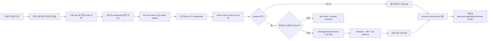

# AI FDE 공개 동작 연구와 Foundry-lite 이식 결과

기준일은 2026-08-05입니다. 이 문서는 Palantir가 공개한 제품 문서를 동작 계약으로 분석하고 Foundry-lite의 실제 제품 경로와 대조한 결과입니다. 비공개 소스 코드나 내부 구현을 복제했다는 뜻은 아닙니다. 세부 상태와 증거는 [AI FDE 비교표](./ai-fde-parity-matrix.json)가 기준이며, Action Types·두 MCP plane·Pilot을 하나의 제품으로 완성하는 목표 요구사항은 [Palantir급 Agent-Native Operations Platform PRD](./palantir-action-mcp-prd-ko.md)를 따릅니다.

## 공식 문서에서 확인한 핵심

- AI FDE는 단순 질의응답기가 아니라 사용자의 의도를 native operation으로 바꾸고 실행 결과를 관찰해 다음 행동을 정하는 대화형 운영자입니다. [AI FDE overview](https://www.palantir.com/docs/foundry/ai-fde/overview)
- mode는 작업별 문서·capability·tool 묶음이며 data integration, data connection, ontology, functions, exploration, governance, ML, OSDK React, platform Q&A로 나뉩니다. [Modes and capabilities](https://www.palantir.com/docs/foundry/ai-fde/modes-and-capabilities)
- AI는 현재 사용자의 권한으로 동작하고, 읽기 도구와 달리 mutation은 명시적인 사용자 확인을 요구합니다. [Security and governance](https://www.palantir.com/docs/foundry/ai-fde/security-and-governance)
- 리소스 변경은 branch에서 만들고 proposal 또는 code review로 검토하는 것이 기본 운영 경계입니다. 작은 context/tool 집합으로 결과를 검증하며 반복하는 방식이 권장됩니다. [Best practices](https://www.palantir.com/docs/foundry/ai-fde/best-practices)
- Palantir MCP는 build-time platform tool plane이고 Ontology MCP는 허용된 object/action/query를 소비하는 plane입니다. [Palantir MCP overview](https://www.palantir.com/docs/foundry/palantir-mcp/overview), [MCP security](https://www.palantir.com/docs/foundry/palantir-mcp/security)
- 공개된 Palantir MCP catalog는 Compass, Dataset, Lineage, Ontology, Object Set, OSDK, Platform SDK, Code Repository, Global Branching, Developer Console, Compute Module, Data Connection, documentation의 13개 family와 현재 72개 도구를 제공합니다. [Available tools](https://www.palantir.com/docs/foundry/palantir-mcp/available-tools)
- tool search는 시작 시 `search_tools`만 노출하고 필요한 tool을 session에 활성화해 큰 catalog의 context 비용을 줄입니다. [June 2026 announcement](https://www.palantir.com/docs/foundry/announcements/2026-06)
- Ontology MCP는 Developer Console application restriction과 OAuth를 재사용하며 interactive user는 Authorization Code, service integration은 Client Credentials를 사용합니다. [Ontology MCP overview](https://www.palantir.com/docs/foundry/ontology-mcp/overview), [Authentication and authorization](https://www.palantir.com/docs/foundry/ontology-mcp/authentication-and-authorization)
- Pilot은 ontology design, seed data, React UI, CI, Developer Console application을 한 흐름으로 생성합니다. [Pilot overview](https://www.palantir.com/docs/foundry/pilot/overview)

## 폭의 차이

현재 Foundry-lite AI FDE catalog는 9개 mode와 69개 server-owned tool입니다. 이 중 43개는 Palantir의
공개 72개 catalog와 이름이 정확히 일치하고, 나머지 26개는 Foundry-lite의 branch/test/proposal/Pilot
계약을 표현하는 고유 도구입니다. 공식명 43개는 catalog placeholder가 아니라 Compass Project/Resource,
committed Dataset manifest, lineage, Ontology branch, Object Query, OSDK/Platform SDK registry, Developer
Console, governed Source/Webhook/egress policy, curated documentation의 실제 application service를 호출합니다.

남은 공식 29개는 Compass namespace/template 2개, Dataset SQL/create/build 계열 6개, Code Repository
7개, Global Branching 6개, Developer Console repository/React conversion 2개, Compute Module 5개,
versioned webhook update 1개입니다. 해당 제품 원장이나 안전한 mutation 계약 없이 이름만 추가하지 않습니다.
비교표의 16개 축이 `current`인 것은 permission, branch, confirmation, bounded loop, durable ledger 같은
**동작 계약**이 사용자 경로에 연결됐다는 뜻이며, 아직 공개 72개와 1:1 폭이 같다는 뜻은 아닙니다.

`/mcp/builder/{application_id}`와 `/mcp/ontology/{application_id}`는 분리돼 있습니다. 전자는 구조를
branch에서 만들고, 후자는 application restriction으로 허용된 production object/action/function만
소비합니다. consumer MCP는 공식 Python MCP `ClientSession`이 별도 Uvicorn 프로세스의 Streamable HTTP
endpoint에 연결해 PostgreSQL 객체 조회와 고위험 Action의 approval-required 결과를 받은 live gate까지
통과했습니다. 실제 ChatGPT SaaS tenant 연결과 production cloud KMS는 여전히 별도 운영 증거입니다.

## Foundry-lite에 적용한 실행 계약

현재 제품 경로는 다음과 같습니다.

- `GET /api/aip/fde/catalog`는 호출자에게 실제 허용된 mode와 tool만 반환합니다.
- `POST /api/aip/fde/run`은 최대 8회의 bounded execute-observe-adjust loop, lazy tool search, 구조화 plan/clarification을 실행합니다.
- current mode는 `exploration`, `ontology_editing`, `data_integration`, `data_connection`, `functions_editing`, `governance`, `ml`, `osdk_react`, `platform_qa`입니다.
- Dataset, Ontology/Pipeline branch, Source, Function, OSDK app, Project, Resource, Model context는 정상 서비스 권한으로 다시 읽고 버전·해시·token budget이 붙은 evidence로 저장합니다.
- Ontology와 Pipeline 변경은 선택한 branch에만 쓰며 proposal까지 만들 수 있습니다. AI에게 승인·merge·deploy·activation tool은 제공하지 않습니다.
- 모델·도구·입력·구조화 결과·사용량·상태 이벤트는 `ai_sessions`, `ai_execution_runs`, `ai_tool_calls` 원장에 남습니다.
- `/mcp/builder/{application_id}`는 Streamable HTTP, OAuth Authorization Code + PKCE, app/client/resource-scope 제한, Origin 검증, native structured content, JSON-RPC 재전송 idempotency, out-of-band mutation 확인을 제공합니다. `discoveryMode=lazy`에서는 새 session이 `search_tools`만 받고, local ranking으로 찾은 허용 도구만 그 session에 영속 활성화하며 `notifications/tools/list_changed`를 받습니다. eager mode는 호환 경로로 유지됩니다.
- Pilot API와 AIP UI는 Project, replay-safe seed Dataset, Ontology branch, OSDK application, 실제 OSDK query를 사용하는 React source, CI workflow, durable resource, stable preview path를 한 번의 명시적 생성으로 만듭니다. 고객 화면은 base SDK나 inline generic object descriptor를 직접 받지 않고 `consumer_osdk_strict` 앱 package/domain hook만 import합니다. 모델이 반환된 plan의 package/profile/exception을 변조해도 서버가 strict 좌표를 다시 계산하며, bundle의 TypeScript AST checker와 `consumer-osdk:check` CI step이 우회를 차단합니다.
- generated TypeScript/browser SDK와 AIP/Pilot 화면은 같은 named API 계약을 사용합니다.

## 완성 경계

비교표의 16개 공개 동작 축은 모두 `current`입니다. 여기서 “완성”은 AI가 production 통제를 우회한다는 뜻이 아닙니다. 오히려 아래의 제한이 완성 조건입니다.

- 사용자와 애플리케이션의 권한 교집합 밖 도구는 보이지도 실행되지도 않습니다.
- mutation은 매 실행의 명시적 확인 없이는 실패합니다.
- Ontology와 Pipeline 변경은 branch와 사람 검토를 통과해야 합니다.
- Pilot 생성 직후 화면은 안전한 preview이며 production 객체·Action 사용은 Ontology 활성화 뒤에만 가능합니다.
- 공개 문서에서 확인할 수 없는 Palantir 내부 구현과 proprietary prompting은 동일 구현이라고 주장하지 않습니다.
