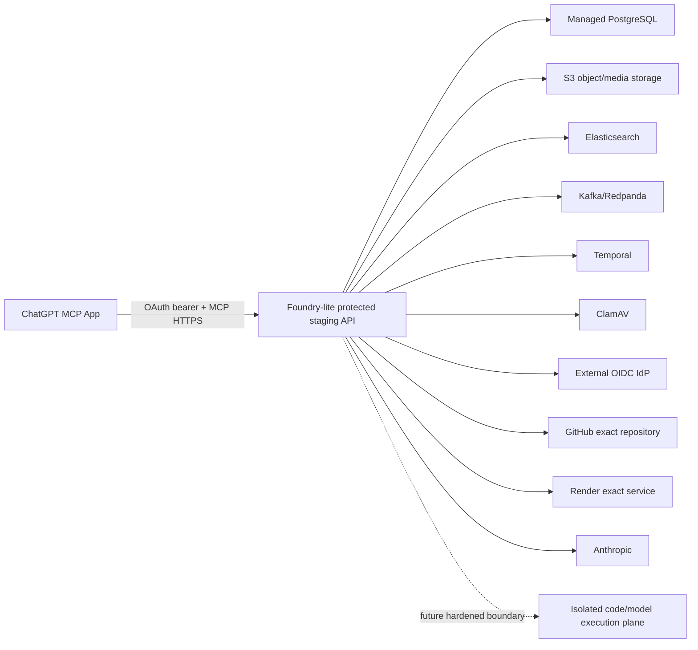

# Governed Release Hosted Staging 배포 Runbook

이 문서는 최초 외부 연결이 끝난 뒤 사용자가 ChatGPT 화면을 떠나지 않고 변경 검토부터 배포·상태 확인·필요한 롤백까지 수행하기 위한 **보호형 staging 부트스트랩** 절차다. IdP client 등록, 공개 HTTPS 배포, GitHub·Render secret/target 연결, Render 유료 리소스 생성과 최초 비용 승인은 ChatGPT 대화형 릴리스가 대신할 수 없는 1회 운영자 설정이다. 현재 파일은 배포 가능한 모양을 고정하지만, Render나 다른 외부 계정에 서비스를 생성했다는 증거는 아니다.

## 현재 판정

| 항목 | 현재 상태 | 의미 |
|---|---|---|
| API 컨테이너 | 패키징됨 | `deploy/render/Dockerfile.api`가 Python 3.12, 전체 production adapter extra, non-root 사용자와 고정 시작 명령을 제공한다. |
| Render Blueprint | 템플릿 준비 | `deploy/render/render.staging-bootstrap.yaml`은 protected staging API와 PostgreSQL을 선언하지만 아직 적용하지 않았다. 적용하면 유료 리소스가 생길 수 있다. |
| Kubernetes package | repository proof 통과, live 설치 대기 | `deploy/helm/foundry-lite`와 Kubernetes deployment provider/controller, ARM64 image workflow, S3/OIDC/격리 실행 및 Mac mini 운영 도구가 있다. 실제 single-node 실행은 [Mac mini Enterprise QA runbook](./macmini-enterprise-qa-runbook.md)에서 별도로 추적하며, 완료 전에는 hosted production proof가 아니다. |
| DB migration | 패키징됨 | 매 배포 전에 `deploy/render/predeploy_migrate.sh`가 singleton-lock Alembic runner로 `head`를 적용한다. |
| readiness | 구성 확인 가능 | `/readyz`는 실제 API composition과 metadata DB `SELECT 1`을 확인한다. 단순 생존 확인인 `/healthz`와 목적이 다르다. |
| GPT 내 MCP App UI | hosted branch·read-only reload slice 실증 | `ui://foundry-lite/governed-release-v9-87ac4aeadd8c.html`은 MCP Apps `2026-01-26` JSON-RPC `postMessage` bridge를 기본으로 사용하고 `window.openai`는 기존 host 호환 fallback으로만 사용한다. 2026-08-12 hosted ChatGPT에서 workspace open → exact widget branch create → Builder handoff와 read-only inbox 재접속 복구를 실증했다. |
| 외부 OIDC | 입력 및 live 검증 필요 | Authorization Code + PKCE를 지원하는 IdP client와 정확한 audience/scope/claim/JWKS가 필요하다. 작성자와 검토자가 서로 다른 principal일 필요는 없다. |
| GitHub·Render write path | 입력 및 live 검증 필요 | exact repository/service token과 live policy preflight가 모두 통과해야 한다. |
| 정상 릴리스 운영 완료 | 서버 projection 구현, hosted 실행 미검증 | exact Render deploy가 terminal success이면 `operationalCompletion`이 정상 운영 완료를 표시한다. 이 판정에는 rollback이 필요하지 않다. |
| rollback rehearsal/live attestation | 서버 경로 구현, hosted 실행 미검증 | 서버가 exact 현재 OAuth 검토자에게만 두 workflow root를 `completionCoordinates`로 제시하고, 사용자가 app-only 확인을 하면 `verify_release_completion`이 PostgreSQL·GitHub·Render를 재조회해 별도의 rollback rehearsal DB attestation을 남긴다. 외부 계정에 대한 실제 성공 증거는 아직 없다. |
| 전체 production topology | 아직 미완료 | 아래 외부 managed dependency와 격리 실행 plane이 실제로 연결됐다는 증거가 없다. |

검토 담당 배정과 사람의 위젯 승인은 필수지만, 작성자와 검토자가 서로 다른 계정일 필요는 없다. 따라서 한 ChatGPT/OAuth 사용자가 제안을 작성하고 검토 담당을 self-claim한 뒤 승인할 수 있다. 별도 리뷰어가 필요한 GitHub ruleset이 있으면 그 저장소 정책은 추가 조건으로 적용된다.

2026-08-12 부분 실증은 공개 HTTPS tunnel과 Foundry-lite local Authorization Code OAuth server를 사용했다. ChatGPT가 prepare와 action 사이에서 MCP transport session ID와 짧은 수명의 access-token 발급·만료 시각을 바꿨지만, 서버는 같은 human OAuth session을 다시 확인한 뒤 `qa-gpt-mcp-20260812-131500` 브랜치를 정확히 한 번 만들고 `ontology-branch:ontbranch_3ca76bb7c2a644d9bba8cc5d39400ffd` Builder workspace를 대화에 전달했다. 이는 MCP App 호스트·OAuth 회전·one-time confirmation·branch 생성 구간의 live 증거이며, 외부 IdP 상호운용, GitHub 병합, Render 배포·관찰·rollback의 증거는 아니다.

같은 hosted 대화의 후속 read-only QA에서 `list_release_inbox`가 local OAuth access-token을 갱신한 새 MCP session으로 호출되고, `empty-inbox`와 “검토할 제안이 없습니다”를 MCP App 카드에 표시하는 것도 확인했다. 이 과정에서 실제 proposal이 없는 workspace·branch-created·empty-inbox 카드의 “상태 새로고침”이 sentinel proposal ID로 `get_release_status`를 호출할 수 있는 UI 결함을 발견했다. `ui://foundry-lite/governed-release-v6-f2bef02fe8ee.html`은 이 버튼을 fail-closed하고, 실제 proposal snapshot만 상태 조회를 허용한다. hosted empty-inbox 읽기와 결함 발견은 live 증거이며, v6 차단 동작 자체는 현재 32개 widget 회귀 테스트와 MCP transport 계약으로 확인했다.

후속 새 hosted ChatGPT 대화는 서버의 수정된 HTML과 같은 `v4` URI를 재사용하자 과거 캐시 자산을 다시 렌더링해 버튼이 활성화된 것처럼 보였다. 서버 호출 자체는 sentinel을 차단했지만 UI cache key가 immutable하지 않았던 결함이다. 첫 content-addressed URI인 `v5-25a98896119d`부터 HTML SHA-256 앞 12자리를 포함하며, `test_governed_release_widget_uri_is_content_addressed`가 실제 파일 hash와 tool/resource URI가 다르면 실패한다.

ChatGPT 등록 관리 화면에서 “새로 고침”을 실행한 뒤 descriptor와 실제 iframe이 `v5-25a98896119d`를 사용한 것도 확인했지만, 초기 tool result가 카드에 전달되지 않아 안내 skeleton에 머무는 두 번째 live 결함이 드러났다. ChatGPT의 MCP Apps adapter는 sandbox 내부의 same-window `postMessage`를 수신하는데 위젯은 parent window로만 초기화 요청을 보내고 있었다. `v6-f2bef02fe8ee`는 초기화에 한해 self와 parent를 함께 탐색하고 첫 유효 JSON-RPC 응답 source에 transport를 고정하며, same-window에 되돌아오는 자기 요청은 response로 오인하지 않는다. 이후 `tools/call`, `ui/message`, teardown은 고정된 exact source 한 곳에만 보낸다. `v2`·`v3`·`v4`와 이전 content-addressed `v5` resource read는 기존 대화 호환용으로 같은 현재 HTML을 계속 제공하지만 새 descriptor는 오직 content-addressed v6를 광고한다.

v6 서버 재시작과 ChatGPT 등록 정보 새로 고침 뒤 새 hosted 대화에서 `list_release_inbox`를 정확히 한 번 다시 호출했다. 실제 iframe title이 `ui://foundry-lite/governed-release-v6-f2bef02fe8ee.html`로 고정되고, `empty-inbox` 스냅샷이 skeleton 대신 “검토할 제안이 없습니다” 카드로 렌더링됐다. 격리 브랜치 생성, 검토 담당 수락, 승인, 반려, 병합·활성화, Pipeline 배포, 상태 새로고침, 롤백의 8개 버튼은 모두 구체적인 차단 사유와 함께 disabled였다. 이 재검증은 read-only였으며 브랜치 생성·병합·활성화·외부 배포·롤백 mutation은 실행하지 않았다.

이후 같은 v6 대화를 새 탭에서 다시 열자 ChatGPT가 과거 tool result를 즉시 재전달하지 않아 skeleton이 장시간 유지되는 세 번째 live 결함을 발견했다. v7은 늦은 `window.openai.toolInput`으로 `list_release_inbox` 또는 exact `get_release_status`만 호출하도록 보완했지만, 실제 hosted reload에서는 tool input도 즉시 복원되지 않아 22초 시점까지 skeleton이 남았다. 이 실패는 브라우저 화면에서 재현했으며 mutation은 실행하지 않았다.

`ui://foundry-lite/governed-release-v9-87ac4aeadd8c.html`은 첫 정상 스냅샷에서 토큰·후보 본문·시크릿을 제외하고 `releaseKind`, 실제 `proposalId` 또는 workspace/inbox 종류와 최소 branch 좌표만 MCP Apps 표준 `ui/update-model-context`로 영구 저장한다. 재접속 시 이 client-owned 좌표를 권한 근거로 신뢰하지 않고 서버의 `open_release_workspace`, `list_release_inbox`, `get_release_status` 중 하나만 정확히 한 번 다시 호출해 현재 OAuth 권한과 서버 상태를 재검증한다. host global과 좌표가 모두 없을 때도 15초 bounded wait 뒤 무한 busy skeleton 대신 명시적 복구 안내를 표시한다. 현재 descriptor는 v9만 광고하고 v2~v8 URI는 기존 대화의 resource read 호환에만 남긴다.

v8 서버 재시작과 ChatGPT 등록 새로 고침 뒤 새 hosted 대화에서 read-only `list_release_inbox`를 정확히 한 번 호출했고 실제 v8 HTML의 recovery schema와 표준 state 요청 코드를 iframe 안에서 확인했다. 같은 대화 URL을 새 탭에서 열었을 때 5초 시점에는 초기 skeleton이었지만 23초 시점에는 `empty-inbox` 카드가 자동 복구됐고, 해당 1분의 durable MCP rate-limit 원장에는 tool 호출이 정확히 1회만 기록됐다. 자동 복구 안내나 무한 busy 상태는 남지 않았으며 브랜치 생성·승인·병합·활성화·배포·롤백 mutation은 0건이었다. 로컬 회귀 증거는 38개 widget test와 content-address transport test다.

실제 pending Ontology proposal `ontprop_6c20d7a24b7745b897334d4d005df32f`도 fresh `get_release_candidate`와 새 탭 재접속의 exact `get_release_status`로 read-only 검증했다. fresh 카드는 2개 object type 추가, 차단·경고 0건, 구조·migration·SDK 검증 통과, 외부 CI `source_control_not_configured`를 표시했고 작성자 본인의 claim·승인·반려·실행·배포·rollback은 모두 비활성화했다. 최초 reload 타임라인에는 proposal 제출보다 약 4시간 앞선 다른 active Ontology의 `ontology.version.activated`가 섞였는데, 원인은 proposal 비교용 `activeOntology`를 audit resource ref로 사용한 것이었다. status 증거는 이제 pipeline의 `currentDeployment`와 ontology의 `activeOntology` 같은 비교 대상은 제외하고 proposal에 직접 연결된 `candidateDeployment`와 `appliedOntologyVersion`만 조회한다. 서버 재시작 뒤 같은 hosted 대화를 재접속하자 타임라인에는 exact `ontology.proposal.submitted` 1건만 남았다. DB에서 proposal은 계속 `pending`/`pending_review`, assignee·decision 없음, external delivery 0건, governed action audit 0건이었고 보호 mutation은 실행하지 않았다.

실제 Pipeline proposal `ppr_24242aacedaa4bcaa8782afb366bc87b`도 fresh `get_release_candidate`와 새 탭 재접속의 exact `get_release_status`로 read-only 검증했다. 현재 OAuth 사용자 `user-demo`는 작성자 `u-admin`도 지정 검토자 `u-reviewer`도 아니므로 claim·승인·반려·내부 병합·`PROMOTED` 배포·rollback이 모두 비활성화됐다. 후보 카드에는 branch diff 없음, static graph/output-contract proof `missing`, external CI `source_control_not_configured`, 위험 “미분류”, 증거 “미완결”이 그대로 표시됐다. 재접속은 5초 skeleton 뒤 약 25초 안에 서버 상태로 복구됐고 타임라인에는 exact `pipeline.proposal.submitted`와 `pipeline.proposal.assigned` 2건만 남았다. 실제 nested iframe의 “상태 새로고침” 버튼도 클릭해 표준 bridge의 registered DOM action을 검증했다. 카드는 최신 서버 스냅샷 완료 안내와 새 request ID를 표시했고, 그 fixed window의 durable quota는 read-only tool 정확히 1회였다. DB proposal은 계속 `in_review`, assignee `u-reviewer`, decision 없음, proposal-derived version 0건, external delivery 0건, governed action audit 0건이었다. 보호 mutation이나 confirmation 준비는 호출하지 않았다.

author-only source publication UI도 보호 mutation 없이 hosted 검증했다. 서버에는 exact GitHub repository metadata를 넣되 secretRef는 의도적으로 인증에 실패하는 non-secret QA 값으로 해석시켜, 실수로 action을 호출해도 provider write가 성공할 수 없게 했다. 이 상태에서 작성자 `user-demo`의 pending Ontology proposal `ontprop_6c20d7a24b7745b897334d4d005df32f`을 fresh 조회하자 외부 CI 사유가 `source_candidate_not_published`로 바뀌고 `GitHub 후보 PR 게시`만 enabled였다. 작성자 본인의 reviewer claim·승인·반려와 아직 선행 조건이 없는 merge·activation·deploy·rollback은 disabled였다. 게시 버튼이나 `prepare_release_action`은 클릭·호출하지 않았다. 같은 hosted 대화 `https://chatgpt.com/c/6a7c138e-654c-83ee-afc9-04b527db56ec`를 reload하자 5초 skeleton 뒤 약 30초 안에 동일 후보·동일 버튼 상태·exact `ontology.proposal.submitted` timeline으로 복구됐다. 해당 fixed window에는 read-only tool quota 1회만 기록됐고 DB proposal은 `pending`, assignee·decision 없음, delivery 0건, governed action audit 0건을 유지했으며 GitHub 열린 PR 목록도 전후 모두 0건이었다. QA 뒤 서버는 source-control 미구성 안전 기본값으로 되돌렸다. 이 증거는 게시 action의 hosted 가시성과 서버 권한 projection만 확인하며 실제 GitHub PR publication이나 provider credential의 유효성을 증명하지 않는다.

같은 날 현재 runtime에 GET-only live preflight를 적용했다. 등록된 `ongleam_fde` application의 내부 ID와 `governed_release:execute` scope를 SQLite 원장에서 read-only로 확인했고, 공개 tunnel의 exact protected-resource metadata는 실제 응답으로 통과했다. 기존 GitHub CLI 로그인 토큰을 값 비공개로 주입한 점검도 exact `ludia8888/foundry-lite` repository ID, `main` HEAD, push/admin 권한, protected branch와 classic protection을 실제 GitHub GET으로 통과했다. 최초 점검에서는 공개 MCP base와 달리 authorization server가 개발용 `https://foundry-lite.local/osdk-oauth`를 광고하는 결함 때문에 public discovery가 실패했다. 이를 수정한 뒤 서버는 local OAuth를 공개할 때 `FOUNDRY_LITE_OAUTH_ISSUER`와 `FOUNDRY_LITE_MCP_PUBLIC_BASE_URL`이 같은 HTTPS origin이 아니면 시작하지 않는다. 새 공개 세션으로 DCR public client 등록 → Authorization Code + PKCE S256 → exact resource Bearer 발급 → MCP `initialize`/`notifications/initialized` → 13개 `tools/list` → read-only `list_release_inbox`를 tunnel 밖에서 끝까지 재검증했다. 토큰·authorization code는 출력하지 않았고 릴리스 mutation은 0건이었다. Render CLI는 여전히 `unauthorized`이며 secretRef가 가리킬 실제 token과 service가 없어 `render_secret_unresolved`로 차단된다. 외부 IdP 상호운용, 병합·배포·rollback 호출도 아직 실행하지 않았다. 사전점검은 여러 필수 운영 설정이 비어 있으면 첫 항목만이 아니라 누락된 12개 설정 이름을 redacted report 한 번에 모두 보여준다.

## 배포 토폴로지



Blueprint는 API와 PostgreSQL만 선언한다. S3, Elasticsearch, Kafka, Temporal, ClamAV, IdP, Anthropic과 격리 실행 plane은 기존 managed service를 연결해야 한다. 빈 값을 local/fake adapter로 자동 대체하지 않는다.

## 시작 단계의 fail-closed 규칙

보호 프로필은 다음 조건 중 하나라도 어기면 HTTP 포트를 열기 전에 실패한다.

1. `FOUNDRY_LITE_DB_URL`이 PostgreSQL URL이 아니다.
2. `FOUNDRY_LITE_HOME`이 절대 경로가 아니거나 `FOUNDRY_LITE_DURABLE_STATE_MOUNT` 아래에 있지 않다.
3. `FOUNDRY_LITE_DURABLE_STATE_MOUNT`가 운영체제에서 실제 mount로 확인되지 않는다.
4. S3/media/Elasticsearch/Spark/REST/Kafka/Temporal/Anthropic/ClamAV production adapter profile 중 하나가 빠졌다.
5. OIDC issuer, public MCP HTTPS base, non-empty JWKS, human-grant claim, allowed client 또는 정확한 audience가 빠졌다.
6. GitHub repository binding, Render service binding 또는 대응 secretRef가 빠지거나 해석되지 않는다.
7. code execution 및 trained-model 이미지가 `sha256` digest로 고정되지 않았다.

이 검사는 비밀값을 응답이나 운영 증거에 출력하지 않는다.

## Render Blueprint 적용 전 필수 확인

`deploy/render/render.staging-bootstrap.yaml`을 실제로 동기화하기 전 다음 승인이 필요하다.

- Render `standard` web service, `basic-1gb` PostgreSQL, 10GB persistent disk의 비용 승인
- Singapore region이 외부 데이터·IdP·GitHub 정책에 맞는지 확인
- 모든 `sync: false` 항목을 비밀 저장소 또는 Render 환경 설정으로 입력
- `FOUNDRY_LITE_GOVERNED_RELEASE_APPLICATION_ID`를 실제 active OSDK application row와 정확히 일치시키고, 해당 application에 `osdk:connector:governed_release:execute` scope를 부여
- 구조 진단용 산출물 네 경로가 모두 `/var/data/foundry-lite/operator-evidence/` 아래인지 확인한다. Blueprint는 manifest, preflight, raw golden evidence, verification 경로를 이 영구 디스크에 고정하지만, 이 파일들은 `live_verified` 권한을 갖지 않는다.
- IdP audience/resource를 `https://<public-host>/mcp/release/{application_id}`와 정확히 일치시키고, 그 client에 Authorization Code + PKCE grant를 등록
- 최소 한 개의 human account에 동일 tenant/application의 author·reviewer·executor 권한을 부여한다. 조직 정책상 분리가 필요할 때만 추가 계정을 사용한다.
- GitHub token은 exact repository의 PR/policy/check/merge 권한만 부여
- Render token은 self `RENDER_SERVICE_ID`가 가리키는 한 서비스의 deploy/status/rollback 권한만 부여
- Render 서비스의 `autoDeployTrigger`가 계속 `off`인지 확인
- `pnpm --silent release:live-preflight`가 secret-free report 기준 `ready`인지 확인

Blueprint 동기화는 외부 상태 변경과 비용 발생 작업이므로 이 저장소 검증 명령이 자동 실행하지 않는다.

운영 shell에서 read-only preflight를 실행할 때는 Blueprint가 설정한 경로를 그대로 사용한다. 이 명령은 provider를 읽기만 하며 merge/deploy/rollback을 실행하지 않는다.

```bash
/opt/foundry-lite-venv/bin/python /app/scripts/operations/run_governed_release_live_preflight.py \
  --output /var/data/foundry-lite/operator-evidence/governed_release_live_preflight.json
```

Golden E2E 이후 파일 검증기는 구조 진단이나 장애 분석이 필요할 때만 사용한다. 같은 디렉터리의 manifest, raw evidence, preflight를 검사해 결과를 영구 디스크에 남기지만, 이 명령은 DB attestation을 만들지 않고 `live_verified`를 활성화할 수도 없다.

```bash
/opt/foundry-lite-venv/bin/python /app/scripts/operations/verify_governed_release_live_evidence.py \
  --manifest /var/data/foundry-lite/operator-evidence/governed_release_golden_manifest.json \
  --evidence /var/data/foundry-lite/operator-evidence/governed_release_golden_evidence.json \
  --preflight /var/data/foundry-lite/operator-evidence/governed_release_live_preflight.json \
  --output /var/data/foundry-lite/operator-evidence/governed_release_golden_verification.json
```

## 정상 운영 완료와 rollback rehearsal의 차이

정상 릴리스 완료는 GitHub 병합, 내부 Ontology activation 또는 Pipeline `PROMOTED`, exact Render deploy의 terminal-success 관찰까지다. Render가 요청을 접수한 것만으로는 완료가 아니며, 위젯은 `deploying`/`deployment_unverified` 상태를 bounded polling한 뒤 서버의 `operationalCompletion.isComplete=true`를 보여준다. 운영자는 정상 배포를 증명하기 위해 일부러 rollback할 필요가 없다.

candidate deploy가 terminal failure이면 새 candidate는 live가 된 적이 없고 기존 Render live deploy가 계속 서비스 중이다. 이 `deployment_failed` 상태에서 외부 provider rollback을 호출하면 오히려 기존 운영판보다 한 단계 더 과거로 내려갈 수 있으므로, 서버는 application rollback target을 노출하지 않고 internal-only recovery만 제시한다. 사용자가 확인하면 내부 Pipeline `PROMOTED` version만 직전 값으로 되돌리고 현재 Render live deploy는 그대로 보존한다.

`liveReadiness` attestation은 정상 완료와 별개인 **배포·복구 rollback rehearsal** 증거다. 이 선택적 리허설은 GPT 안에서 다음 순서로 수행한다.

1. Ontology와 Pipeline golden 시나리오가 각각 승인·병합·활성화/배포·안전한 rollback까지 끝난다.
2. 서버가 bounded recent workflow root를 원장에서 찾고, 두 root가 제출자와 다른 exact 현재 OAuth 검토자 및 현재 app/client/session에 맞을 때만 `attestationPurpose=rollback_rehearsal`, `isEligible=true`인 `completionCoordinates`를 status에 넣는다. 사용자가 workflow ID를 복사하거나 입력하지 않는다.
3. 위젯은 유효한 서버 좌표가 있을 때만 “배포·복구 리허설 검증” 버튼을 보여준다. 사용자가 확인하면 app-only `verify_release_completion`이 그 좌표와 exact arguments에서 결정적으로 만든 caller idempotency key를 사용하며 caller evidence JSON, status 또는 live flag는 받지 않는다.
4. 서버가 PostgreSQL의 action/delivery/audit 원장과 실제 GitHub PR/commit, Render target policy 및 현재 활성 rollback deploy를 각각 다시 읽는다. 선택된 DB 증거가 수집 중 바뀌거나 provider 상태가 일치하지 않으면 실패한다.
5. 모든 검증이 통과하면 같은 최종 DB transaction 안에서 append-only attestation, audit, outbox를 기록한다. 이후 `get_release_status`의 `liveReadiness` 또는 인증된 `GET /mcp/release/{application_id}/live-readiness`가 이 rollback rehearsal을 `live_verified`로 표시한다.

attestation은 현재 서버 구성 fingerprint와 정확히 결합되고 최대 24시간만 유효하다. 이 fingerprint에는 고정 release application id, public MCP base, OIDC issuer와 exact resource audience, 정렬된 허용 OAuth client 목록, scope, ChatGPT origin, GitHub/Render target, 서버 revision이 포함된다. hosted release MCP는 설정된 application 한 개가 아니면 metadata부터 404, 호출은 401로 차단한다. 만료 시간이 없거나, 이 구성 중 하나라도 달라졌거나, 다른 client/resource/workflow/검토자가 같은 작업을 재사용하려 하면 fail-closed한다. 응답 유실 뒤 같은 GPT 작업을 재시도할 때만 서버가 deterministic collector ID로 이미 커밋된 동일 attestation을 찾아 재사용한다.

## 마이그레이션과 시작 순서

1. Render가 Docker image를 빌드한다.
2. 시작 스크립트는 Render의 `postgresql://` connection string scheme만 SQLAlchemy psycopg v3용 `postgresql+psycopg://`로 메모리 안에서 바꾸며 URL이나 비밀번호를 출력하지 않는다.
3. pre-deploy compute가 `predeploy_migrate.sh`를 실행한다. Persistent disk는 pre-deploy 단계에서 접근할 수 없으므로 migration evidence는 `/tmp`에만 쓰며, schema truth는 PostgreSQL에 남는다.
4. migration이 실패하거나 singleton lock을 얻지 못하면 새 배포를 시작하지 않는다.
5. runtime instance가 persistent disk를 `/var/data`에 mount한다.
6. `start_api.sh`가 유효한 `PORT`를 확인하고 Uvicorn을 `0.0.0.0:${PORT}`에 non-root로 시작한다.
7. Render가 `/readyz`의 `200`을 확인한 뒤 새 instance를 healthy로 판정한다.

`/readyz` 성공은 API composition과 PostgreSQL 연결 증거다. 외부 OIDC 로그인, 배정된 사람 승인, GitHub merge, Render deploy/rollback의 live E2E 성공을 뜻하지 않는다. 정상 릴리스의 현재 완료는 인증된 status의 `operationalCompletion`에서 확인하고, rollback rehearsal 증거는 GPT의 `verify_release_completion`이 만든 DB attestation과 `liveReadiness`에서 따로 확인한다. 파일 preflight/verifier는 구조 진단 증거로만 사용한다.

## 현재 staging 한계와 production 승격 조건

현재 composition은 OAuth local signing material, 암호화된 prompt artifact와 backup receipt를 `FOUNDRY_LITE_HOME` 아래에 둔다. Blueprint가 persistent disk를 붙여 재배포 후 유실은 막지만, Render disk는 단일 instance만 사용할 수 있고 zero-downtime deploy를 지원하지 않는다. 따라서 이 Blueprint는 **single-instance protected staging bootstrap**이지 최종 production topology가 아니다.

또한 code/function/trained-model execution adapter는 Docker-compatible 격리 runtime을 요구한다. Render의 API container 안에서 nested Docker가 제공된다고 가정할 수 없으므로, 별도의 안전한 remote execution port/worker가 연결되고 digest-pinned image를 실제 실행하는 E2E가 통과하기 전에는 전체 기능이 운영 가능하다고 판정하지 않는다.

production 승격에는 최소한 다음이 추가로 필요하다.

- local prompt/backup/OAuth signing state를 다중 instance가 공유할 수 있는 managed/KMS-backed store로 이전
- zero-downtime 및 horizontal scaling이 가능한 stateless API composition
- isolated code/model execution plane과 worker deployment
- live OIDC discovery/JWKS rotation 전달 또는 운영 가능한 rotation workflow
- Kafka/Temporal/outbox/source/transform/action worker의 continuously running packaging
- 실제 hosted ChatGPT에서 배정된 사람의 승인 → GitHub merge → exact commit deploy → 상태 receipt → rollback golden E2E

Application row, scope grant와 두 human account는 컨테이너 image가 자동 생성하지 않는다. IdP와 Foundry-lite의 운영 bootstrap 절차에서 명시적으로 등록하고, live preflight 및 golden E2E가 그 exact binding을 다시 확인해야 한다.

## 저장소 내부 검증

```bash
pnpm --silent quality:hosted-deployment-packaging
pnpm --silent quality:governed-release-mcp
pnpm --silent quality:frontend-backend-surface
pnpm --silent quality:doc-drift
```

Render Blueprint 필드, `preDeployCommand`, `healthCheckPath`, `autoDeployTrigger: off`, `sync: false`의 의미와 persistent disk의 단일-instance/무중단 배포 제한은 Render 공식 문서를 따른다.

- [Render Blueprint YAML Reference](https://render.com/docs/blueprint-spec)
- [Render Default Environment Variables](https://render.com/docs/environment-variables)
- [Render Persistent Disks](https://render.com/docs/disks)
- [Render Deploys](https://render.com/docs/deploys)
