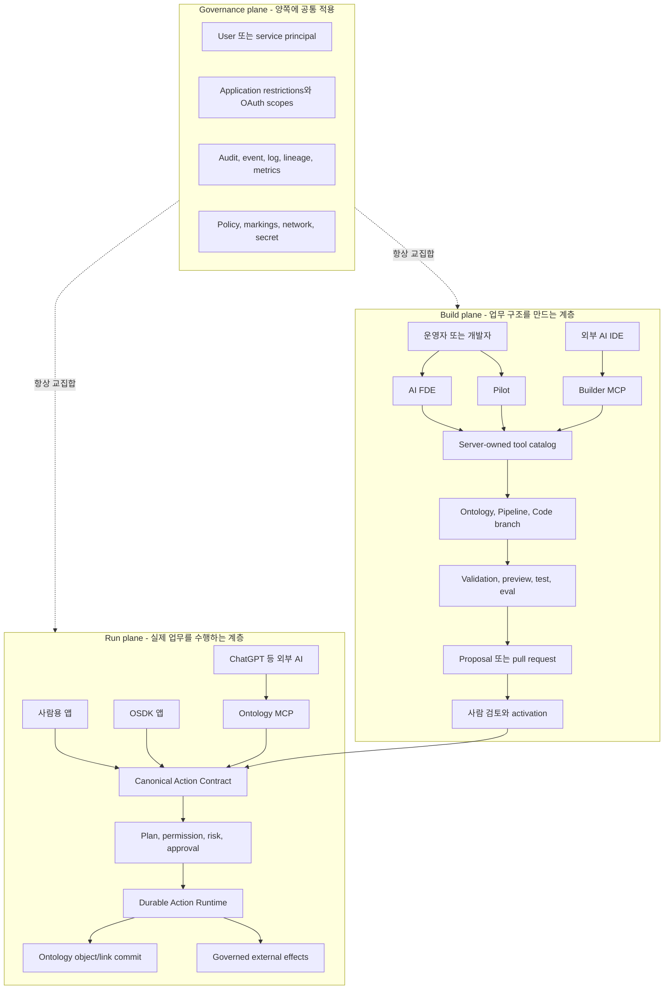

# Foundry-lite Palantir급 Agent-Native Operations Platform PRD

**문서 상태:** 승인 대상 제품 요구사항 / 구현 완료 증거가 아님  
**기준일:** 2026-08-04  
**제품 범위:** Action Types, AI FDE, Builder MCP, Ontology MCP, Pilot-style application generation  
**현재 상태 원본:** [Implementation Status](./implementation-status.md), [Action Types 비교표](./action-types-parity-matrix.json), [AI FDE 비교표](./ai-fde-parity-matrix.json)  
**증거 원본:** [Sprint Evidence Ledger](./sprint-evidence-ledger.md)

> 이 문서는 Palantir의 공개 제품 문서에서 확인 가능한 **동작 계약**을 Foundry-lite의 제품 요구사항으로
> 번역한 것이다. Palantir의 비공개 소스 코드, 내부 프롬프트, 운영 인프라를 복제했다는 뜻이 아니다.
> 또한 이 문서에 적힌 목표를 현재 구현이라고 읽으면 안 된다. `current` 승격은 코드, DB, API, SDK,
> UI, 브라우저 E2E, 실제 PostgreSQL/Temporal 증거가 모두 통과한 뒤에만 가능하다.

---

## 1. 한 문장 제품 정의

Foundry-lite는 사람이 말로 설명한 업무를 AI FDE와 Pilot이 안전한 Ontology·Action·애플리케이션
설계로 바꾸고, 사람·애플리케이션·외부 AI 에이전트가 같은 Action 계약으로 실제 업무를 실행하며,
모든 변경을 권한·승인·버전·감사·재시도·되돌리기 증거로 통제하는 **agent-native operations platform**이 된다.

비개발자 관점에서는 다음 세 층으로 이해하면 된다.

1. **업무 설계 층:** “예약 업무를 만들어줘”라고 말하면 AI FDE/Pilot이 객체, 관계, Action, 화면을 branch에 만든다.
2. **업무 실행 층:** 사람, 웹앱, ChatGPT 같은 외부 AI가 동일한 Action을 계획하고 실행한다.
3. **통제 층:** 누가 무엇을 볼 수 있고 실행할 수 있는지, 승인이 필요한지, 실제로 무엇이 바뀌었는지를 원장에 남긴다.

핵심은 챗봇이 DB를 마음대로 수정하는 것이 아니다. AI는 서버가 미리 허용한 도구와 Action만 사용할 수
있고, production 구조 변경과 고위험 업무 실행은 사람의 검토 경계를 통과한다.

---

## 2. 공식 문서에서 도출한 제품 계약

### 2.1 Action Types

| 공식 문서 | 공개 동작의 요지 | Foundry-lite 요구사항 |
| --- | --- | --- |
| [Action overview](https://www.palantir.com/docs/foundry/action-types/overview) | 하나의 Action 제출이 하나 이상의 객체를 한 트랜잭션으로 편집하고, 여러 앱에서 같은 로직과 검증을 재사용한다. | 모든 실행 채널이 하나의 canonical Action contract와 committer를 사용한다. |
| [Rules](https://www.palantir.com/docs/foundry/action-types/rules) | 객체 생성·수정·삭제, 링크 생성·삭제, interface 규칙 또는 function 규칙을 선언하며 규칙 순서가 의미를 가진다. | 선언적 규칙을 결정적 EditPlan으로 컴파일하고 잘못된 순서·중복 편집을 활성화 전에 차단한다. |
| [Parameters](https://www.palantir.com/docs/foundry/action-types/parameter-overview) | typed parameter가 Action 로직과 사용자 폼의 공통 인터페이스다. | 서버 검증, JSON Schema, UI 폼, TypeScript/Python OSDK, MCP tool schema를 한 계약에서 생성한다. |
| [Defaults](https://www.palantir.com/docs/foundry/action-types/parameters-default-value) | 정적 값, 객체 속성, 현재 사용자·시간 등으로 중앙 기본값을 정의한다. | 기본값 계산 순서와 provenance를 고정하고 클라이언트가 조작한 기본값을 신뢰하지 않는다. |
| [Conditional overrides](https://www.palantir.com/docs/foundry/action-types/parameters-override) | 앞선 parameter를 조건으로 visibility, required, constraint, default를 바꾸며 첫 일치 블록을 사용한다. | compiler와 runtime에서 earlier-parameter-only, first-match 의미를 동일하게 적용한다. |
| [Submission criteria](https://www.palantir.com/docs/foundry/action-types/submission-criteria) | nested condition과 사용자·그룹·객체 조건이 제출 가능 여부와 사용자 메시지를 결정한다. | typed AST, fail-closed identity predicate, 서버 측 재평가, 설명 가능한 거절 결과를 제공한다. |
| [Function-backed Actions](https://www.palantir.com/docs/foundry/action-types/function-actions-overview) | 여러 객체·링크를 읽고 복잡한 이종 편집을 만들 때 versioned function을 사용한다. | 함수는 DB를 직접 쓰지 않고 version-pinned `OntologyEditBatch`만 반환하며 공통 committer가 재검증한다. |
| [Batched execution](https://www.palantir.com/docs/foundry/action-types/function-actions-batched-execution) | batch 전체를 원자적으로 처리하거나 list-of-struct 한 번으로 함수를 호출할 수 있다. | sequential batch와 collection batch를 구분하고 전체 commit point, 취소, 한도, 오류 좌표를 명시한다. |
| [Permissions](https://www.palantir.com/docs/foundry/action-types/permissions) | Action apply, 객체·속성·링크, 데이터 접근, application restriction의 권한이 함께 적용된다. | 사용자 ∩ 앱 ∩ OAuth scope ∩ Action ∩ 각 edit ∩ function/effect 권한을 실행 직전 다시 계산한다. |
| [Webhooks](https://www.palantir.com/docs/foundry/action-types/webhooks) | writeback은 commit 전 한 개, side effect는 commit 후 여러 개이며 후처리는 비동기일 수 있다. | before/after commit point를 분리하고 receipt, idempotency, ambiguity, DLQ, reconciliation을 원장화한다. |
| [Notifications](https://www.palantir.com/docs/foundry/action-types/notifications) | 수신자별 데이터 접근권한을 확인하고 전달 실패 정책을 선택한다. | 권한 없는 수신자에게 객체 정보가 새지 않으며 strict/best-effort recipient policy를 지원한다. |
| [Action log](https://www.palantir.com/docs/foundry/action-types/action-log) | Action마다 log object type 하나, 제출마다 log object 하나를 만들고 모든 편집 객체와 연결한다. | 정규 DB 원장과 Ontology-queryable `[LOG] <Action>` projection을 함께 제공한다. |
| [Revert](https://www.palantir.com/docs/foundry/action-types/action-reverts) | 원 실행자, 최신 편집, 제출 시 활성화 조건을 만족할 때 내부 편집을 되돌리며 외부효과는 되돌리지 않는다. | 전체 대상 최신성 검증 후 원자적 inverse edit을 만들고 revert 자체도 새 Action run/log가 된다. |
| [Branching Actions](https://www.palantir.com/docs/foundry/action-types/branching-action-types) | branch edit은 main에 합쳐지지 않고 외부효과는 기본 차단된다. | base snapshot + overlay query/diff, main 격리, production connector 금지를 구조적으로 강제한다. |
| [Interface Actions](https://www.palantir.com/docs/foundry/action-types/actions-on-interfaces) | interface shared property와 link constraint로 여러 concrete type에 같은 Action을 적용한다. | concrete type 해석, shared property, PK 불변, link constraint와 concrete permission을 재검증한다. |
| [Struct parameters](https://www.palantir.com/docs/foundry/action-types/actions-on-structs) | 중첩 구조를 하나의 typed parameter로 받아 struct property에 연결한다. | nested schema, constraints, defaults, partial-update 정책을 canonical contract에 포함한다. |
| [Media](https://www.palantir.com/docs/foundry/action-types/upload-media) | media parameter가 Media Set reference를 만들고 성공한 Action과 연결된다. | upload staging과 Action commit을 연결하되 실패·취소된 upload의 수명과 정리 증거를 남긴다. |
| [Attachments](https://www.palantir.com/docs/foundry/action-types/upload-attachments) | 파일은 form 제출 전에 업로드될 수 있고 여러 객체와 연결된다. | orphan cleanup, 크기·형식·악성 파일 검사, 접근권한 상속, attachment lineage를 제공한다. |
| [Form sections](https://www.palantir.com/docs/foundry/action-types/configure-sections) | parameter를 조건부 section과 1~2열 폼으로 구성할 수 있다. | no-code Builder가 layout을 저장하고 모든 runtime form이 같은 조건을 렌더링한다. |
| [Inline edits](https://www.palantir.com/docs/foundry/action-types/inline-edits) | 단순 단일 객체 수정 Action만 inline edit에 적합하며 복잡한 side effect에는 제한이 있다. | compiler가 `inlineEligible`를 계산하고 부적합 Action을 table cell edit에 노출하지 않는다. |
| [Scale limits](https://www.palantir.com/docs/foundry/action-types/scale-property-limits) | object, list, batch, edit 크기에 명시적 상한이 있다. | 실행 전 cost/size estimate와 tenant별 hard limit을 적용하고 partial commit 없이 거절한다. |
| [Monitoring](https://www.palantir.com/docs/foundry/action-types/monitoring) · [Metrics](https://www.palantir.com/docs/foundry/action-types/action-metrics) | 성공·실패·p95 latency·실패 유형을 Action별로 추적한다. | 30일 지표, 최근 run, failure taxonomy, effect backlog, takeover/retry 지표와 alert를 제공한다. |

### 2.2 AI FDE, Palantir MCP, Ontology MCP, Pilot

| 공식 문서 | 공개 동작의 요지 | Foundry-lite 요구사항 |
| --- | --- | --- |
| [AI FDE overview](https://www.palantir.com/docs/foundry/ai-fde/overview) | 자연어 의도를 native platform operation으로 바꾸고 결과를 관찰해 다음 행동을 선택한다. | 모델은 임의 SQL/HTTP가 아니라 server-owned tool만 호출하며 execute-observe-adjust loop를 사용한다. |
| [Modes and capabilities](https://www.palantir.com/docs/foundry/ai-fde/modes-and-capabilities) | 작업 mode가 관련 문서, context, capability, tool만 로드한다. | 9개 mode를 유지하되 tool family 폭과 검증 loop를 Palantir 공개 범위까지 확장한다. |
| [Navigation](https://www.palantir.com/docs/foundry/ai-fde/navigation) | 사용자가 context와 tool을 통제하고 mutation 또는 side effect tool을 승인한다. | minimal-context 시작, 명시적 attachment, token 표시, context 삭제/요약, tool별 승인 정책을 제공한다. |
| [Security and governance](https://www.palantir.com/docs/foundry/ai-fde/security-and-governance) | AI는 현재 사용자 권한을 넘지 못하고 세션·표준 audit에 모두 기록된다. | 별도 초권한 bot을 만들지 않고 principal/app/scope 교집합과 attribution을 강제한다. |
| [Best practices](https://www.palantir.com/docs/foundry/ai-fde/best-practices) | branch-first, 작은 context/tool, 반복 검증, eval, 빠른 병렬 작업에 대한 인프라 제한이 중요하다. | branch/proposal 기본값, budget/rate/concurrency 정책, preview·test·eval 증거를 release 조건으로 둔다. |
| [Palantir MCP overview](https://www.palantir.com/docs/foundry/palantir-mcp/overview) | builder용 MCP는 data integration부터 Ontology와 앱 개발까지 다루지만 production Ontology data는 쓰지 않는다. | Builder MCP는 구조·코드·dataset mock·branch/proposal 도구만 제공하고 production object mutation을 금지한다. |
| [Palantir MCP tools](https://www.palantir.com/docs/foundry/palantir-mcp/available-tools) | Compass, Dataset, Lineage, Ontology, Object Set, OSDK, Platform SDK, Code Repo, Branch, Developer Console, Compute, Data Connection, Docs를 포괄한다. | 같은 tool family를 Foundry-lite native service에 매핑하며 각 tool에 schema, scope, effect, approval, evidence를 붙인다. |
| [Tool search](https://www.palantir.com/docs/foundry/announcements/2026-06) | 시작 시 `search_tools` 하나만 노출하고 관련 도구를 local rank 후 동적으로 활성화한다. | `tools/list_changed`를 포함한 session-scoped lazy activation과 eager fallback을 지원한다. |
| [MCP security](https://www.palantir.com/docs/foundry/palantir-mcp/security) | 외부 LLM으로 나간 데이터의 거버넌스 경계가 바뀌며 write tool은 비파괴적이거나 사람 검토를 요구한다. | provider disclosure, data classification, DLP/redaction, branch/proposal, no-destructive-production-write 정책을 강제한다. |
| [Ontology MCP overview](https://www.palantir.com/docs/foundry/ontology-mcp/overview) | consumer용 MCP는 앱에 포함된 object, Action, query function을 외부 agent에 제공한다. | `/mcp/ontology/{application_id}`가 application restrictions를 그대로 tool catalog에 투영한다. |
| [Ontology MCP auth](https://www.palantir.com/docs/foundry/ontology-mcp/authentication-and-authorization) | Developer Console OAuth와 application restriction을 재사용하며 Authorization Code와 Client Credentials를 지원한다. | 별도 MCP 인증을 만들지 않고 기존 OAuth metadata, user/service principal, resource scope를 재사용한다. |
| [Ontology MCP setup](https://www.palantir.com/docs/foundry/ontology-mcp/getting-started) | 앱에서 MCP를 활성화하고 MCP Hub에서 서버를 발견한다. | Developer Console toggle, server description, client config, MCP Hub registry와 revoke/disable 흐름을 제공한다. |
| [Pilot overview](https://www.palantir.com/docs/foundry/pilot/overview) | prompt로 Ontology, design spec, React/OSDK code, isolated seed data, CI, deployment를 생성한다. | domain prompt에서 branch-first full application bundle을 생성하고 real data 전환은 promotion 뒤에만 허용한다. |
| [Pilot modes](https://www.palantir.com/docs/foundry/pilot/models-and-modes) | plan/act mode와 ontology architect, designer, app builder, seed generator 역할이 분리된다. | 네 개 specialized agent의 artifact contract와 plan approval, durable task history를 제공한다. |

---

## 3. 현재 기준선과 정직한 격차

| 영역 | 현재 확인된 상태 | 이 PRD의 완료 목표 |
| --- | --- | --- |
| Action Types | 비교표 18축 중 `current` 12, `partial` 6이다. 독립 View/Edit/Apply 권한, typed parameters/defaults/overrides/criteria, before/after effect fencing, 모호한 외부 결과 무재호출, 병렬 fan-out, durable run state machine, Action Log/revert/branch/interface와 실제 Kafka 경보에 더해 Function-backed Action의 순차/collection batch, 단일 atomic commit, PostgreSQL+Temporal worker kill/takeover까지 제품 경로로 닫았다. 나머지 축은 남은 제품 surface와 외부 인프라 증거 때문에 과장 승격하지 않는다. | 18축 모두 API·DB·SDK·UI·브라우저·live evidence를 갖춘 `current` |
| Action runtime | atomic EditPlan, unified sync/async run history, durable effect/log/revert/branch/interface, typed before-webhook response→rule assignment, 30일 failure taxonomy/alert evaluation, concrete Interface 해석, DB-native Action Log, edited-object→Object Explorer deep link, dynamic browser OSDK fallback, compiler-gated inline object-table edit, fingerprint-pinned Python `TypedDict`, upload/retention/권한 상속/lifetime holder/malware scan과 protected-runtime ClamAV 강제가 있다. PostgreSQL+실제 Temporal+worker 2개에서 kill/takeover, 취소, dispatch 복구와 정확히 한 번의 커밋을 증명했고, 활성 경보를 시간·정책별로 dedupe한 뒤 실제 Kafka로 전달했다. | revert/branch 전용 race, virtual Ontology log link type과 실제 ClamAV 증거까지 폐쇄 |
| AI FDE | 9 modes, 69 server-owned tools, bounded loop, Builder MCP, Pilot slice가 있다. 69개 중 43개는 공개 Palantir MCP 72개와 exact-name이며 실제 native service에 연결되고, 26개는 Foundry-lite 고유 branch/test/proposal/Pilot 도구다. | 남은 공식 29개를 실제 product foundation과 함께 구현하고 context UX, eval loop, 운영 budget까지 확장 |
| Builder MCP | Streamable HTTP/OAuth/branch-first 도구 plane, strict initialize/version/notification/ping lifecycle, typed JSON-RPC ID, canonical structured/text result, fingerprint-bound challenge→별도 human control-plane 승인→single-use `confirmationReceipt`, durable replay·endpoint/tool rate limit·단일 SSE lease, bearer/session/SSE/clean-EOF DELETE를 보존하는 local stdio proxy, session-scoped `search_tools` lazy activation, `tools/list_changed`, eager fallback, 실제 69개 wire 호출 ratchet, 공식 MCP client+별도 strict-OIDC Uvicorn+PostgreSQL live gate, 43개 exact-name native tool이 있음. `pipeline.branch.run_tests`는 static graph/output-contract proof이며 row 실행은 아님 | 남은 공식 29개를 Code Repository·Global Branch·Compute·Dataset Build 등 실제 원장과 함께 구현하고 repository-aware context와 proposal evidence를 닫음 |
| Ontology MCP | `partial`: consumer Streamable HTTP, app-restricted tool projection, 표준 form PKCE와 managed Client Credentials, one-time secret 회전·폐기, 발급된 durable access session 즉시 철회와 rotation race lock, typed query function, low-risk run, high-risk AIP proposal→사람 승인→원 앱 권한 재검증→실행→read-only 상태 추적, execution error `isError`, strict lifecycle, durable session/event resume·단일 SSE lease·종료 후 404, POST/GET/DELETE와 tool rate limit, fail-closed enablement와 visual Developer Console/MCP Hub, Origin policy, stdio HTTP proxy가 통합 테스트로 연결됐다. 브라우저는 MCP application/client/scope, plan hash, Action/object version, risk를 고정한 요청을 사람이 승인·실행하고 외부 MCP가 동일 Action run을 다시 읽는 경로까지 증명한다. 공식 Python MCP client가 별도 Uvicorn 프로세스와 PostgreSQL에 연결하는 live test와 PostgreSQL rate-limit concurrency/RLS gate도 통과한다. | production cloud secret manager/KMS, external IdP/DCR interoperability와 실제 ChatGPT SaaS tenant 연결 증거까지 완성 |
| No-code Action Builder | 브랜치 전용 Builder가 typed parameter/default, recursive struct, section/visibility, override, criteria, object/link/interface rule, function, effect, risk, Action Log/revert 정책을 작성한다. 브라우저가 attachment upload→branch 저장→proposal→독립 승인→activation→SDK 재생성 없는 동적 실행→log→revert, compiler-gated inline object-table edit와 runtime SSE/takeover/effect를 증명하고, 실제 PostgreSQL/Temporal worker 경로도 별도 live gate로 통과한다. | 전용 overlay data diff, compensation authoring과 live ClamAV/effect 전용 증거 |
| Pilot | Project, seed Dataset, branch, OSDK app, React/CI bundle의 bounded slice | isolated workspace, design system, multi-agent artifacts, live preview, guided production promotion |

AI FDE 비교표의 16축이 `current`인 것은 “현재 정의한 좁은 동작 계약이 사용자 경로로 연결됐다”는 뜻이다.
Palantir의 공개 MCP 72개와 1:1 기능 폭이 같다는 뜻은 아니다. 소비자용 Ontology MCP는 구현됐지만
production cloud KMS와 실제 ChatGPT SaaS tenant 연결까지 완료됐다는 뜻도 아니다.

---

## 4. 목표 아키텍처와 강제 경계

### 절대 섞지 않는 경계

- Builder MCP는 Ontology **구조**를 branch에서 바꿀 수 있지만 production object data를 직접 편집하지 않는다.
- Ontology MCP는 production **데이터**를 predefined Action으로 바꿀 수 있지만 Ontology 구조를 만들거나 활성화하지 않는다.
- AI FDE와 Pilot은 production activation, proposal approval, high-risk Action approval 권한을 도구로 받지 않는다.
- 외부 AI에 전달된 데이터는 외부 model provider의 거버넌스에도 놓이므로 사용자에게 provider와 데이터 범위를 명시한다.
- 모델의 자연어 판단은 권한, OCC, transaction, idempotency, risk policy를 대체하지 않는다.

---

## 5. 사용자와 핵심 여정

### 5.1 사용자 유형

- **업무 운영자:** 코딩 없이 parameter, rule, permission, approval, notification을 정의한다.
- **Ontology/FDE builder:** 자연어로 domain model과 Action을 branch에 만들고 검증 후 proposal을 제출한다.
- **앱 개발자:** TypeScript/Python OSDK와 Builder MCP로 앱을 만들고 CI를 통과시킨다.
- **현장 사용자:** generated form이나 OSDK 앱에서 Action plan을 확인하고 제출한다.
- **외부 AI agent:** Ontology MCP에서 허용된 객체를 읽고 Action plan/apply/status만 수행한다.
- **검토자:** schema proposal과 high-risk Action proposal을 승인하거나 거절한다.
- **운영자/감사자:** run, retry, takeover, effect receipt, Action log, revert와 actor attribution을 조사한다.

### 5.2 자연어에서 production까지

1. 사용자가 “외국인이 한국 식당을 찾고 예약·취소할 수 있는 서비스를 만들어줘”라고 설명한다.
2. AI FDE가 domain, 제약, 민감정보, 외부 시스템, 승인 정책을 질문하고 구조화된 plan을 제시한다.
3. Pilot이 `Restaurant`, `AvailabilitySlot`, `Hold`, `Booking`, `Guest`와 링크, Action, OSDK app을 branch에 만든다.
4. seed data와 preview에서 검색, hold, confirm, cancel, no-show 흐름을 검증한다.
5. proposal에서 schema diff, Action risk, connector, permission, migration, test evidence를 사람이 검토한다.
6. activation 뒤 ChatGPT는 Ontology MCP를 통해 식당을 검색하고 `CreateHold` plan을 만든다.
7. low-risk autonomous 정책이면 실행하고, 결제·환불·마지막 좌석 확정 같은 고위험 Action은 승인 큐로 보낸다.
8. 사용자와 상점은 같은 Booking object와 Action log를 보며, 중복 예약은 OCC/constraint/transaction으로 차단된다.

이 여정은 식당에 한정되지 않는다. `FlightOffer`, `HotelRoom`, `DeliveryOrder`, `Payment`, `Refund` 같은
domain model과 connector를 추가하면 같은 플랫폼 계약을 재사용할 수 있다.

---

## 6. Functional Requirements — Canonical Action Platform

### ACT-001 Canonical Action Contract

- `ActionDefinitionV3`를 단일 정본으로 유지하고 legacy v1/v2는 v3 IR로 dual-read한다.
- definition은 target object/interface, typed parameters, defaults, overrides, criteria, rules/function,
  effects, permission, risk, agent policy, log, revert, branch policy, layout을 포함한다.
- activation은 모든 object/property/link/interface/function/connector 참조와 type을 검증한다.
- immutable deployment artifact, semantic version, fingerprint, generated schema bundle을 저장한다.
- server validator, UI, TypeScript/Python OSDK, MCP가 서로 다른 schema를 만들 수 없게 byte-stable generation을 제공한다.

### ACT-002 Typed parameter와 form semantics

- primitive, boolean, date, timestamp, decimal, enum, object/interface reference, object set, array,
  struct, media, attachment를 지원한다.
- static, prior parameter, object property, current actor/time, generated ID 기본값을 서버에서 해석한다.
- conditional override는 앞선 parameter만 참조하며 첫 번째 일치 블록만 적용한다.
- nested submission criteria는 typed `all/any/not` AST와 사용자용 failure explanation을 제공한다.
- group/organization/marking처럼 token에서 누락될 수 있는 identity attribute의 부정 조건은 fail-open이
  되지 않도록 별도 safe operator를 사용하거나 compiler에서 거절한다.
- Builder layout은 section, 1~2열, 설명, 접기, 조건부 visibility와 field order를 저장한다.
- `inlineEligible`는 단일 대상 수정, 완전한 default, effect 없음 등 안전 조건으로 compiler가 계산한다.

### ACT-003 Rule, function, batch

- object create/modify/create-or-modify/delete, M:M link create/delete, interface variants를 지원한다.
- one-to-one/one-to-many 링크는 FK property 의미와 link visibility를 함께 검증한다.
- rule order, read-your-writes, multiple assignment, create/delete ordering, duplicate create를 compile-time에 판정한다.
- function rule은 일반 rules와 상호 배타적이며 version-pinned `OntologyEditBatch`를 반환한다.
- 함수 결과도 type, permission, read set, OCC, Action constraint를 통과한 뒤 공통 committer로만 반영된다.
- `per_request` batch는 최대 20개 요청을 순서대로 함수 호출하고, `batched` mode는 최대 10,000개
  struct를 하나의 list input으로 한 번 호출한다. batched Action의 단건 호출도 1개짜리 list로 전달한다.
- 두 mode 모두 함수 실행이 전부 끝난 뒤 반환된 edit batch를 결합해 전체 batch를 한 commit point로 처리한다.
- 한 Action submission은 object edit 최대 10,000개, edited object type 최대 50개를 넘기 전에 거절한다.
- cost estimate와 hard limit을 plan 단계에서 계산하며 한도 초과는 아무것도 commit하지 않는다.

### ACT-004 Plan, permission, risk, approval

- 실행 순서는 `validate → resolve → criteria → authorize → plan → approve → commit`으로 고정한다.
- `EditPlan`은 read/write version, before/after, effect manifest, function/definition version, plan hash,
  risk reason, permission evidence를 포함한다.
- 권한은 actor/service principal, application restriction, token scope, Action apply, 모든 object/link/property,
  function, connector, side effect, criteria, approval policy의 교집합이다.
- 시스템이 유도한 위험보다 definition이 낮은 위험을 선언할 수 없다.
- 삭제, 민감정보, 외부 호출, 결제/환불, 큰 batch는 high로 분류한다.
- agent autonomous 실행은 명시적으로 허용된 low-risk Action만 가능하다.
- medium/high는 plan hash, versions, expiry, evidence를 고정한 approval proposal을 만들며 MCP에는 승인 도구가 없다.
- 승인 뒤에도 권한, plan hash, Action version, object versions가 drift하면 새 plan을 요구한다.

### ACT-005 Durable execution

- 순수하고 작은 atomic edit은 동기 `200`, function/effect/large batch는 기본 `202` durable run을 사용한다.
- run/step/attempt/event/effect receipt는 Foundry DB를 기준 원장으로 한다.
- PostgreSQL lease, heartbeat, fencing token, retry time, worker identity와 append-only sequence를 저장한다.
- worker kill 뒤 새 worker만 lease를 takeover하고 이전 fencing token의 commit/receipt/terminal write를 거절한다.
- Temporal history replay만으로 success를 선언하지 않고 DB commit 증거를 확인한다.
- retry는 worker loss, 분류된 transient failure, safe timeout에만 적용한다.
- ambiguous external outcome, permission, validation, cost limit, OOM, cancellation, commit outcome unknown은 자동 재호출하지 않는다.
- cancellation은 pending/retry를 즉시 닫고 running task에 cooperative cancel과 격리 runtime TERM→grace→KILL을 적용한다.

### ACT-006 External effects

- before-commit writeback은 definition에 등록된 connector endpoint 한 개만 사용한다.
- inline URI, request-supplied destination, raw secret, policy 밖 host/IP를 차단한다.
- 알려진 실패는 Ontology commit을 막고, ambiguous 성공 여부는 `outcome_unknown`으로 닫아 자동 재호출하지 않는다.
- response field를 후속 EditPlan 값으로 사용할 때 response schema와 immutable receipt hash를 검증한다.
- after-commit webhook, notification, event, schedule/build, connector command는 outbox로 병렬 전달한다.
- effect별 idempotency key, receipt, attempt, retry, DLQ, cancellation, reconciliation 상태를 저장한다.
- after-effect 실패는 이미 성공한 Ontology commit을 되돌리지 않는다.
- notification은 수신자별 object access를 검사하며 strict/all-or-nothing 또는 best-effort 정책을 명시한다.

### ACT-007 Log, monitoring, revert

- 성공한 제출마다 정규 `action_log_entries` 하나와 모든 object/link edit 관계를 저장한다.
- `[LOG] <Action>` object type projection을 object set query, aggregation, timeline에서 읽을 수 있게 한다. 현재 catalog/get과 DB-native filter/search/order/signed-keyset-cursor query/aggregation, Action Log edited-object→Object Explorer deep link는 구현됐고, virtual Ontology link type·generic Workshop timeline은 출시 게이트로 남는다.
- actor, time, Action/version, redacted params, branch, plan, approval, edit, effect receipt, request ID를 조회한다.
- Action별 success/failure, p95, retry/takeover, effect backlog, approval latency, conflict rate를 집계한다.
- failure taxonomy는 invalid parameter, scale, authorization, side effect, function, user-facing function,
  conflict, cancellation, outcome unknown, unclassified를 최소 집합으로 사용한다.
- revert는 original actor, definition opt-in, 모든 대상의 latest-edit 조건을 만족할 때만 전체를 원자적으로 복구한다.
- 외부효과는 되돌리거나 다시 호출하지 않고 조사 evidence만 연결한다.

### ACT-008 Branch와 interface

- branch Action은 base snapshot 위 object/link overlay를 만들고 main을 수정하거나 merge하지 않는다.
- branch query는 composed state와 three-way diff, main drift를 반환한다.
- production connector와 external-call function은 기본 금지한다.
- 명시적 sandbox connector opt-in은 별도 scope와 승인 정책을 요구한다.
- interface create는 concrete type을 명시하고 modify/delete/link는 concrete implementation으로 안전하게 resolve한다.
- shared property, link constraint, PK immutability, concrete permission/OCC를 모두 재검증한다.

---

## 7. Functional Requirements — Builder MCP

### MCP-BLD-001 제품 역할

Builder MCP는 AI IDE와 AI FDE가 Foundry-lite의 **구조와 개발 리소스**를 만들고 검토하는 계층이다.
production Ontology object에 대한 임의 쓰기는 제공하지 않는다.

### MCP-BLD-002 공개 tool family 목표

다음 family를 한꺼번에 모델 context에 넣지 않고 catalog로 관리한다.

| Tool family | 최소 목표 |
| --- | --- |
| Projects/Resources | namespace·project·folder list/search/create, imports, templates, RID context |
| Dataset | schema, bounded SQL, files/stats, notional dataset create, build/status/history/job diagnostics |
| Lineage | resource graph, upstream/downstream slice, workflow annotation |
| Ontology structure | search/view/create/update/delete object/link/Action/interface/function type on branch |
| Object set analysis | permission-scoped query/aggregation. Builder plane에서 production mutation은 금지 |
| OSDK | repository-aware context/examples, definition inspect, SDK generation/install status |
| Platform SDK | product API catalog와 versioned reference/example retrieval |
| Code Repository | context, create/clone, PR create/list/get/comment, CI status |
| Global Branch/Proposal | branch create/view/close, proposal create/view/close. merge/approve는 미노출 |
| Developer Console | app connect, resource restriction diff/update, OSDK React conversion, SDK release preparation |
| Compute | module docs/info/logs, sandbox/dev lifecycle, bounded function execution |
| Data Connection | REST source, registered webhook, egress policy, connection diagnostics on governed scope |
| Documentation | curated summary, exact page load, search, product/library-specific documentation |
| Control | plan, clarification, mode change, context management, tool search, progress/evidence |

#### 2026-08-05 공식 Palantir MCP 72-tool inventory

공식 [Available tools](https://www.palantir.com/docs/foundry/palantir-mcp/available-tools)의 현재 목록은 13개
family, 72개 도구다. 아래 이름은 기능 아이디어가 아니라 parity 검토의 고정 입력이다. Palantir가 이후 목록을
바꾸면 `researchAsOf`와 이 inventory를 함께 갱신한다.

| Family | 수 | 공식 tool name |
| --- | ---: | --- |
| Compass | 6 | `list_resources_in_foundry_folder`, `get_project_imports`, `list_foundry_namespaces`, `list_foundry_project_templates`, `create_foundry_project`, `search_foundry_projects` |
| Dataset | 9 | `get_foundry_dataset_schema`, `run_sql_query_on_foundry_dataset`, `create_and_write_to_foundry_dataset`, `list_dataset_files`, `build_datasets`, `get_build_status`, `search_dataset_builds`, `get_job_status`, `get_dataset_stats` |
| Data Lineage | 1 | `get_resource_graph` |
| Ontology | 12 | `get_foundry_ontology_rid`, `search_foundry_ontology`, `search_foundry_functions`, `view_foundry_object_type`, `create_or_update_foundry_object_type`, `delete_foundry_object_type`, `view_foundry_link_type`, `create_or_update_foundry_link_type`, `delete_foundry_link_type`, `view_foundry_action_type`, `create_or_update_foundry_action_type`, `delete_foundry_action_type` |
| Object Set | 2 | `query_ontology_objects`, `aggregate_ontology_objects` |
| OSDK | 2 | `get_ontology_sdk_context`, `get_ontology_sdk_examples` |
| Platform SDK | 2 | `list_platform_sdk_apis`, `get_platform_sdk_api_reference` |
| Code Repository | 7 | `get_repository_context`, `create_python_transforms_code_repository`, `clone_code_repository_locally`, `create_code_repository_pull_request`, `list_code_repository_pull_requests`, `get_code_repository_pull_request`, `create_code_repository_pull_request_comment` |
| Global Branching | 6 | `create_global_branch`, `view_global_branch`, `close_global_branch`, `create_global_proposal`, `view_global_proposal`, `close_global_proposal` |
| Developer Console | 5 | `connect_to_dev_console_app`, `convert_to_osdk_react`, `generate_new_ontology_sdk_version`, `install_sdk_package`, `view_osdk_definition` |
| Compute module | 5 | `get_compute_modules_documentation`, `get_compute_modules_info`, `get_compute_modules_logs`, `manage_compute_modules`, `execute_compute_modules_function` |
| Data Connection | 5 | `create_foundry_rest_api_data_source`, `create_foundry_rest_api_data_source_webhook`, `update_foundry_rest_api_data_source_webhook`, `view_foundry_rest_api_data_source_webhook`, `get_or_create_network_egress_policy` |
| Documentation | 10 | `get_python_transforms_documentation`, `get_typescript_v1_functions_documentation`, `get_typescript_v2_functions_documentation`, `get_custom_widget_documentation`, `get_ml_documentation`, `get_spark_profile_documentation`, `get_osdk_react_components_documentation`, `load_foundry_documentation_page`, `get_documentation_summaries`, `search_foundry_documentation` |

Foundry-lite의 현재 69개 server-owned tool 중 43개는 이 72개와 exact-name이고, 26개는
Foundry-lite 고유 branch/test/proposal/Pilot tool이다. exact-name 도구는 native Projects/Resources,
committed Dataset manifest, lineage, Ontology branch, Object Query, OSDK/Platform SDK registry,
Developer Console, governed Source/Webhook/egress policy, docs service에 실제 연결된다. 남은 공식 29개는
Compass namespace/template 2, Dataset SQL/create/build 6, Code Repository 7, Global Branching 6,
Developer Console repository/React conversion 2, Compute Module 5, versioned webhook update 1이다.
나머지는 다음 조건을 모두 만족할 때만
`current`로 센다: native service 존재, permission과 application scope 교집합, typed input/output, branch 또는
non-destructive write 경계, idempotency, audit/tool ledger, focused test, supported MCP client 증거. 단순 catalog row나
항상 성공하는 mock을 추가해 72개로 보이게 만드는 것은 금지한다.

#### 남은 공식 29개를 위한 product-foundation acceptance

공식 catalog의 설명을 Foundry-lite 요구사항으로 번역하면 아래와 같다. 이 표의 완료 단위는 MCP handler가 아니라
그 handler가 호출하는 durable product resource다. Palantir의 Global Branching은 여러 애플리케이션의 변경을 한
branch에서 함께 시험하고 proposal check와 resource별 승인을 모두 통과한 뒤에만 main으로 합치는 별도 제품이며,
Compute Module은 단순 함수 호출기가 아니라 stateless replica, container lifecycle, execution mode, application/job-token
permission을 가진 운영 제품이다. 따라서 기존 Ontology/Pipeline branch나 local subprocess를 이름만 바꿔 재사용하지 않는다.

| 공식 gap | Palantir 공개 동작 | Foundry-lite 필수 product foundation | `current` 승격 증거 |
| --- | --- | --- | --- |
| Compass 2 | 사용자가 접근 가능한 namespace를 찾고, namespace별 project template을 조회한 뒤 template로 project를 만든다. | tenant-scoped `Namespace`와 immutable `ProjectTemplate` 원장, template version/fingerprint, project create transaction, app restriction, cursor query | 숨은 namespace 비노출, stale template 거절, 같은 key project 단일 생성, API/SDK/UI/MCP 계약 |
| Dataset 6 | optional branch에서 bounded SQL을 실행하고, CSV로 dataset을 만들며, Python transform dataset build를 시작하고 build/job의 현재·과거 상태와 source error를 조회한다. | read-only SQL parser와 row/byte/time cap, branch-aware dataset snapshot, upload→transaction→commit, `BuildRun`/`JobRun` 원장, async dispatch·cancel·retry·log/source span | DDL/DML·경로 함수 차단, branch isolation, commit CAS, build replay/takeover, status/history cursor, PostgreSQL+worker live |
| Code Repository 7 | repository/project/Ontology context를 읽고 Python transform repo를 만들거나 clone하며 PR 생성·검색·상세·CI/review/comment를 다룬다. | tenant-scoped `CodeRepository`, immutable commit tree, protected branch, credential-less checkout lease, PR/review/comment/check 원장, inline anchor, audit/outbox | path traversal·secret·tenant crossover 차단, concurrent PR update CAS, required checks/reviewer evidence. merge/approve tool은 AI에 미노출 |
| Global Branching 6 | 여러 supported resource를 하나의 branch에 묶어 end-to-end 시험하고, main 변화 rebase/conflict와 resource별 check/approval을 해결한 proposal만 merge 가능하게 한다. 공식 MCP는 create/view/close branch/proposal만 제공한다. | `GlobalBranch`가 Ontology·Pipeline·Dataset build·Code repo의 pinned base와 overlay를 소유하고, `GlobalProposal`이 resource checks, conflict, approval policy, reviewer decision을 고정한다. close는 merge가 아니다. | main 불변, cross-resource snapshot consistency, rebase conflict, protected-resource approval, stale check 차단, close idempotency. MCP에는 merge/approve 미노출 |
| Developer Console 2 | 외부 Git repository를 application에 연결하고 기존 OSDK app을 `@osdk/react`/`OsdkProvider2`로 변환한다. | repository connection credential reference, immutable app↔repo binding, generated patch artifact, dependency/version compatibility report, dry-run diff와 PR handoff | arbitrary local path/token 차단, same-revision deterministic patch, app restriction 보존, browser/SDK/real repository integration |
| Compute Module 5 | 문서 조회뿐 아니라 module configuration/status/log를 보고 start/stop/dev-mode를 관리하며 `FUNCTION` mode 함수만 동기 호출한다. Container는 replica 간 stateless이고 function no-platform/application permission과 pipeline job-token permission이 분리된다. | `ComputeModule`/revision/deployment/replica/log/function 원장, image digest+SBOM+signature, sandbox/network/secret policy, mode별 principal, autoscaling config, lifecycle state machine, invocation receipt | non-FUNCTION 호출 차단, app/job-token 최소권한, start/stop CAS, log cursor/redaction, replica loss/takeover, timeout/cancel, signed-image policy, multi-process/container live |
| Data Connection 1 | webhook을 제자리 수정하지 않고 새 version을 publish하며 최신 version의 metadata/spec/input/call/output을 조회한다. | immutable `WebhookVersion`, current pointer CAS, compatibility validation, secretRef/network-policy 재검증, rollback pointer, audit/outbox | concurrent publish 단일 승자, old version replay, secret 비노출, live signed delivery, status/SDK/UI/MCP evidence |

Global Branching 구현 시에는 branch에서 기존 resource 수정은 main과 격리하되, resource 생성·삭제의 main 영향이
제품별로 다르다는 공식 경계를 그대로 모델링한다. Ontology entity는 branch-local 생성·수정·삭제가 가능하지만 다른
resource family는 capability별 `creationSemantics`와 `deletionSemantics`를 선언해야 한다. proposal 생성 권한,
resource protection policy, required reviewer, rebase check, 모든 check green 조건은 MCP 외부의 사람 통제로 유지한다.

Compute Module 구현 시에는 Function mode와 Pipeline mode를 하나의 권한으로 합치지 않는다. Function mode는
`no_platform_permissions` 또는 application service principal을 쓰고, Pipeline mode는 선언된 input/output에만 제한된
job token을 쓴다. replica local state는 serving truth가 될 수 없으며 모든 invocation/result/artifact는 Foundry DB와
immutable storage에 커밋된 receipt를 기준으로 조회한다.

각 tool은 deterministic name/version, JSON Schema input/output, effect class, idempotency, required scope,
approval policy, maximum output, timeout, audit classification을 가진다.

### MCP-BLD-003 Tool search

- lazy mode는 시작 시 `search_tools`와 control tools만 노출한다.
- 검색은 tool name, family, description, curated keyword를 local ranking하며 별도 model call을 만들지 않는다.
- 활성화된 tool은 session 동안 유지하고 `notifications/tools/list_changed`를 보낸다.
- 동적 refresh를 지원하지 않는 client에는 eager 또는 bounded family preload를 제공한다.
- 같은 `Mcp-Session-Id`로 reconnect하면 durable activation state와 tool execution ledger를 모두 보존한다.
  새 session은 이전 activation을 상속하지 않아 session 간 tool 노출이 격리된다.

### MCP-BLD-004 Transport와 보안

- 외부 연동은 MCP Streamable HTTP, local IDE는 `pnpm mcp:builder:stdio -- --application-id <id>` stdio proxy를 지원한다. proxy는 short-lived OAuth bearer와 MCP session을 보존하되 토큰을 로그나 `repr`에 노출하지 않는다.
- mutation은 먼저 application/session/tool/workspace/arguments fingerprint에 묶인 `challengeId`를 반환한다. 별도 human control-plane bearer만 그 challenge를 승인할 수 있고, client는 반환된 short-lived single-use `confirmationReceipt`를 같은 session의 동일 tool outer arguments에 넣어 재호출한다. 고정 환경변수나 재사용 가능한 confirmation header는 허용하지 않는다.
- stdio proxy는 finite SSE notification batch를 JSON-RPC line으로 전달하고 `Last-Event-ID`를 이어가며, stdin clean EOF에는 MCP session DELETE를 보낸다.
- principal과 application restriction을 가진 OAuth token을 사용하고 token passthrough를 금지한다.
- Origin, Host, DNS rebinding, session fixation, audience, expiry/revocation, tenant crossover를 차단한다.
- external provider로 전송될 수 있는 data classification과 disclosure를 client 연결 화면에 표시한다.
- destructive production write는 tool catalog에 존재하지 않는다.
- Ontology 삭제를 포함한 구조 변경은 branch에만 기록되고 proposal review 없이는 main에 들어가지 않는다.
- `pipeline.branch.run_tests`는 persisted graph validation과 declared output contract를 확인하는 static proof다. 실제 Pipeline row 실행·output Dataset commit 증거로 표기하지 않는다.

### MCP-BLD-005 Repository-aware context와 closed loop

- repository type을 OSDK React, Python transform, TypeScript/Python function 등으로 감지한다.
- 관련 SDK/doc/example만 context로 주입하고 파일·dataset·Ontology RID provenance를 남긴다.
- transform/function preview, test, CI, build status를 관찰해 실패 원인을 고친 뒤 bounded retry한다.
- 반복 횟수, compute, storage, model token, network budget을 초과하면 durable `budget_exhausted`로 종료한다.

---

## 8. Functional Requirements — Ontology MCP

### MCP-ONT-001 서버 생성과 discovery

- Developer Console application에서 MCP 활성화 toggle, Markdown description, allowed client configuration을 제공한다.
- endpoint는 `/mcp/ontology/{application_id}`이며 stdio development adapter는 같은 gateway를 호출한다.
- MCP Hub가 tenant 내 활성 server, owner, description, resource count, auth mode, last activity를 보여준다.
- application disable/revoke가 새 session과 기존 token을 즉시 또는 정책 TTL 안에 차단한다.

### MCP-ONT-002 Deterministic consumer tools

- application에 허용된 object type별 get/search와 pagination을 제공한다.
- 허용된 query function별 typed execution tool을 제공한다.
- Action별 `plan`, `apply-or-request-approval`, `run-status` tool을 제공한다.
- Action `agentToolDescription`을 설명으로 사용하고 canonical parameter schema를 그대로 투영한다.
- 결과는 문자열 속 JSON이 아니라 MCP native `structuredContent`로 반환한다.
- tool name collision은 stable application/resource identifier로 결정적으로 해소한다.
- 숨겨진 object/action/function은 tool list와 오류 detail 어디에도 노출하지 않는다.

### MCP-ONT-003 실행 정책

- object read는 principal permission ∩ application restriction ∩ token scope를 통과해야 한다.
- Action plan은 side effect 없이 criteria, risk, before/after, approval requirement를 반환한다.
- 명시적 autonomous low-risk Action만 직접 apply할 수 있다.
- medium/high는 approval proposal을 만들고 `approvalRequired`, proposal ID, plan hash를 반환한다.
- approval/merge/activate tool은 외부 agent에 제공하지 않는다.
- 같은 JSON-RPC ID 또는 Idempotency-Key 재전송은 같은 Action run을 반환한다.
- apply 뒤 agent는 durable run/status/events/log를 조회하며 Temporal 결과만으로 success를 받지 않는다.

### MCP-ONT-004 OAuth

- Authorization Code + PKCE를 interactive end-user agent에 제공한다.
- Client Credentials를 confidential service integration에 제공한다.
- protected-resource metadata와 authorization-server metadata를 표준 endpoint로 제공한다.
- resource indicator/audience와 scope를 검증하고 user/service principal의 실제 권한을 다시 적용한다.
- long-lived secret은 SecretProvider에 저장하고 rotation/revocation audit를 남긴다.
- local public client에 client secret을 요구하지 않는다.

---

## 9. Functional Requirements — AI FDE와 Pilot

### FDE-001 Governed conversational operator

- mode는 data integration, data connection, ontology editing, functions editing, exploration,
  governance, machine learning, OSDK React, platform Q&A를 제공한다.
- agent는 mode를 자동 선택하거나 중간에 바꿀 수 있고 사용자는 항상 현재 mode/capability/tool을 볼 수 있다.
- plan, clarification, change-mode, manage-context, manage-capabilities를 first-class control tool로 제공한다.
- 초기 context에는 일반 platform contract만 있고 customer data는 명시적으로 추가할 때만 로드한다.
- dataset, function, branch, interface, Action, object type, document, media를 attachment로 추가한다.
- chat outline은 prompt, response, tool, result, token, context revision을 표시하며 context에서 제거/요약할 수 있다.

### FDE-002 Approval와 branch-first

- default branch 또는 unbranched mutation, side effect, build에는 tool confirmation을 요구한다.
- allowlisted branch/project에는 session-scoped pre-approval을 허용하되 scope와 expiry를 표시한다.
- Ontology/Pipeline/Code 변경은 branch에서 만들고 proposal/PR까지만 agent가 제출한다.
- main merge, production deploy, activation, high-risk operational approval은 agent tool catalog에서 제외한다.
- 모든 operation은 invoking user attribution과 표준 audit에 기록한다.

### FDE-003 Validation loop와 Evals

- agent는 preview/test/build/CI/function eval 결과를 관찰해 수정하고 다시 검증한다.
- loop는 step/model/tool/compute/network/storage budget과 wall-clock timeout을 가진다.
- 같은 실패가 반복되면 root cause와 필요한 사람 입력을 구조화해 중단한다.
- AI-backed function에는 regression suite, deterministic evaluator와 선택적 LLM judge를 version pin한다.
- 여러 session의 병렬 operation이 infrastructure를 과부하시키지 않도록 tenant/user/project concurrency limit을 둔다.

### PILOT-001 Prompt-to-app bundle

- 입력은 application objective, personas, workflows, data sensitivity, external systems, visual references다.
- ontology architect는 object/action/link/interface와 policy artifact를 만든다.
- designer는 color, typography, spacing, layout, interaction, accessibility spec을 만든다.
- app builder는 OSDK React source와 typed screens를 만든다.
- seed generator는 격리 container 안에서 synthetic data만 만들며 production data를 model build context에 넣지 않는다.
- 모든 agent artifact는 version, provenance, dependency와 validation status를 가진다.

### PILOT-002 Plan/Act와 preview/deploy

- Plan mode는 상세 artifact plan을 만들고 사용자 승인 뒤 실행한다.
- Act mode도 isolated branch/container 안에서만 자동 편집하고 production promotion은 별도다.
- editor view는 seed data, deploy view는 permission-scoped real Ontology data를 사용한다.
- desktop/tablet/mobile preview와 accessibility·empty/loading/error 상태를 검증한다.
- guided deploy는 Ontology proposal, Developer Console app/restriction, SDK generation, CI, subdomain/hosting, OAuth를 순서대로 확인한다.
- CI가 실패하거나 app restriction이 drift하면 release를 차단한다.

---

## 10. Public API, SDK, UI

### 10.1 Action API

기존 Action API를 호환 유지하면서 다음 surface를 canonical contract로 고정한다.

- `GET /api/actions`
- `GET /api/actions/{action}`
- `GET /api/actions/{action}/schema`
- `POST /api/actions/{action}/validate`
- `POST /api/actions/{action}/plan`
- `POST /api/actions/{action}/dry-run`
- `POST /api/actions/{action}/apply`
- `POST /api/actions/{action}/apply-batch`
- `POST /api/actions/{action}/runs?waitSeconds=0..30`
- `POST /api/actions/{action}/batch-runs?waitSeconds=0..30`
- `GET /api/actions/runs`
- `GET /api/actions/runs/{run_id}`
- `GET /api/actions/runs/{run_id}/events`
- `POST /api/actions/runs/{run_id}/cancel`
- `GET /api/actions/runs/{run_id}/revert-eligibility`
- `POST /api/actions/runs/{run_id}/revert`
- `GET /api/actions/logs`
- `GET /api/actions/metrics`

모든 mutation은 `Idempotency-Key`, request ID, tenant, actor, app/client ID, definition version,
audit/outbox를 요구한다. public payload에는 lease secret을 노출하지 않는다.

### 10.2 Builder API

- **Current bounded slice:** Builder의 Action Type list/get/create/update/delete는 active Ontology가 아니라
  `/api/ontology/branches/{branch_id}/action-types`만 사용한다. 서버는 v3 계약, 전체 Ontology 참조,
  폼 layout, inline eligibility를 검증하고 branch CAS fingerprint와 canonical contract fingerprint를 반환한다.
  화면은 typed parameter/default, recursive struct, 다중 section과 typed visibility 조건,
  earlier-parameter-only first-match override, nested criteria와 실패 메시지,
  ordered object/link rules, Interface concrete create/shared-property/link-constraint rules, object Action의 version-pinned function 선택, 등록된 before/after effect와 payload, risk floor를
  active Ontology catalog picker로 작성하고 exact canonical definition으로 reload한다.
  mutation은 tenant·actor·branch·operation·idempotency key·request fingerprint·원 응답을 DB 원장에
  원자적으로 저장하며, 동일 요청 replay와 다른 요청 key 재사용 거절, audit/outbox 단일 생성을 보장한다.
- **Remaining target:** inline object-table edit, compensation/alert authoring, definition 전용 compile/test endpoint,
  branch overlay data diff를 같은 화면에서 닫는다. Media/attachment upload와 scan evidence, Action Log/revert
  정책, visual proposal publish/approval/activation은 현재 브라우저 경로에 연결되어 있다.
- production activation endpoint는 AI FDE, Pilot, MCP token scope에 포함하지 않는다.

### 10.3 SDK와 OSDK

- generated TypeScript와 Python SDK가 catalog/schema/validate/plan/dryRun/apply/runs/events/cancel/logs/revert/metrics를 제공한다.
- static OSDK는 Action별 parameter/result, object/interface ref, plan, approval, run status를 생성한다.
- SDK generation은 canonical schema fingerprint와 application restriction fingerprint를 노출한다.
- stale SDK가 active Ontology와 호환되지 않으면 runtime에서 조용히 진행하지 않고 typed drift error를 반환한다.

### 10.4 UI

Action Builder는 다음 탭을 제공한다.

1. metadata와 human/agent description
2. typed parameters, section layout, form preview
3. defaults, constraints, first-match overrides
4. rules 또는 version-pinned function과 batch mode
5. criteria, permissions, risk, approval, agent policy
6. before/after effects, connector/network/secret policy
7. log, monitoring, alerts, revert
8. branch test, diff, proposal publish

Runtime UI는 permission-aware form, plan diff, criteria explanation, risk, approval, live timeline,
retry/takeover, effect receipt/DLQ, Action log, revert eligibility를 보여준다. SSE가 끊기면 snapshot을 읽고
마지막 sequence부터 재연결한다.

---

## 11. Data model과 원장

최소 정규 모델은 다음을 포함한다.

- `action_definition_versions`, `action_deployment_artifacts`
- `action_runs`, `action_run_steps`, `action_step_attempts`, `action_run_events`
- `action_plans`, `action_plan_reads`, `action_plan_edits`
- `action_approvals`, `action_approval_evidence`
- `action_effects`, `action_effect_attempts`, `action_effect_receipts`, `action_effect_dlq`
- `action_log_entries`, `action_log_edited_objects`, `action_log_edited_links`
- `action_revert_relations`
- `ontology_branch_object_overlays`, `ontology_branch_link_overlays`
- `mcp_servers`, `mcp_sessions`, `mcp_tool_activations`, `mcp_requests`
- `ai_sessions`, `ai_execution_runs`, `ai_tool_calls`, `ai_context_revisions`
- `pilot_applications`, `pilot_artifacts`, `pilot_agent_tasks`, `pilot_deployments`

tenant-scoped table은 PostgreSQL RLS, tenant write guard, request/actor/app attribution을 가진다.
event sequence는 run row CAS 또는 database sequence allocation으로 중복 없이 증가한다.

---

## 12. Security, privacy, governance requirements

- deny-by-default와 least privilege를 기본값으로 한다.
- user/service identity, application restriction, OAuth operation/resource scope, object/property policy의 교집합을 사용한다.
- 외부 LLM provider, 전송되는 data classification, retention/usage policy를 연결 전에 사용자에게 표시한다.
- secret value, access token, raw credential은 model context, tool result, log, error, audit에 포함하지 않는다.
- tool result는 object/property masking을 우회하지 않는다.
- prompt injection이 tool schema, policy, system-owned argument를 변경할 수 없게 context와 control instruction을 분리한다.
- arbitrary URL, DNS rebinding, redirect-to-private-IP, alternate IP resolution을 connector network policy로 차단한다.
- MCP Origin/Host/session/audience/tenant 검증을 적용하고 POST/GET/DELETE endpoint와 tool invocation을 durable tenant/plane/application/client/actor quota로 제한한다. 거부는 정확한 `Retry-After`와 audit/outbox evidence를 남기며, durable replay는 tool quota를 다시 소비하지 않는다.
- media/attachment는 malware scan, content type/size, object permission inheritance, deletion/retention policy를 통과한다.
- audit에는 model/provider/version, prompt/tool manifest hash, user, app/client, request, plan, approval, result가 남는다.
- high-risk Action의 human approval을 모델이 대신 수행하거나 self-approve할 수 없다.

---

## 13. Reliability, limits, SLO

### 13.1 기능 한도

Palantir 공개 한도는 호환 참고값으로 사용하되 Foundry-lite deployment profile에서 더 낮게 설정할 수 있다.

- Action 한 번의 object type, object edit, link edit, parameter collection, attachment/media 크기에 hard cap을 둔다.
- plan 단계가 예상 object count, serialized edit bytes, external calls, function cost를 계산한다.
- limit 초과는 `scale_limit_exceeded`로 commit 전에 실패한다.
- large batch는 chunk 실행을 허용하더라도 business commit이 원자적이어야 하는 경우 staging + final CAS를 사용한다.

### 13.2 목표 SLO

- 단순 Action plan p95 ≤ 500ms, 단순 atomic apply p95 ≤ 1s (deployment profile과 warm state 기준).
- durable Action enqueue p95 ≤ 300ms, run event availability ≤ 2s.
- terminal Action의 log/audit/outbox completeness = 100%.
- 같은 idempotency coordinate에서 Ontology serving commit 중복 = 0.
- stale fencing token commit 성공 = 0.
- 권한 밖 object/action/function tool 노출 = 0.
- approval-required Action의 autonomous commit = 0.
- MCP JSON-RPC 재전송으로 중복 Action run 생성 = 0.
- operator metric은 30일 rollup과 최근 run drill-down을 제공한다.

---

## 14. Acceptance scenarios

### A. No-code standard Action

운영자가 Builder에서 typed parameter, override, criteria, multi-object/link rule, permission, log, revert를
정의하고 branch test → proposal → activation → runtime form → log → revert까지 코드 없이 완료한다.

### B. Function-backed durable Action

version-pinned Logic function은 `per_request`에서 요청별 순차 호출 또는 `batched`에서 list-of-struct 단일 호출로
여러 object/link edit을 반환한다. worker를 강제 종료해도 두 번째 worker가 fencing token을 올려 takeover하고,
batch 전체 serving commit, log, audit, outbox는 정확히 한 번만 생긴다. 한 target의 OCC가 실패하면 모든 edit이
롤백된다.

### C. Governed external effect

before writeback의 응답이 모호하면 재호출 없이 `outcome_unknown`이 된다. after webhook 실패는 Ontology
commit을 보존하고 retry/DLQ/reconciliation receipt를 남긴다.

### D. Ontology MCP external agent

외부 AI가 OAuth 로그인 후 허용된 Restaurant/Booking만 발견한다. 검색 → plan → approval request → 사람 승인 →
동일 run status 확인을 수행하며 숨겨진 PaymentAdmin Action은 tool list와 error에 나타나지 않는다.

### E. Builder MCP application development

AI IDE가 tool search로 Dataset/Ontology/OSDK/PR 도구만 활성화한다. notional dataset, object/link/action을 branch에
만들고 tests/CI를 통과한 proposal과 PR을 생성하지만 main merge나 production object mutation은 할 수 없다.

### F. AI FDE closed loop

사용자가 data integration mode에서 pipeline 요구를 말한다. agent가 plan, branch graph, preview, failed test 수정,
재검증, proposal까지 수행하고 모든 prompt/tool/result/token이 durable session outline에 남는다.

### G. Pilot prompt-to-production

prompt에서 Ontology, design spec, OSDK React, synthetic seed data, responsive preview, Developer Console restriction,
CI를 생성한다. 사람 proposal/activation 뒤 deploy view가 실제 permission-scoped data로 전환된다.

### H. 예약 도메인 concurrency

마지막 좌석에 두 사용자가 동시에 `ConfirmBooking`을 실행하면 PostgreSQL unique/constraint와 OCC/CAS로 한 명만
성공한다. 실패한 사용자와 agent는 typed conflict와 새 availability를 받고 중복 결제·notification은 없다.

---

## 15. Verification gates

### Contract/property

- 모든 parameter/struct/media/attachment type과 deterministic schema/fingerprint
- nested criteria, safe identity operator, first-match override, form layout
- legacy v1/v2 → v3 behavior equivalence
- rule ordering, interface/link constraint, inline eligibility, cost/scale estimate

### PostgreSQL/repository

- tenant RLS와 cross-tenant denial
- idempotency single winner, OCC, event sequence
- lease expiry takeover와 fencing increment
- stale worker/plan/effect/revert commit 차단
- cancel/commit/revert race와 one-log-per-submission

### Temporal/live runtime

- PostgreSQL + 실제 Temporal + 동일 queue worker 2개
- worker kill/takeover, history replay, control/API restart dispatch recovery
- function/batch exactly-once commit
- cancellation propagation과 subprocess/container termination
- ambiguous external response 무재호출과 reconciliation

### MCP/OAuth/security

- Authorization Code + PKCE와 Client Credentials
- metadata discovery, resource indicator, audience/scope/app restriction
- Origin/DNS/session/tenant/revoked-token 공격 차단
- `tools/list_changed` lazy activation과 eager fallback
- hidden resource 비노출, approval-required autonomous commit 차단
- JSON-RPC replay idempotency와 provider disclosure

### Browser

- Builder → branch test → proposal → activation → form → plan → approval → run → log → revert
- runtime retry/takeover/effect receipt/metrics
- MCP-created approval을 UI에서 승인하고 동일 run 추적
- Pilot plan/act, ontology graph, seed preview, responsive preview, guided deploy

---

## 16. 직렬 전달 순서

각 단계는 DB·API·SDK·UI·테스트·문서·operator evidence를 함께 포함한다. 앞 단계가 green이 아니면 다음 단계를
병합하지 않는다.

1. **Action Contract/UI completeness**  
   현재 media/attachment upload·retention·권한 상속·lifetime holder·malware scan 경계, compiler-gated inline edit와 redacted per-clause criteria explanation을 유지한다. Static per-Action Python OSDK는 active Ontology fingerprint에서 TypeScript와 함께 생성하고 mypy/Pyright/drift gate로 잠근다.
2. **Action runtime hardening**  
   effect response mapping, full monitoring taxonomy, live two-worker effect takeover, cancel/revert race를 닫는다.
3. **Log/branch/interface completeness**  
   이미 구현된 branch object/link overlay, branch-authored definition 실행, Interface concrete create/link constraint를 유지하면서 Ontology-queryable log와 live concurrency 증거를 완성한다.
4. **No-code Builder browser completion**  
   전체 definition surface와 branch/proposal/runtime/history browser journey를 완성한다.
5. **Builder MCP breadth**  
   현재 69개 server-owned/43개 exact-name native 도구를 남은 공식 29개 product foundation까지 확장하고 HTTP/stdio 양쪽 transport와 repository context를 닫되, 구현된 session-scoped lazy activation 계약을 유지한다.
6. **Ontology MCP**  
   Developer Console, OAuth, object/query/action tools, approval boundary, MCP Hub를 완성한다.
7. **AI FDE operational depth**  
   context outline, Evals, budgets, concurrency, Workflow Lineage와 broader closed-loop evidence를 완성한다.
8. **Pilot production lifecycle**  
   specialized artifacts, isolated seed, responsive preview, restriction/CI/hosting guided deploy를 완성한다.
9. **Live hardening and honest promotion**  
   실제 복수 worker/MCP/OAuth/browser 증거 뒤에만 matrix와 README를 `current`로 바꾼다.

---

## 17. Definition of Done

이 PRD는 다음 조건을 모두 만족해야 완료다.

- Action Types 비교표 18축이 실제 증거와 함께 모두 `current`다.
- Builder MCP와 Ontology MCP가 명확히 분리되고 둘 다 supported client에서 연결된다.
- 외부 agent가 object/query/action을 수행하되 권한 밖 tool과 승인 tool을 볼 수 없다.
- no-code Builder가 canonical contract 전체를 authoring하고 branch proposal로만 publish한다.
- TypeScript와 Python OSDK가 같은 Action schema와 실행 결과를 제공한다.
- PostgreSQL+Temporal+복수 worker에서 retry, cancel, takeover, exact-once, stale fence 차단이 증명된다.
- before/after effect의 ambiguity, retry, DLQ, reconciliation이 운영 화면과 원장에 남는다.
- Action log가 Ontology query/aggregation/timeline에서 읽히고 안전한 revert가 browser에서 동작한다.
- AI FDE가 branch-first closed loop로 preview/test/eval/CI를 수행하고 모든 tool activity가 감사 가능하다.
- Pilot이 synthetic preview에서 human-reviewed production promotion까지 한 제품 흐름으로 동작한다.
- `pnpm ci:gate`는 5분 PR budget을 지키고, 무거운 live/release 증거는 병렬 required check로 완주한다.
- implementation status, evidence ledger, quality roadmap, parity matrices, SDK generation, 화면/API surface가 같은 변경에서 갱신된다.

---

## 18. 제외 범위와 원칙

- Palantir 비공개 구현, 내부 프롬프트, proprietary model routing을 동일하다고 주장하지 않는다.
- Kubernetes/Helm/HPA/PDB와 multi-region 운영 패키지는 별도 프로그램이다.
- arbitrary Python/TypeScript code execution platform 전체는 이 PRD의 필수 조건이 아니다. version-pinned function
  contract와 격리 adapter 경계를 우선한다.
- agent에게 production schema activation, proposal approval, high-risk Action approval 권한을 주지 않는다.
- “코드가 전혀 필요 없다”는 약속을 하지 않는다. 표준 업무는 no-code로 조립할 수 있어야 하지만 새로운 결제사,
  독점 예약망, 특수 최적화, 법규별 세금/환불 로직은 connector/function을 한 번 개발해야 할 수 있다.
- Palantir와 같은 기능 이름을 갖는 것보다 권한·commit·failure·evidence 의미가 같은 것이 우선이다.
